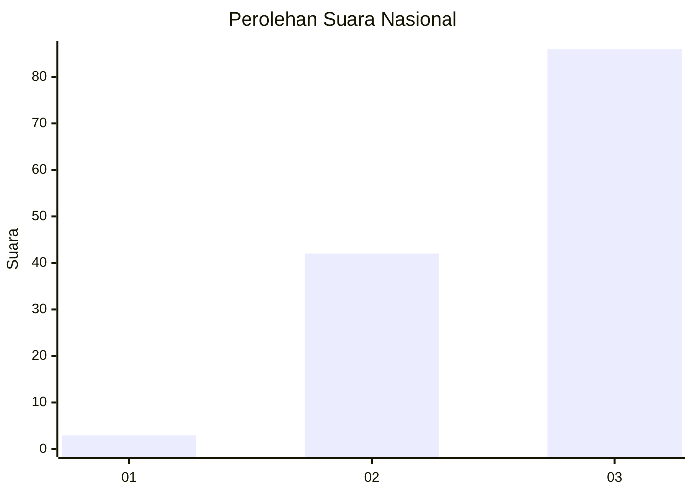
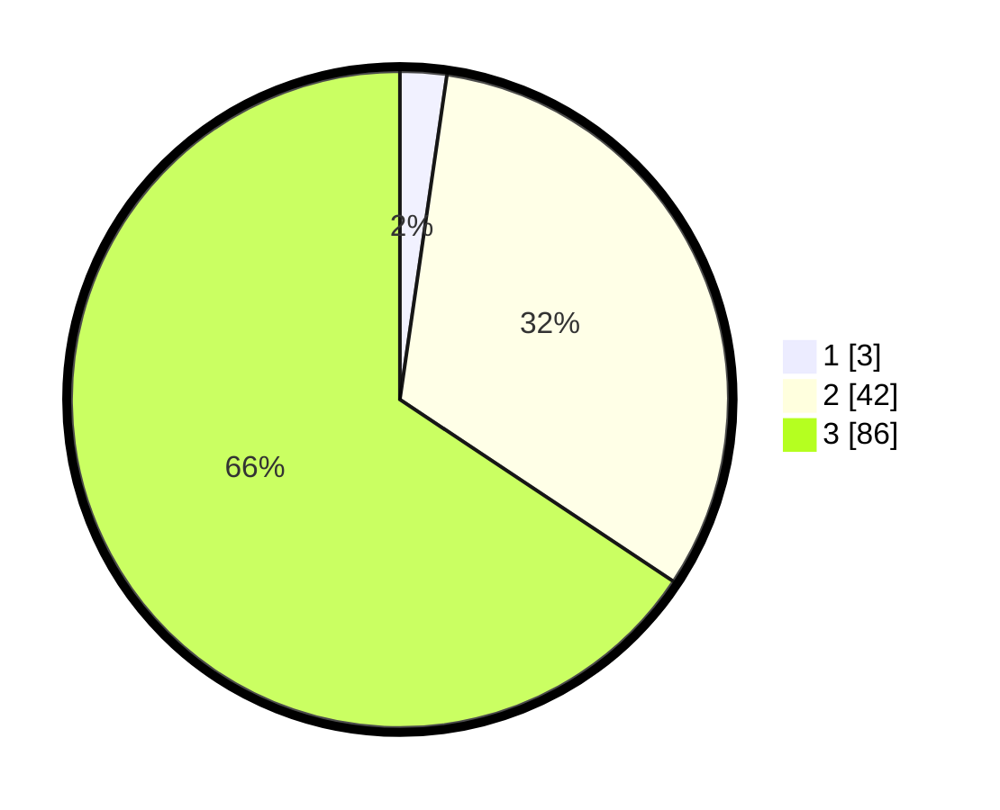

# Hasil

## Grafik

## Tabel

| No. | Nama Paslon    | Suara | Suara (raw) | Persentase |
|:--- |:-------------- | -----:| -----------:| ----------:|
| 1   | ANIES MUHAIMIN | 3     | [3][p-1]    | 2,29       |
| 2   | PRABOWO GIBRAN | 42    | [42][p-2]   | 32,06      |
| 3   | GANJAR MAHFUD  | 86    | [86][p-3]   | 65,65      |

[p-1]: https://github.com/gigit-pemilu/pemilu-2024/blob/main/pilpres/hitung-suara/sub/53-nusa-tenggara-timur/sub/18-sumba-barat-daya/sub/08-kodi-utara/sub/2011-bukambero/sub/005-tps/sub/paslon-1.txt
[p-2]: https://github.com/gigit-pemilu/pemilu-2024/blob/main/pilpres/hitung-suara/sub/53-nusa-tenggara-timur/sub/18-sumba-barat-daya/sub/08-kodi-utara/sub/2011-bukambero/sub/005-tps/sub/paslon-2.txt
[p-3]: https://github.com/gigit-pemilu/pemilu-2024/blob/main/pilpres/hitung-suara/sub/53-nusa-tenggara-timur/sub/18-sumba-barat-daya/sub/08-kodi-utara/sub/2011-bukambero/sub/005-tps/sub/paslon-3.txt

## Foto C Plano

https://sirekap-obj-formc.kpu.go.id/6457/pemilu/ppwp/53/18/08/20/11/5318082011005-20240215-133001--71ccff9f-83e5-4e76-bf1e-36348554c7d5.jpg

https://sirekap-obj-formc.kpu.go.id/6457/pemilu/ppwp/53/18/08/20/11/5318082011005-20240215-133202--16079342-2215-4f9e-ae6e-02733fce337c.jpg

https://sirekap-obj-formc.kpu.go.id/6457/pemilu/ppwp/53/18/08/20/11/5318082011005-20240215-133307--8fb3ca9e-f3c2-4a5d-85ab-a19091bd537c.jpg

## Metadata

| Key        | Value               |
| ---------- | ------------------- |
| Time Stamp | 2024-02-24 22:31:28 |

