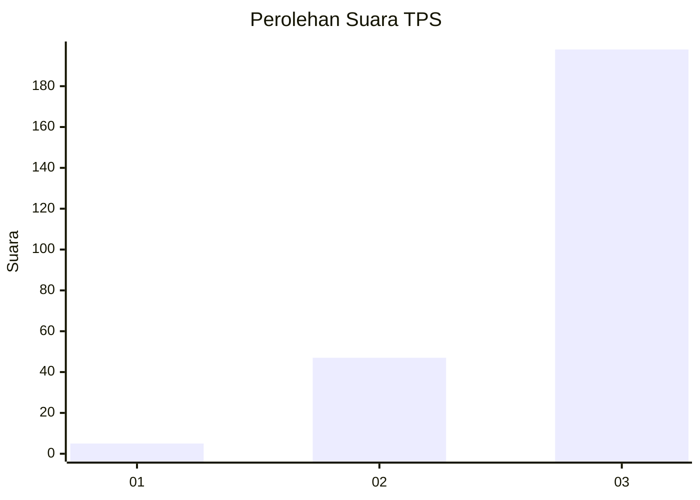
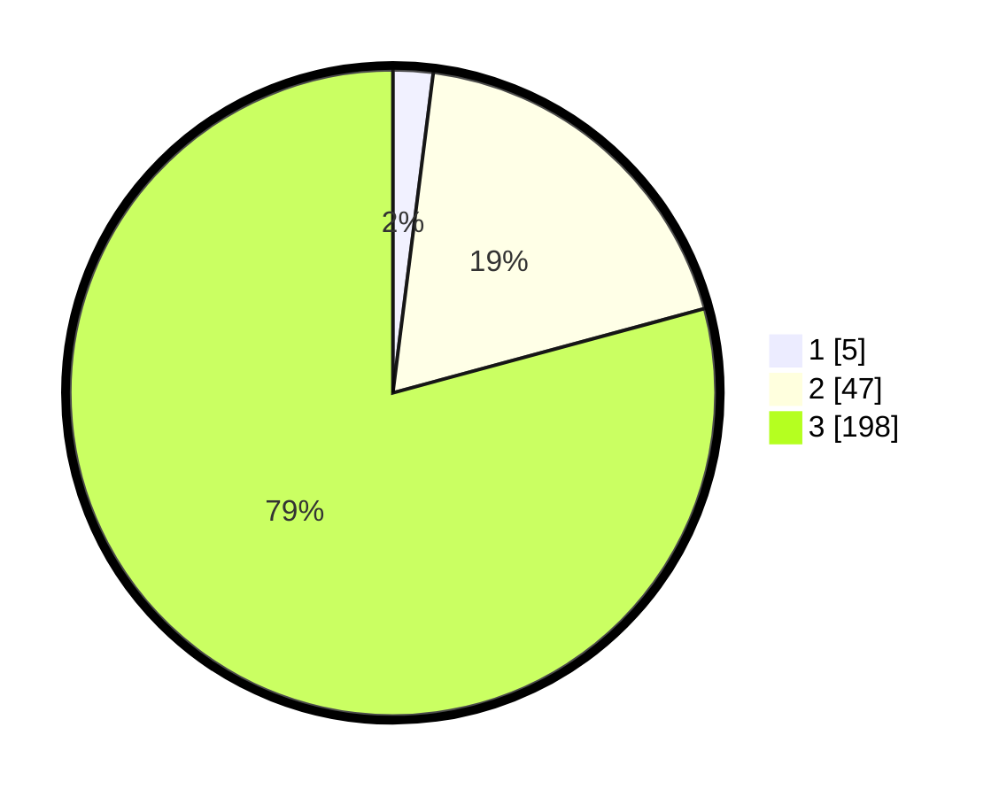

# Hasil

## Grafik

## Tabel

| No. | Nama Paslon    | Suara | Suara (raw) | Persentase |
|:--- |:-------------- | -----:| -----------:| ----------:|
| 1   | ANIES MUHAIMIN | 5     | [5][p-1]    | 2,00       |
| 2   | PRABOWO GIBRAN | 47    | [47][p-2]   | 18,80      |
| 3   | GANJAR MAHFUD  | 198   | [198][p-3]  | 79,20      |

[p-1]: https://github.com/gigit-pemilu/pemilu-2024-53-nusa-tenggara-timur/blob/main/pilpres/hitung-suara/sub/53-nusa-tenggara-timur/sub/18-sumba-barat-daya/sub/08-kodi-utara/sub/2016-kadu-eta/sub/005-tps/sub/paslon-1.txt
[p-2]: https://github.com/gigit-pemilu/pemilu-2024-53-nusa-tenggara-timur/blob/main/pilpres/hitung-suara/sub/53-nusa-tenggara-timur/sub/18-sumba-barat-daya/sub/08-kodi-utara/sub/2016-kadu-eta/sub/005-tps/sub/paslon-2.txt
[p-3]: https://github.com/gigit-pemilu/pemilu-2024-53-nusa-tenggara-timur/blob/main/pilpres/hitung-suara/sub/53-nusa-tenggara-timur/sub/18-sumba-barat-daya/sub/08-kodi-utara/sub/2016-kadu-eta/sub/005-tps/sub/paslon-3.txt

## Foto C Plano

https://sirekap-obj-formc.kpu.go.id/ff69/pemilu/ppwp/53/18/08/20/16/5318082016005-20240215-124224--bc5c2b03-bcff-4082-88af-47992e01f0ca.jpg

https://sirekap-obj-formc.kpu.go.id/ff69/pemilu/ppwp/53/18/08/20/16/5318082016005-20240215-130422--b1ece35f-20c4-49d1-8f04-3a672723190d.jpg

https://sirekap-obj-formc.kpu.go.id/ff69/pemilu/ppwp/53/18/08/20/16/5318082016005-20240215-130634--161111b2-77b0-478b-93ad-56466ba9a04f.jpg

## Metadata

| Key        | Value               |
| ---------- | ------------------- |
| Time Stamp | 2024-02-25 22:00:00 |

