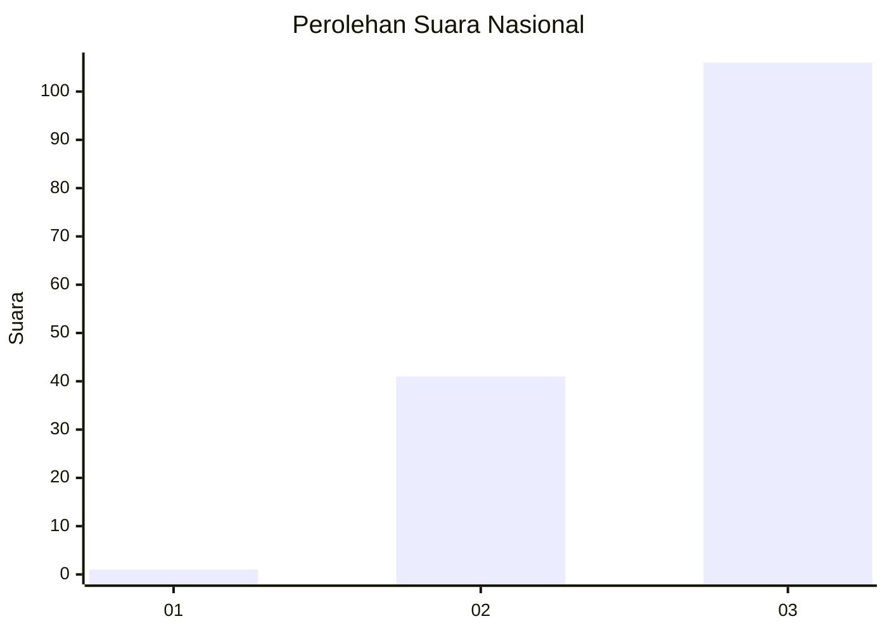
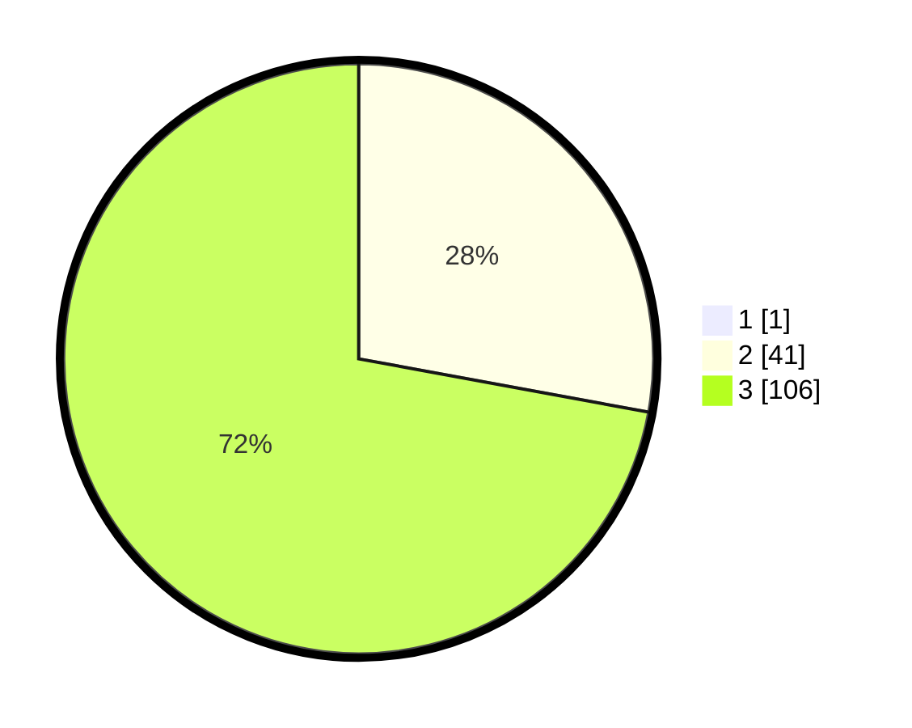

# Hasil

## Grafik

## Tabel

| No. | Nama Paslon    | Suara | Suara (raw) | Persentase |
|:--- |:-------------- | -----:| -----------:| ----------:|
| 1   | ANIES MUHAIMIN | 1     | [1][p-1]    | 0,68       |
| 2   | PRABOWO GIBRAN | 41    | [41][p-2]   | 27,70      |
| 3   | GANJAR MAHFUD  | 106   | [106][p-3]  | 71,62      |

[p-1]: https://github.com/gigit-pemilu/pemilu-2024/blob/main/pilpres/hitung-suara/sub/53-nusa-tenggara-timur/sub/18-sumba-barat-daya/sub/08-kodi-utara/sub/2020-nangga-mutu/sub/003-tps/sub/paslon-1.txt
[p-2]: https://github.com/gigit-pemilu/pemilu-2024/blob/main/pilpres/hitung-suara/sub/53-nusa-tenggara-timur/sub/18-sumba-barat-daya/sub/08-kodi-utara/sub/2020-nangga-mutu/sub/003-tps/sub/paslon-2.txt
[p-3]: https://github.com/gigit-pemilu/pemilu-2024/blob/main/pilpres/hitung-suara/sub/53-nusa-tenggara-timur/sub/18-sumba-barat-daya/sub/08-kodi-utara/sub/2020-nangga-mutu/sub/003-tps/sub/paslon-3.txt

## Foto C Plano

https://sirekap-obj-formc.kpu.go.id/a9c8/pemilu/ppwp/53/18/08/20/20/5318082020003-20240215-180037--4c526355-f687-4597-b58e-48873e7e199d.jpg

https://sirekap-obj-formc.kpu.go.id/a9c8/pemilu/ppwp/53/18/08/20/20/5318082020003-20240215-180553--ffef8196-90b2-4307-8252-985c39c6bf85.jpg

https://sirekap-obj-formc.kpu.go.id/a9c8/pemilu/ppwp/53/18/08/20/20/5318082020003-20240215-181020--5adb0de2-40c1-4267-acb8-7fec57214908.jpg

## Metadata

| Key        | Value               |
| ---------- | ------------------- |
| Time Stamp | 2024-02-25 13:00:00 |

