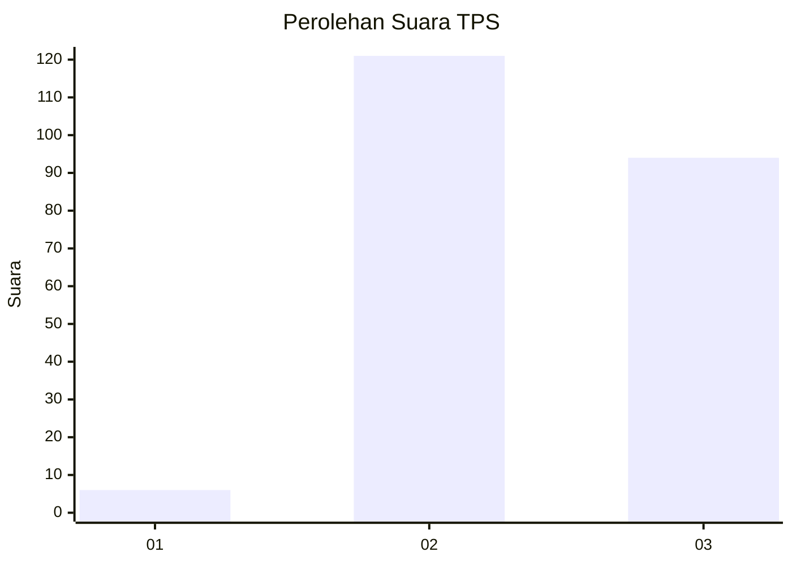
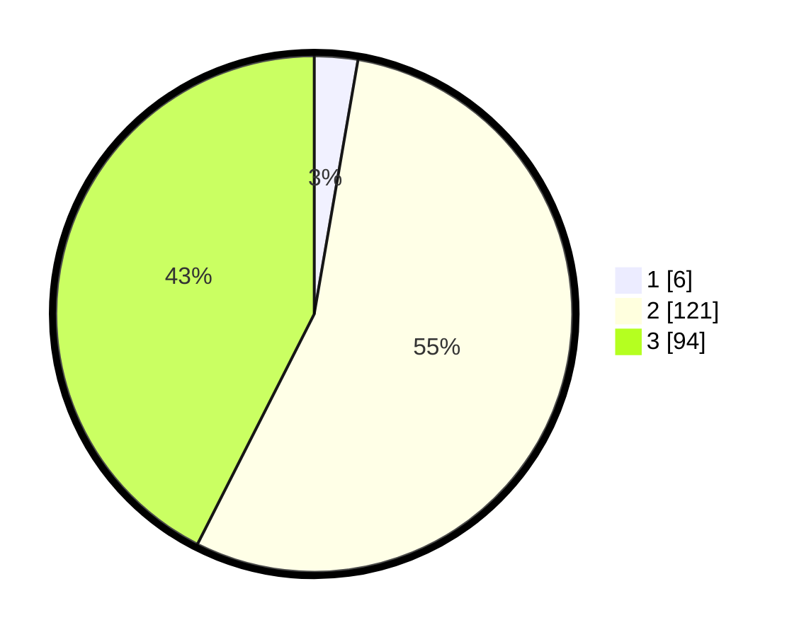

# Hasil

## Grafik

## Tabel

| No. | Nama Paslon    | Suara | Suara (raw) | Persentase |
|:--- |:-------------- | -----:| -----------:| ----------:|
| 1   | ANIES MUHAIMIN | 6     | [6][p-1]    | 2,71       |
| 2   | PRABOWO GIBRAN | 121   | [121][p-2]  | 54,75      |
| 3   | GANJAR MAHFUD  | 94    | [94][p-3]   | 42,53      |

[p-1]: https://github.com/gigit-pemilu/pemilu-2024-53-nusa-tenggara-timur/blob/main/pilpres/hitung-suara/sub/53-nusa-tenggara-timur/sub/18-sumba-barat-daya/sub/09-kota-tambolaka/sub/1003-langga-lero/sub/003-tps/sub/paslon-1.txt
[p-2]: https://github.com/gigit-pemilu/pemilu-2024-53-nusa-tenggara-timur/blob/main/pilpres/hitung-suara/sub/53-nusa-tenggara-timur/sub/18-sumba-barat-daya/sub/09-kota-tambolaka/sub/1003-langga-lero/sub/003-tps/sub/paslon-2.txt
[p-3]: https://github.com/gigit-pemilu/pemilu-2024-53-nusa-tenggara-timur/blob/main/pilpres/hitung-suara/sub/53-nusa-tenggara-timur/sub/18-sumba-barat-daya/sub/09-kota-tambolaka/sub/1003-langga-lero/sub/003-tps/sub/paslon-3.txt

## Foto C Plano

https://sirekap-obj-formc.kpu.go.id/3c68/pemilu/ppwp/53/18/09/10/03/5318091003003-20240215-013736--2bea082e-c4f5-410e-8ffe-283e4937f845.jpg

https://sirekap-obj-formc.kpu.go.id/3c68/pemilu/ppwp/53/18/09/10/03/5318091003003-20240215-013842--2a8ef347-b346-4f8e-bc64-27620943378c.jpg

https://sirekap-obj-formc.kpu.go.id/3c68/pemilu/ppwp/53/18/09/10/03/5318091003003-20240215-013936--6afd6f9d-c92d-4803-82aa-2798ffd5b18b.jpg

## Metadata

| Key        | Value               |
| ---------- | ------------------- |
| Time Stamp | 2024-02-24 22:31:28 |

