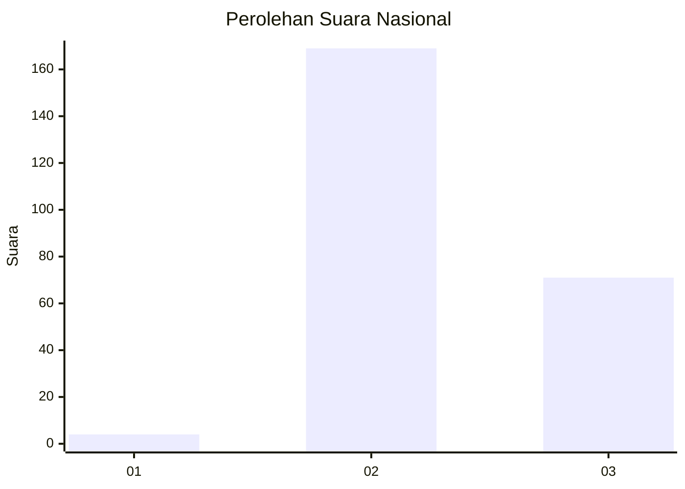

# Hasil

## Grafik

## Tabel

| No. | Nama Paslon    | Suara | Suara (raw) | Persentase |
|:--- |:-------------- | -----:| -----------:| ----------:|
| 1   | ANIES MUHAIMIN | 4     | [4][p-1]    | 1,64       |
| 2   | PRABOWO GIBRAN | 169   | [169][p-2]  | 69,26      |
| 3   | GANJAR MAHFUD  | 71    | [71][p-3]   | 29,10      |

[p-1]: https://github.com/gigit-pemilu/pemilu-2024/blob/main/pilpres/hitung-suara/sub/53-nusa-tenggara-timur/sub/18-sumba-barat-daya/sub/09-kota-tambolaka/sub/1003-langga-lero/sub/004-tps/sub/paslon-1.txt
[p-2]: https://github.com/gigit-pemilu/pemilu-2024/blob/main/pilpres/hitung-suara/sub/53-nusa-tenggara-timur/sub/18-sumba-barat-daya/sub/09-kota-tambolaka/sub/1003-langga-lero/sub/004-tps/sub/paslon-2.txt
[p-3]: https://github.com/gigit-pemilu/pemilu-2024/blob/main/pilpres/hitung-suara/sub/53-nusa-tenggara-timur/sub/18-sumba-barat-daya/sub/09-kota-tambolaka/sub/1003-langga-lero/sub/004-tps/sub/paslon-3.txt

## Foto C Plano

https://sirekap-obj-formc.kpu.go.id/b11a/pemilu/ppwp/53/18/09/10/03/5318091003004-20240214-195309--303b4162-8ecc-4b8b-a379-de4f474655ec.jpg

https://sirekap-obj-formc.kpu.go.id/b11a/pemilu/ppwp/53/18/09/10/03/5318091003004-20240214-195359--73152233-9fa3-4b26-9407-03a831300103.jpg

https://sirekap-obj-formc.kpu.go.id/b11a/pemilu/ppwp/53/18/09/10/03/5318091003004-20240214-195444--5ad3a870-5132-4d7c-a950-bd6aa38f7476.jpg

## Metadata

| Key        | Value               |
| ---------- | ------------------- |
| Time Stamp | 2024-02-24 22:31:28 |

