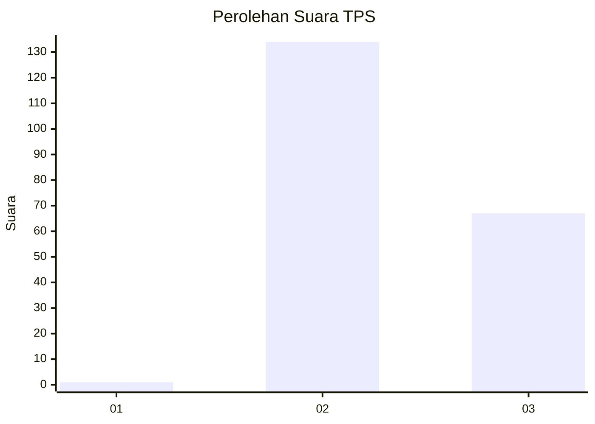
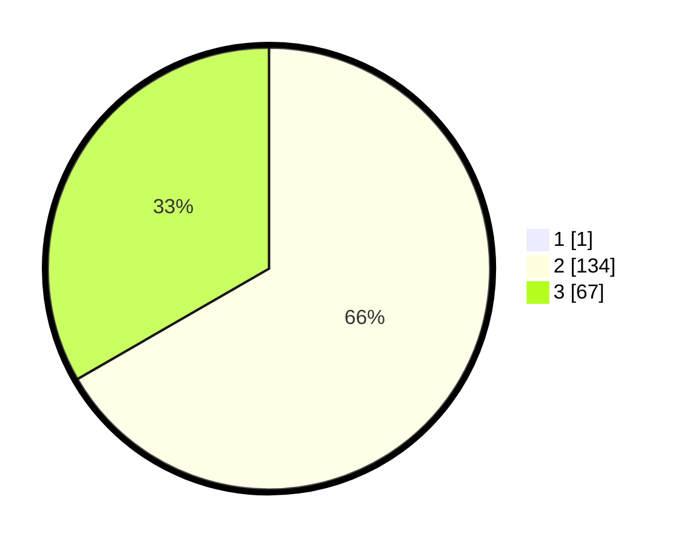

# Hasil

## Grafik

## Tabel

| No. | Nama Paslon    | Suara | Suara (raw) | Persentase |
|:--- |:-------------- | -----:| -----------:| ----------:|
| 1   | ANIES MUHAIMIN | 1     | [1][p-1]    | 0,50       |
| 2   | PRABOWO GIBRAN | 134   | [134][p-2]  | 66,34      |
| 3   | GANJAR MAHFUD  | 67    | [67][p-3]   | 33,17      |

[p-1]: https://github.com/gigit-pemilu/pemilu-2024-53-nusa-tenggara-timur/blob/main/pilpres/hitung-suara/sub/53-nusa-tenggara-timur/sub/18-sumba-barat-daya/sub/09-kota-tambolaka/sub/1004-waitabula/sub/005-tps/sub/paslon-1.txt
[p-2]: https://github.com/gigit-pemilu/pemilu-2024-53-nusa-tenggara-timur/blob/main/pilpres/hitung-suara/sub/53-nusa-tenggara-timur/sub/18-sumba-barat-daya/sub/09-kota-tambolaka/sub/1004-waitabula/sub/005-tps/sub/paslon-2.txt
[p-3]: https://github.com/gigit-pemilu/pemilu-2024-53-nusa-tenggara-timur/blob/main/pilpres/hitung-suara/sub/53-nusa-tenggara-timur/sub/18-sumba-barat-daya/sub/09-kota-tambolaka/sub/1004-waitabula/sub/005-tps/sub/paslon-3.txt

## Foto C Plano

https://sirekap-obj-formc.kpu.go.id/0ddc/pemilu/ppwp/53/18/09/10/04/5318091004005-20240215-084413--480e580a-165e-4145-8acb-68582ceb3a8b.jpg

https://sirekap-obj-formc.kpu.go.id/0ddc/pemilu/ppwp/53/18/09/10/04/5318091004005-20240215-084552--45ba7ea1-e2c3-4b25-b2f3-2d3c46722eb6.jpg

https://sirekap-obj-formc.kpu.go.id/0ddc/pemilu/ppwp/53/18/09/10/04/5318091004005-20240215-084815--8f69943f-71d2-45a5-b41a-6c3a6f554486.jpg

## Metadata

| Key        | Value               |
| ---------- | ------------------- |
| Time Stamp | 2024-02-24 22:31:28 |

