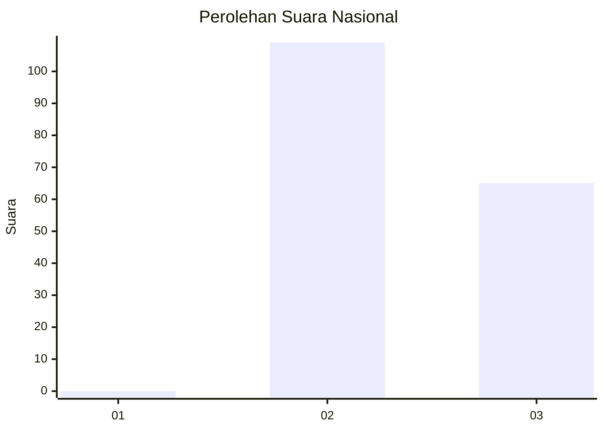
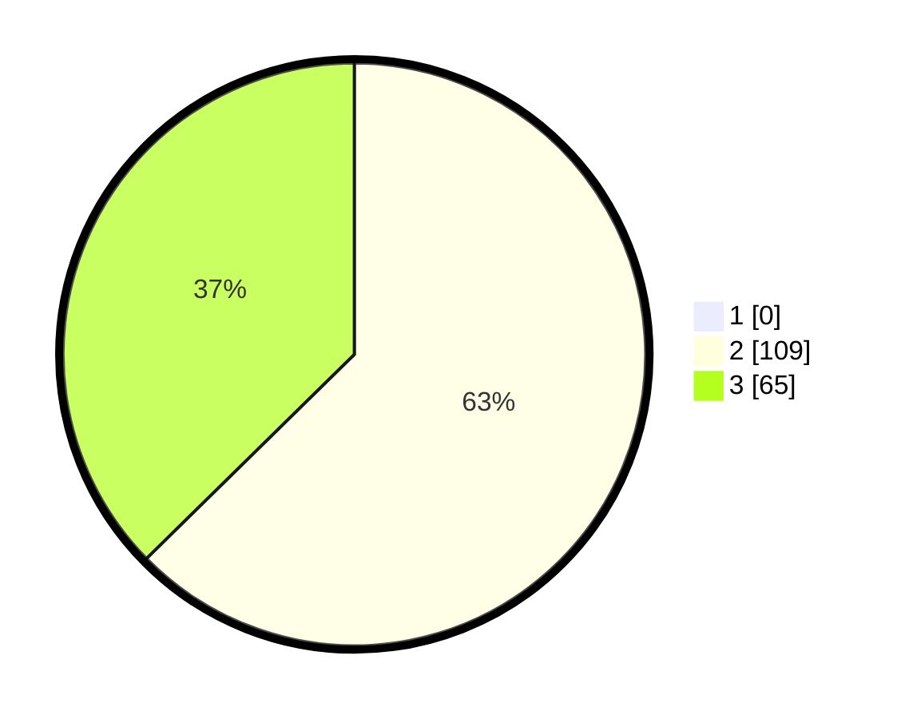

# Hasil

## Grafik

## Tabel

| No. | Nama Paslon    | Suara | Suara (raw) | Persentase |
|:--- |:-------------- | -----:| -----------:| ----------:|
| 1   | ANIES MUHAIMIN | 0     | [0][p-1]    | 0,00       |
| 2   | PRABOWO GIBRAN | 109   | [109][p-2]  | 62,64      |
| 3   | GANJAR MAHFUD  | 65    | [65][p-3]   | 37,36      |

[p-1]: https://github.com/gigit-pemilu/pemilu-2024/blob/main/pilpres/hitung-suara/sub/53-nusa-tenggara-timur/sub/18-sumba-barat-daya/sub/10-wewewa-tengah/sub/2003-wee-kokora/sub/002-tps/sub/paslon-1.txt
[p-2]: https://github.com/gigit-pemilu/pemilu-2024/blob/main/pilpres/hitung-suara/sub/53-nusa-tenggara-timur/sub/18-sumba-barat-daya/sub/10-wewewa-tengah/sub/2003-wee-kokora/sub/002-tps/sub/paslon-2.txt
[p-3]: https://github.com/gigit-pemilu/pemilu-2024/blob/main/pilpres/hitung-suara/sub/53-nusa-tenggara-timur/sub/18-sumba-barat-daya/sub/10-wewewa-tengah/sub/2003-wee-kokora/sub/002-tps/sub/paslon-3.txt

## Foto C Plano

https://sirekap-obj-formc.kpu.go.id/2696/pemilu/ppwp/53/18/10/20/03/5318102003002-20240215-082041--0d122aa2-1c34-4eb2-ba46-20ab8ed7ed5f.jpg

https://sirekap-obj-formc.kpu.go.id/2696/pemilu/ppwp/53/18/10/20/03/5318102003002-20240215-082346--092baea4-8133-4daa-a295-f38381bfc307.jpg

https://sirekap-obj-formc.kpu.go.id/2696/pemilu/ppwp/53/18/10/20/03/5318102003002-20240215-082727--e9f47649-1ec4-4c04-9aaa-c12cffe00af1.jpg

## Metadata

| Key        | Value               |
| ---------- | ------------------- |
| Time Stamp | 2024-02-25 22:00:00 |

