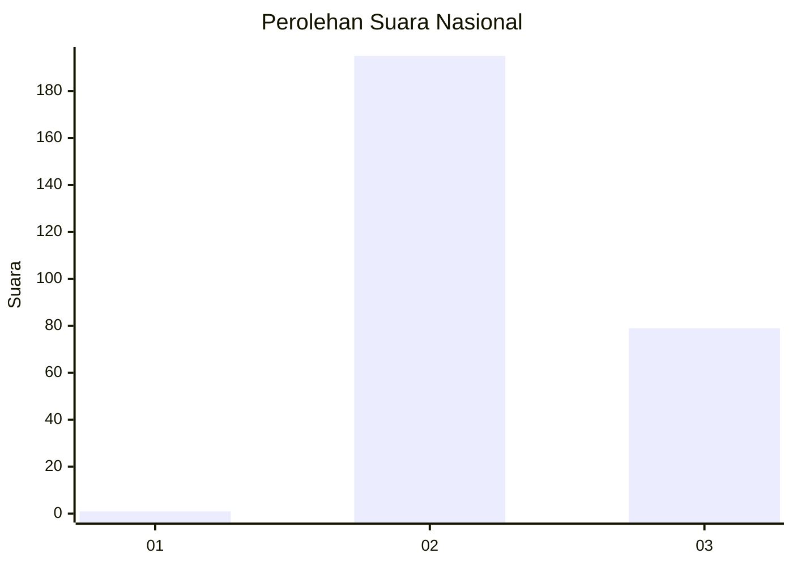
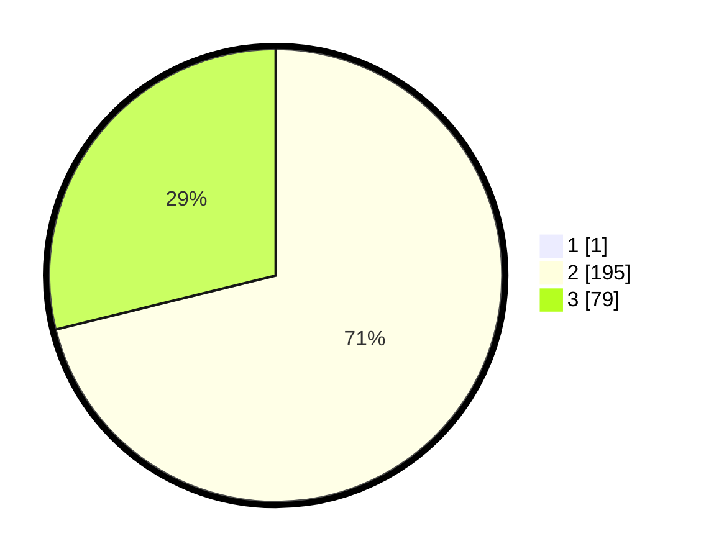

# Hasil

## Grafik

## Tabel

| No. | Nama Paslon    | Suara | Suara (raw) | Persentase |
|:--- |:-------------- | -----:| -----------:| ----------:|
| 1   | ANIES MUHAIMIN | 1     | [1][p-1]    | 0,36       |
| 2   | PRABOWO GIBRAN | 195   | [195][p-2]  | 70,91      |
| 3   | GANJAR MAHFUD  | 79    | [79][p-3]   | 28,73      |

[p-1]: https://github.com/gigit-pemilu/pemilu-2024/blob/main/pilpres/hitung-suara/sub/53-nusa-tenggara-timur/sub/18-sumba-barat-daya/sub/10-wewewa-tengah/sub/2008-omba-rade/sub/005-tps/sub/paslon-1.txt
[p-2]: https://github.com/gigit-pemilu/pemilu-2024/blob/main/pilpres/hitung-suara/sub/53-nusa-tenggara-timur/sub/18-sumba-barat-daya/sub/10-wewewa-tengah/sub/2008-omba-rade/sub/005-tps/sub/paslon-2.txt
[p-3]: https://github.com/gigit-pemilu/pemilu-2024/blob/main/pilpres/hitung-suara/sub/53-nusa-tenggara-timur/sub/18-sumba-barat-daya/sub/10-wewewa-tengah/sub/2008-omba-rade/sub/005-tps/sub/paslon-3.txt

## Foto C Plano

https://sirekap-obj-formc.kpu.go.id/82c6/pemilu/ppwp/53/18/10/20/08/5318102008005-20240215-152606--389959df-3dcc-4168-9ab7-17d11dc0898c.jpg

https://sirekap-obj-formc.kpu.go.id/82c6/pemilu/ppwp/53/18/10/20/08/5318102008005-20240215-152652--c4b4b4da-8fb3-407d-b05f-3f981f1d27bd.jpg

https://sirekap-obj-formc.kpu.go.id/82c6/pemilu/ppwp/53/18/10/20/08/5318102008005-20240215-152722--27657a53-aeed-43f5-8d04-fc1968de56c1.jpg

## Metadata

| Key        | Value               |
| ---------- | ------------------- |
| Time Stamp | 2024-02-25 20:00:00 |

