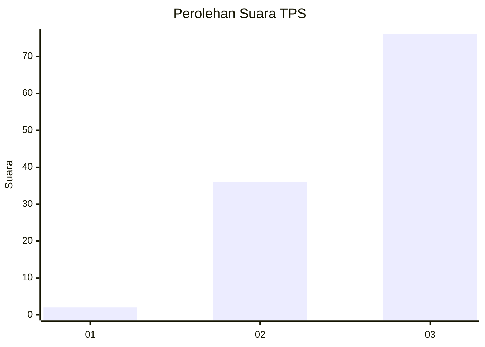
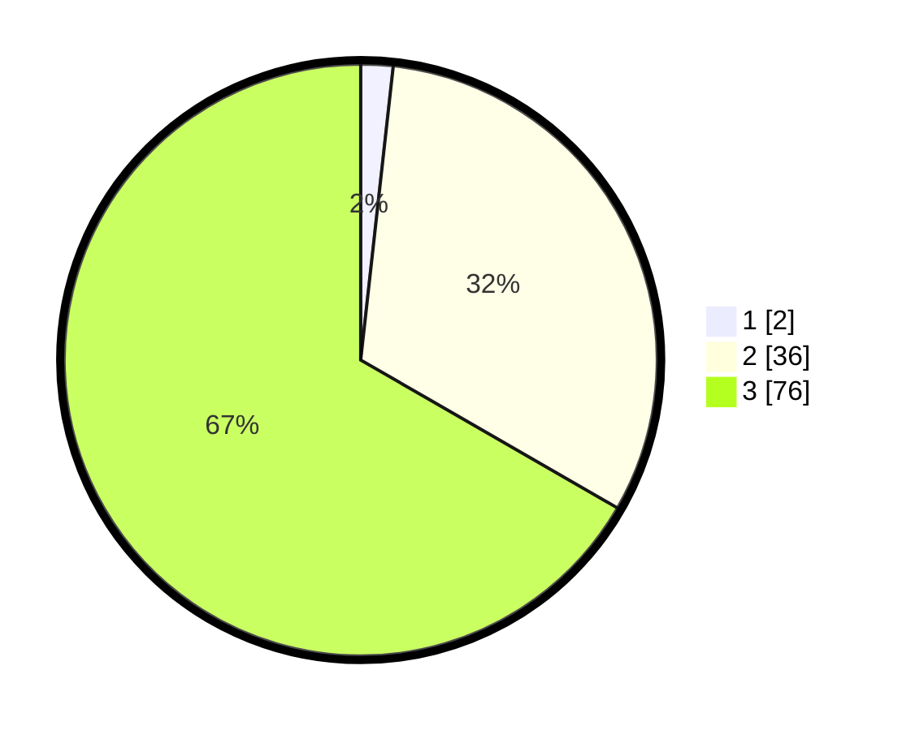

# Hasil

## Grafik

## Tabel

| No. | Nama Paslon    | Suara | Suara (raw) | Persentase |
|:--- |:-------------- | -----:| -----------:| ----------:|
| 1   | ANIES MUHAIMIN | 2     | [2][p-1]    | 1,75       |
| 2   | PRABOWO GIBRAN | 36    | [36][p-2]   | 31,58      |
| 3   | GANJAR MAHFUD  | 76    | [76][p-3]   | 66,67      |

[p-1]: https://github.com/gigit-pemilu/pemilu-2024-53-nusa-tenggara-timur/blob/main/pilpres/hitung-suara/sub/53-nusa-tenggara-timur/sub/18-sumba-barat-daya/sub/10-wewewa-tengah/sub/2009-kalingara/sub/004-tps/sub/paslon-1.txt
[p-2]: https://github.com/gigit-pemilu/pemilu-2024-53-nusa-tenggara-timur/blob/main/pilpres/hitung-suara/sub/53-nusa-tenggara-timur/sub/18-sumba-barat-daya/sub/10-wewewa-tengah/sub/2009-kalingara/sub/004-tps/sub/paslon-2.txt
[p-3]: https://github.com/gigit-pemilu/pemilu-2024-53-nusa-tenggara-timur/blob/main/pilpres/hitung-suara/sub/53-nusa-tenggara-timur/sub/18-sumba-barat-daya/sub/10-wewewa-tengah/sub/2009-kalingara/sub/004-tps/sub/paslon-3.txt

## Foto C Plano

https://sirekap-obj-formc.kpu.go.id/54f8/pemilu/ppwp/53/18/10/20/09/5318102009004-20240215-155451--3eafc811-983e-497a-9a7a-8cb6ea0302d4.jpg

https://sirekap-obj-formc.kpu.go.id/54f8/pemilu/ppwp/53/18/10/20/09/5318102009004-20240218-180949--f9a34ed9-2ce9-4625-80b8-23b825b41179.jpg

https://sirekap-obj-formc.kpu.go.id/54f8/pemilu/ppwp/53/18/10/20/09/5318102009004-20240215-084801--2964b658-d907-4c17-adb2-ca522100d7b0.jpg

## Metadata

| Key        | Value               |
| ---------- | ------------------- |
| Time Stamp | 2024-02-25 21:00:00 |

