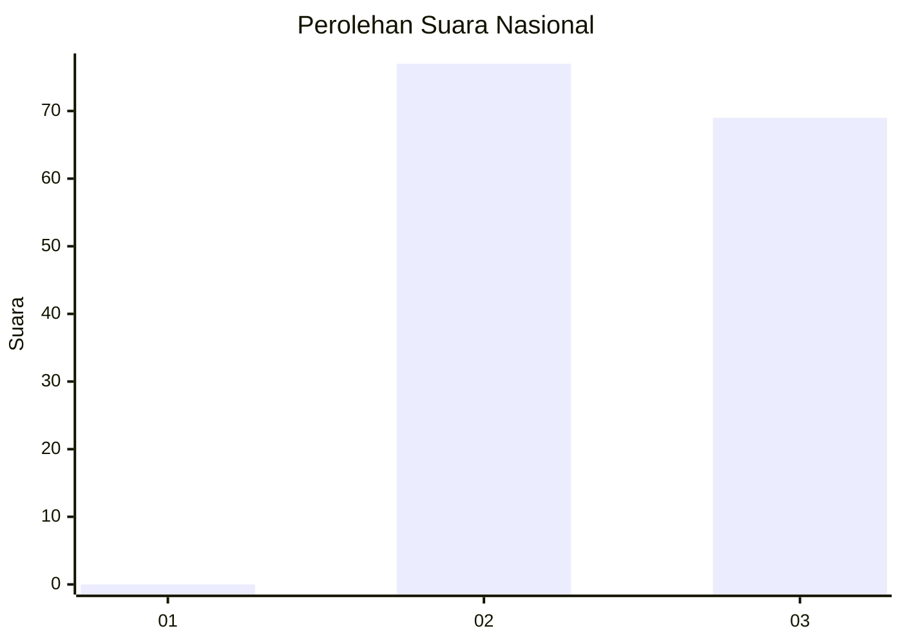
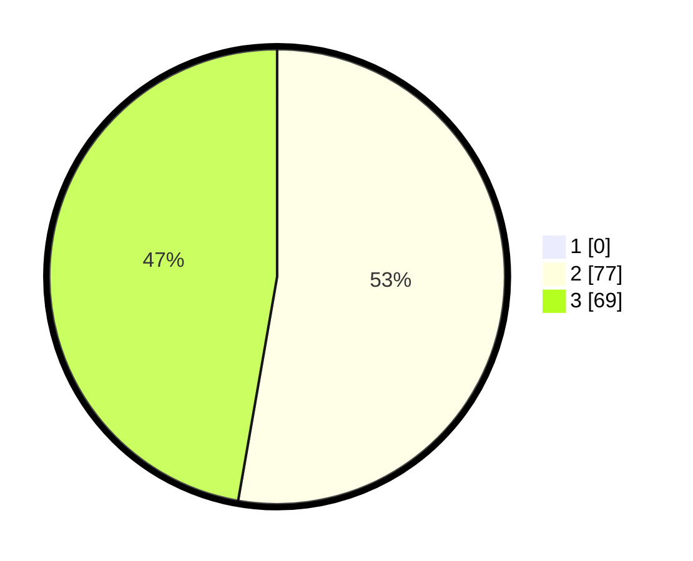

# Hasil

## Grafik

## Tabel

| No. | Nama Paslon    | Suara | Suara (raw) | Persentase |
|:--- |:-------------- | -----:| -----------:| ----------:|
| 1   | ANIES MUHAIMIN | 0     | [0][p-1]    | 0,00       |
| 2   | PRABOWO GIBRAN | 77    | [77][p-2]   | 52,74      |
| 3   | GANJAR MAHFUD  | 69    | [69][p-3]   | 47,26      |

[p-1]: https://github.com/gigit-pemilu/pemilu-2024/blob/main/pilpres/hitung-suara/sub/53-nusa-tenggara-timur/sub/18-sumba-barat-daya/sub/11-kodi-balaghar/sub/2005-waiha/sub/006-tps/sub/paslon-1.txt
[p-2]: https://github.com/gigit-pemilu/pemilu-2024/blob/main/pilpres/hitung-suara/sub/53-nusa-tenggara-timur/sub/18-sumba-barat-daya/sub/11-kodi-balaghar/sub/2005-waiha/sub/006-tps/sub/paslon-2.txt
[p-3]: https://github.com/gigit-pemilu/pemilu-2024/blob/main/pilpres/hitung-suara/sub/53-nusa-tenggara-timur/sub/18-sumba-barat-daya/sub/11-kodi-balaghar/sub/2005-waiha/sub/006-tps/sub/paslon-3.txt

## Foto C Plano

https://sirekap-obj-formc.kpu.go.id/1011/pemilu/ppwp/53/18/11/20/05/5318112005006-20240214-201223--bda49c39-88fb-41ea-8f94-8219f88929fd.jpg

https://sirekap-obj-formc.kpu.go.id/1011/pemilu/ppwp/53/18/11/20/05/5318112005006-20240214-201511--402a9982-5571-49ad-bf7b-dd39de7ae489.jpg

https://sirekap-obj-formc.kpu.go.id/1011/pemilu/ppwp/53/18/11/20/05/5318112005006-20240214-201937--fba1d3b0-168f-4351-939e-530177a9a0d7.jpg

## Metadata

| Key        | Value               |
| ---------- | ------------------- |
| Time Stamp | 2024-02-24 22:31:28 |

