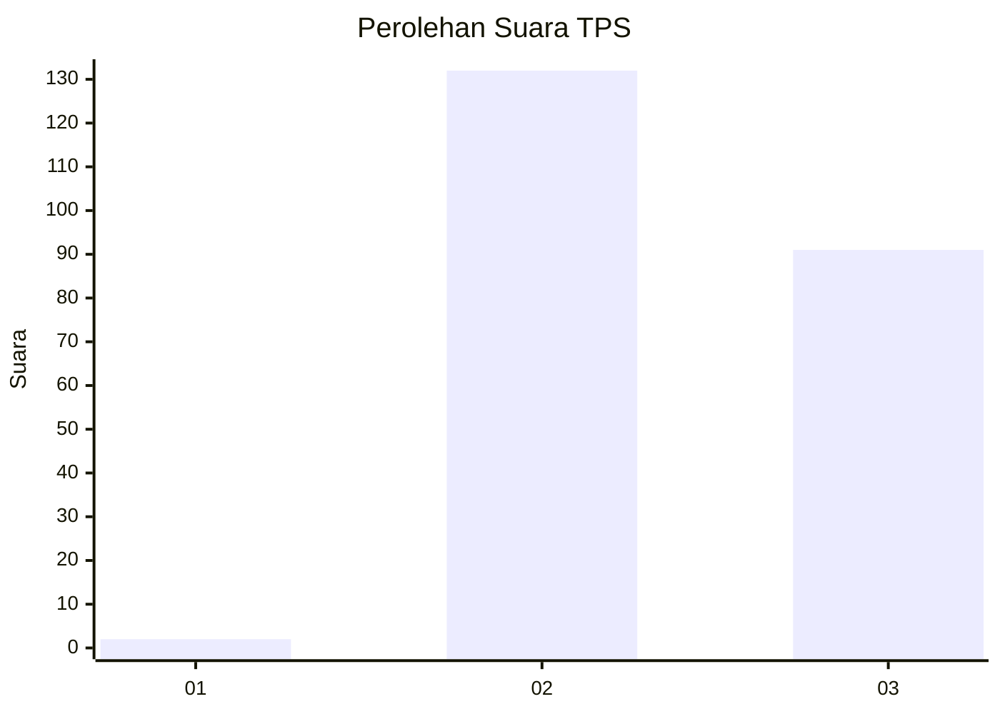
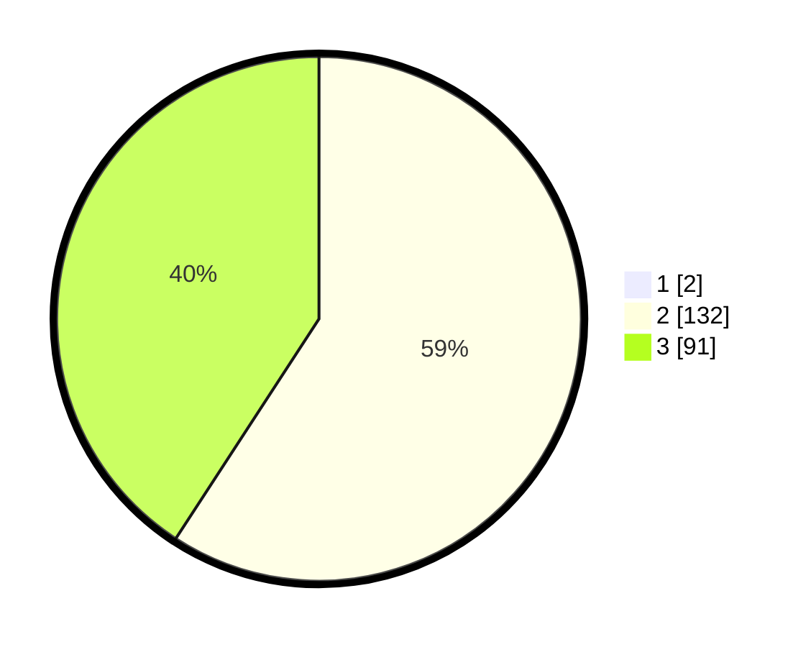

# Hasil

## Grafik

## Tabel

| No. | Nama Paslon    | Suara | Suara (raw) | Persentase |
|:--- |:-------------- | -----:| -----------:| ----------:|
| 1   | ANIES MUHAIMIN | 2     | [2][p-1]    | 0,89       |
| 2   | PRABOWO GIBRAN | 132   | [132][p-2]  | 58,67      |
| 3   | GANJAR MAHFUD  | 91    | [91][p-3]   | 40,44      |

[p-1]: https://github.com/gigit-pemilu/pemilu-2024-53-nusa-tenggara-timur/blob/main/pilpres/hitung-suara/sub/53-nusa-tenggara-timur/sub/19-manggarai-timur/sub/01-borong/sub/1020-kota-ndora/sub/005-tps/sub/paslon-1.txt
[p-2]: https://github.com/gigit-pemilu/pemilu-2024-53-nusa-tenggara-timur/blob/main/pilpres/hitung-suara/sub/53-nusa-tenggara-timur/sub/19-manggarai-timur/sub/01-borong/sub/1020-kota-ndora/sub/005-tps/sub/paslon-2.txt
[p-3]: https://github.com/gigit-pemilu/pemilu-2024-53-nusa-tenggara-timur/blob/main/pilpres/hitung-suara/sub/53-nusa-tenggara-timur/sub/19-manggarai-timur/sub/01-borong/sub/1020-kota-ndora/sub/005-tps/sub/paslon-3.txt

## Foto C Plano

https://sirekap-obj-formc.kpu.go.id/cbfa/pemilu/ppwp/53/19/01/10/20/5319011020005-20240215-082103--15f43140-0e3d-4704-978a-6138d8269eaf.jpg

https://sirekap-obj-formc.kpu.go.id/cbfa/pemilu/ppwp/53/19/01/10/20/5319011020005-20240215-081811--50126bb5-43af-4b55-a4a1-5b598f74283e.jpg

https://sirekap-obj-formc.kpu.go.id/cbfa/pemilu/ppwp/53/19/01/10/20/5319011020005-20240215-081614--4ed7e511-d64f-4143-b87f-f4860eb0a7dc.jpg

## Metadata

| Key        | Value               |
| ---------- | ------------------- |
| Time Stamp | 2024-02-16 10:00:28 |

