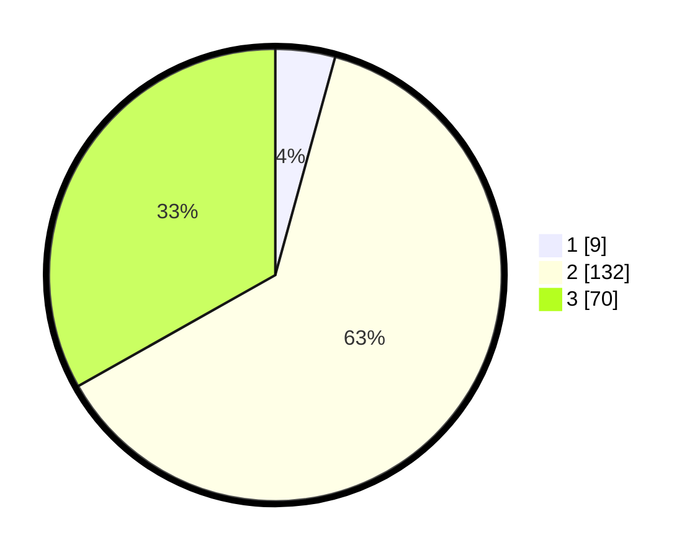

# Hasil

## Grafik

## Tabel

| No. | Nama Paslon    | Suara | Suara (raw) | Persentase |
|:--- |:-------------- | -----:| -----------:| ----------:|
| 1   | ANIES MUHAIMIN | 9     | [9][p-1]    | 4,27       |
| 2   | PRABOWO GIBRAN | 132   | [132][p-2]  | 62,56      |
| 3   | GANJAR MAHFUD  | 70    | [70][p-3]   | 33,18      |

[p-1]: https://github.com/gigit-pemilu/pemilu-2024-53-nusa-tenggara-timur/blob/main/pilpres/hitung-suara/sub/53-nusa-tenggara-timur/sub/19-manggarai-timur/sub/02-lamba-leda-selatan/sub/1027-mandosawu/sub/004-tps/sub/paslon-1.txt
[p-2]: https://github.com/gigit-pemilu/pemilu-2024-53-nusa-tenggara-timur/blob/main/pilpres/hitung-suara/sub/53-nusa-tenggara-timur/sub/19-manggarai-timur/sub/02-lamba-leda-selatan/sub/1027-mandosawu/sub/004-tps/sub/paslon-2.txt
[p-3]: https://github.com/gigit-pemilu/pemilu-2024-53-nusa-tenggara-timur/blob/main/pilpres/hitung-suara/sub/53-nusa-tenggara-timur/sub/19-manggarai-timur/sub/02-lamba-leda-selatan/sub/1027-mandosawu/sub/004-tps/sub/paslon-3.txt

## Foto C Plano

https://sirekap-obj-formc.kpu.go.id/3500/pemilu/ppwp/53/19/02/10/27/5319021027004-20240216-002116--89b97a7e-7d70-4b5a-bad3-cebc87ee1702.jpg

https://sirekap-obj-formc.kpu.go.id/3500/pemilu/ppwp/53/19/02/10/27/5319021027004-20240215-193002--49b77ac9-2dbe-4f32-b9dd-070c761a3b48.jpg

https://sirekap-obj-formc.kpu.go.id/3500/pemilu/ppwp/53/19/02/10/27/5319021027004-20240215-143553--eb0d66ee-c4e7-4048-acd9-f72ebd32a3db.jpg

## Metadata

| Key        | Value               |
| ---------- | ------------------- |
| Time Stamp | 2024-02-16 00:30:27 |

