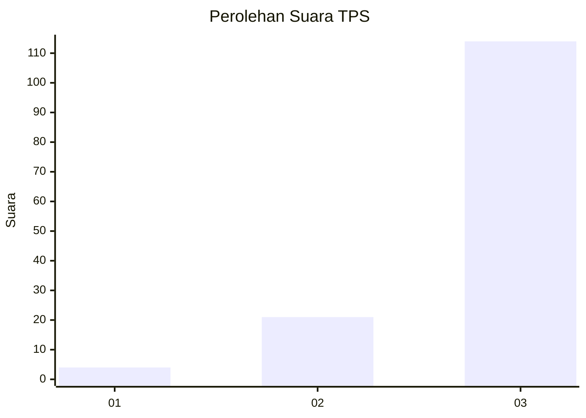
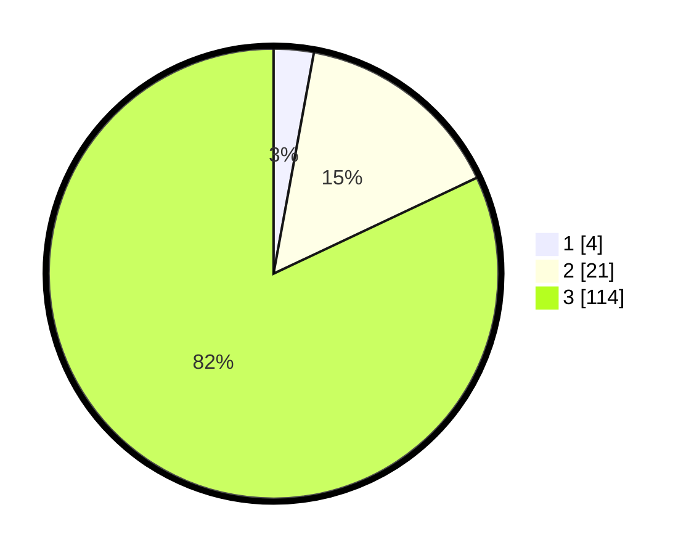

# Hasil

## Grafik

## Tabel

| No. | Nama Paslon    | Suara | Suara (raw) | Persentase |
|:--- |:-------------- | -----:| -----------:| ----------:|
| 1   | ANIES MUHAIMIN | 4     | [4][p-1]    | 2,88       |
| 2   | PRABOWO GIBRAN | 21    | [21][p-2]   | 15,11      |
| 3   | GANJAR MAHFUD  | 114   | [114][p-3]  | 82,01      |

[p-1]: https://github.com/gigit-pemilu/pemilu-2024-53-nusa-tenggara-timur/blob/main/pilpres/hitung-suara/sub/53-nusa-tenggara-timur/sub/19-manggarai-timur/sub/05-elar/sub/2016-legur-lai/sub/001-tps/sub/paslon-1.txt
[p-2]: https://github.com/gigit-pemilu/pemilu-2024-53-nusa-tenggara-timur/blob/main/pilpres/hitung-suara/sub/53-nusa-tenggara-timur/sub/19-manggarai-timur/sub/05-elar/sub/2016-legur-lai/sub/001-tps/sub/paslon-2.txt
[p-3]: https://github.com/gigit-pemilu/pemilu-2024-53-nusa-tenggara-timur/blob/main/pilpres/hitung-suara/sub/53-nusa-tenggara-timur/sub/19-manggarai-timur/sub/05-elar/sub/2016-legur-lai/sub/001-tps/sub/paslon-3.txt

## Foto C Plano

https://sirekap-obj-formc.kpu.go.id/5318/pemilu/ppwp/53/19/05/20/16/5319052016001-20240215-194914--639b2df5-4bfa-46f4-a394-6ce91eee0ef9.jpg

https://sirekap-obj-formc.kpu.go.id/5318/pemilu/ppwp/53/19/05/20/16/5319052016001-20240215-201703--ac78445b-eb8f-4a09-83e2-7d9f519487ee.jpg

https://sirekap-obj-formc.kpu.go.id/5318/pemilu/ppwp/53/19/05/20/16/5319052016001-20240215-214714--547efb60-8adb-4a9c-82dc-841e927799c2.jpg

## Metadata

| Key        | Value               |
| ---------- | ------------------- |
| Time Stamp | 2024-02-16 14:00:34 |

