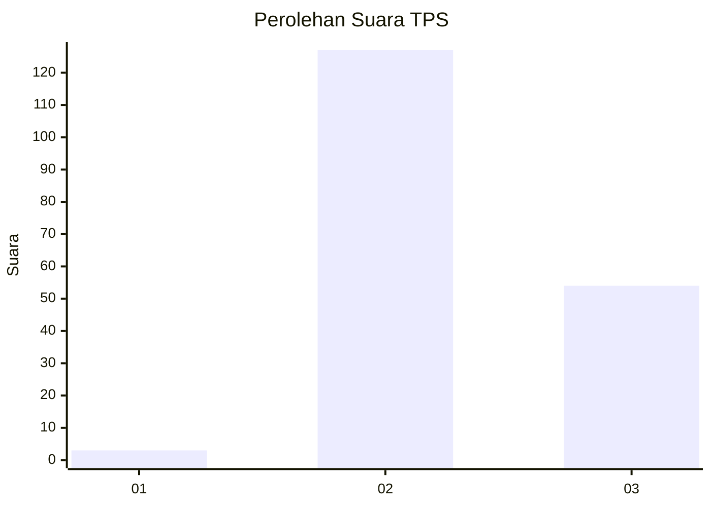

# Hasil

## Grafik

## Tabel

| No. | Nama Paslon    | Suara | Suara (raw) | Persentase |
|:--- |:-------------- | -----:| -----------:| ----------:|
| 1   | ANIES MUHAIMIN | 3     | [3][p-1]    | 1,63       |
| 2   | PRABOWO GIBRAN | 127   | [127][p-2]  | 69,02      |
| 3   | GANJAR MAHFUD  | 54    | [54][p-3]   | 29,35      |

[p-1]: https://github.com/gigit-pemilu/pemilu-2024-53-nusa-tenggara-timur/blob/main/pilpres/hitung-suara/sub/53-nusa-tenggara-timur/sub/19-manggarai-timur/sub/06-kota-komba/sub/1001-watu-nggene/sub/001-tps/sub/paslon-1.txt
[p-2]: https://github.com/gigit-pemilu/pemilu-2024-53-nusa-tenggara-timur/blob/main/pilpres/hitung-suara/sub/53-nusa-tenggara-timur/sub/19-manggarai-timur/sub/06-kota-komba/sub/1001-watu-nggene/sub/001-tps/sub/paslon-2.txt
[p-3]: https://github.com/gigit-pemilu/pemilu-2024-53-nusa-tenggara-timur/blob/main/pilpres/hitung-suara/sub/53-nusa-tenggara-timur/sub/19-manggarai-timur/sub/06-kota-komba/sub/1001-watu-nggene/sub/001-tps/sub/paslon-3.txt

## Foto C Plano

https://sirekap-obj-formc.kpu.go.id/5c5e/pemilu/ppwp/53/19/06/10/01/5319061001001-20240220-091404--a9c67bd0-92c9-4dd3-9024-b515b7b4879d.jpg

https://sirekap-obj-formc.kpu.go.id/5c5e/pemilu/ppwp/53/19/06/10/01/5319061001001-20240215-091722--2f47be3e-2e24-479c-9bb1-3ac50840d9bc.jpg

https://sirekap-obj-formc.kpu.go.id/5c5e/pemilu/ppwp/53/19/06/10/01/5319061001001-20240215-091726--7478828c-a6f7-47d4-a098-4947beb110cf.jpg

## Metadata

| Key        | Value               |
| ---------- | ------------------- |
| Time Stamp | 2024-02-20 10:00:00 |

