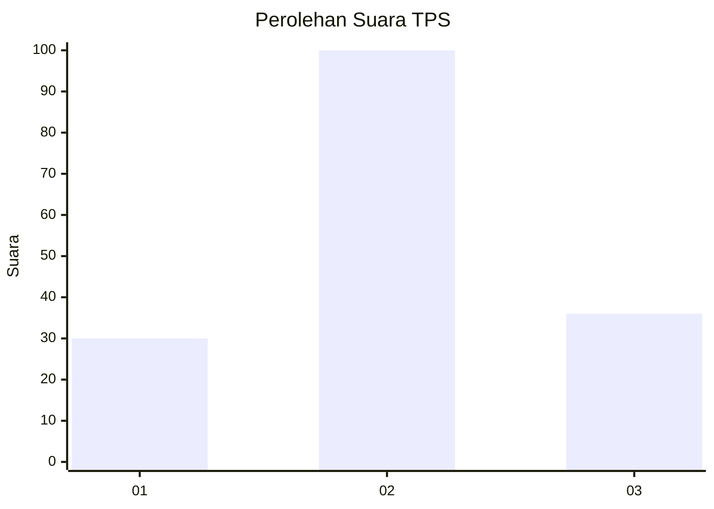
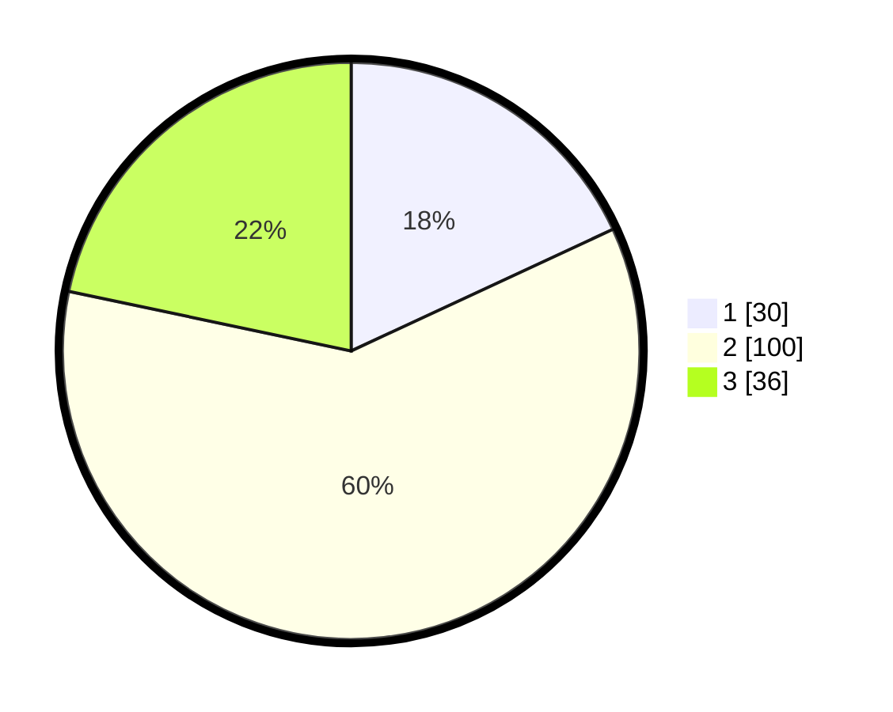

# Hasil

## Grafik

## Tabel

| No. | Nama Paslon    | Suara | Suara (raw) | Persentase |
|:--- |:-------------- | -----:| -----------:| ----------:|
| 1   | ANIES MUHAIMIN | 30    | [30][p-1]   | 18,07      |
| 2   | PRABOWO GIBRAN | 100   | [100][p-2]  | 60,24      |
| 3   | GANJAR MAHFUD  | 36    | [36][p-3]   | 21,69      |

[p-1]: https://github.com/gigit-pemilu/pemilu-2024-53-nusa-tenggara-timur/blob/main/pilpres/hitung-suara/sub/53-nusa-tenggara-timur/sub/19-manggarai-timur/sub/06-kota-komba/sub/1001-watu-nggene/sub/005-tps/sub/paslon-1.txt
[p-2]: https://github.com/gigit-pemilu/pemilu-2024-53-nusa-tenggara-timur/blob/main/pilpres/hitung-suara/sub/53-nusa-tenggara-timur/sub/19-manggarai-timur/sub/06-kota-komba/sub/1001-watu-nggene/sub/005-tps/sub/paslon-2.txt
[p-3]: https://github.com/gigit-pemilu/pemilu-2024-53-nusa-tenggara-timur/blob/main/pilpres/hitung-suara/sub/53-nusa-tenggara-timur/sub/19-manggarai-timur/sub/06-kota-komba/sub/1001-watu-nggene/sub/005-tps/sub/paslon-3.txt

## Foto C Plano

https://sirekap-obj-formc.kpu.go.id/ce9e/pemilu/ppwp/53/19/06/10/01/5319061001005-20240215-065809--59bba12d-8c36-4326-97ac-db7548b2775b.jpg

https://sirekap-obj-formc.kpu.go.id/ce9e/pemilu/ppwp/53/19/06/10/01/5319061001005-20240215-065943--14ba62bb-a8ff-45af-aa63-1259fe18bbca.jpg

https://sirekap-obj-formc.kpu.go.id/ce9e/pemilu/ppwp/53/19/06/10/01/5319061001005-20240215-070424--769a6439-3903-457e-a194-c2a386698af5.jpg

## Metadata

| Key        | Value               |
| ---------- | ------------------- |
| Time Stamp | 2024-02-16 14:30:33 |

