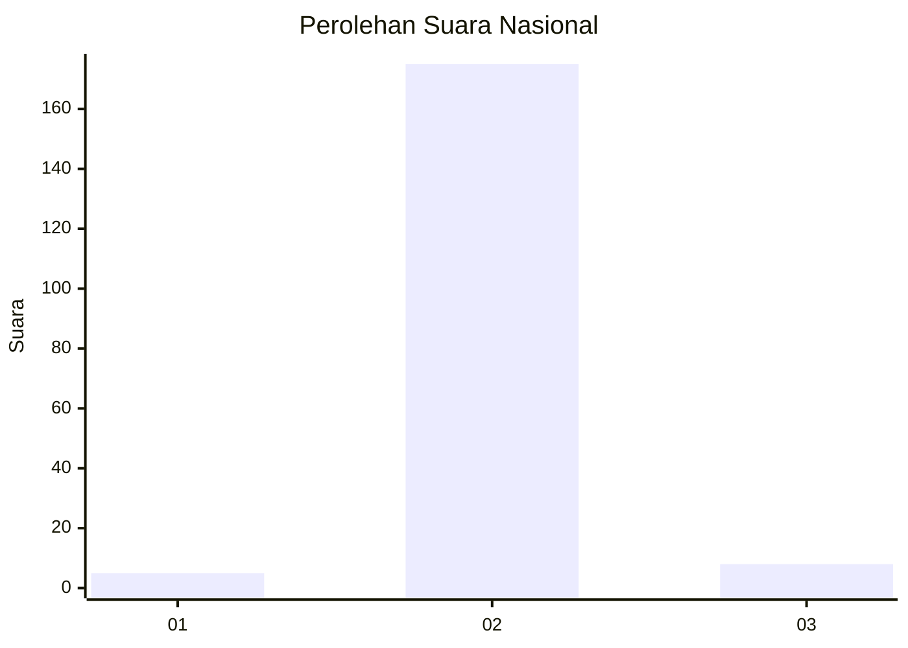
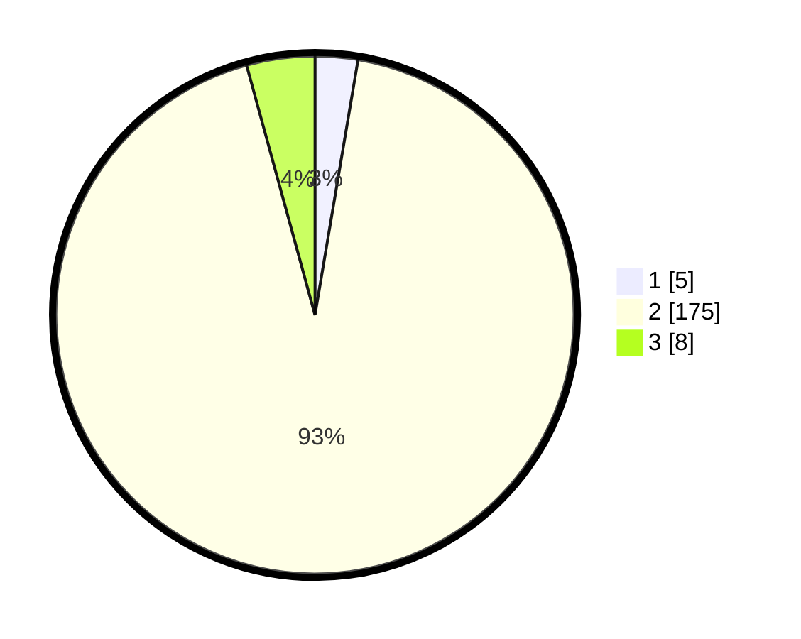

# Hasil

## Grafik

## Tabel

| No. | Nama Paslon    | Suara | Suara (raw) | Persentase |
|:--- |:-------------- | -----:| -----------:| ----------:|
| 1   | ANIES MUHAIMIN | 5     | [5][p-1]    | 2,66       |
| 2   | PRABOWO GIBRAN | 175   | [175][p-2]  | 93,09      |
| 3   | GANJAR MAHFUD  | 8     | [8][p-3]    | 4,26       |

[p-1]: https://github.com/gigit-pemilu/pemilu-2024/blob/main/pilpres/hitung-suara/sub/53-nusa-tenggara-timur/sub/19-manggarai-timur/sub/07-rana-mese/sub/2001-bea-ngencung/sub/004-tps/sub/paslon-1.txt
[p-2]: https://github.com/gigit-pemilu/pemilu-2024/blob/main/pilpres/hitung-suara/sub/53-nusa-tenggara-timur/sub/19-manggarai-timur/sub/07-rana-mese/sub/2001-bea-ngencung/sub/004-tps/sub/paslon-2.txt
[p-3]: https://github.com/gigit-pemilu/pemilu-2024/blob/main/pilpres/hitung-suara/sub/53-nusa-tenggara-timur/sub/19-manggarai-timur/sub/07-rana-mese/sub/2001-bea-ngencung/sub/004-tps/sub/paslon-3.txt

## Foto C Plano

https://sirekap-obj-formc.kpu.go.id/0c3c/pemilu/ppwp/53/19/07/20/01/5319072001004-20240215-104107--b6167309-8a88-4d73-8826-e45fb0d263c2.jpg

https://sirekap-obj-formc.kpu.go.id/0c3c/pemilu/ppwp/53/19/07/20/01/5319072001004-20240215-152336--7074f260-a7be-43ab-8c2e-be0f9585a915.jpg

https://sirekap-obj-formc.kpu.go.id/0c3c/pemilu/ppwp/53/19/07/20/01/5319072001004-20240215-104408--bf2d7d4c-0721-46a4-a1fa-0ae4dafaacc2.jpg

## Metadata

| Key        | Value               |
| ---------- | ------------------- |
| Time Stamp | 2024-02-16 13:00:29 |

