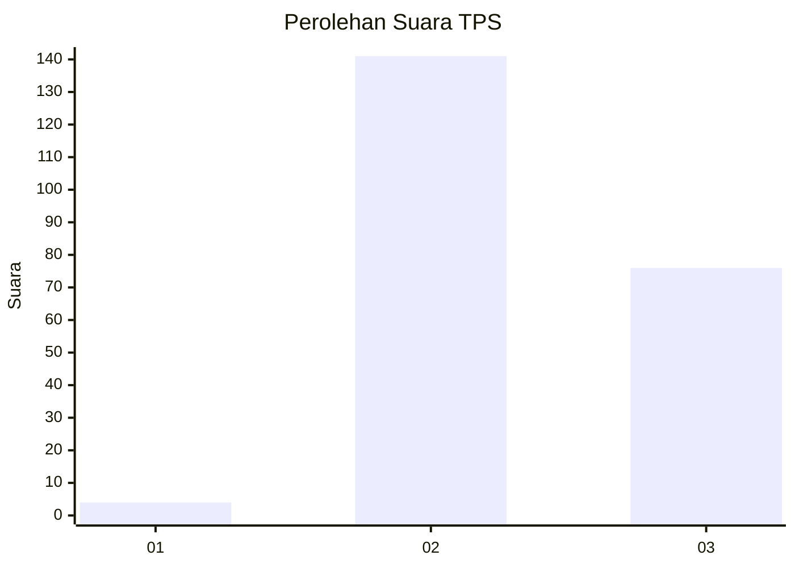
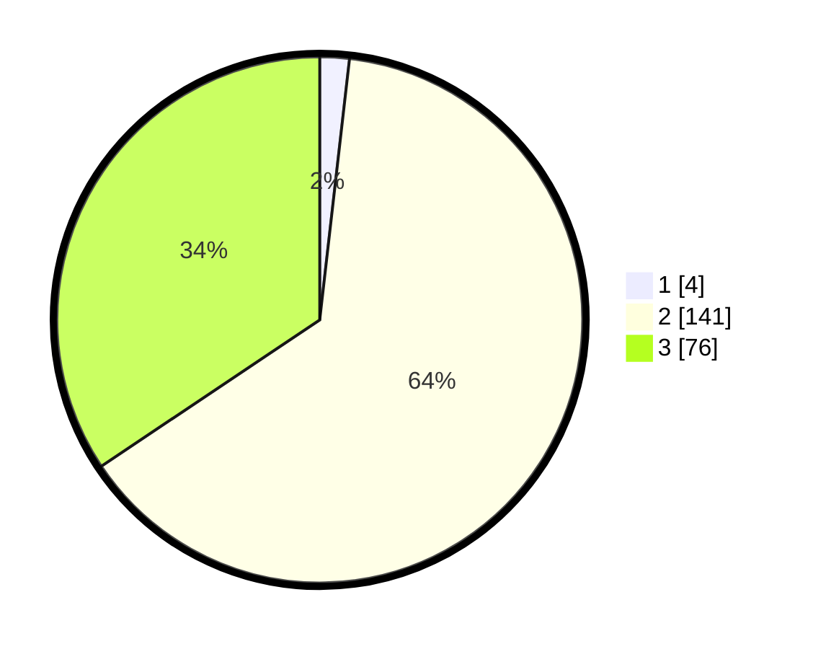

# Hasil

## Grafik

## Tabel

| No. | Nama Paslon    | Suara | Suara (raw) | Persentase |
|:--- |:-------------- | -----:| -----------:| ----------:|
| 1   | ANIES MUHAIMIN | 4     | [4][p-1]    | 1,81       |
| 2   | PRABOWO GIBRAN | 141   | [141][p-2]  | 63,80      |
| 3   | GANJAR MAHFUD  | 76    | [76][p-3]   | 34,39      |

[p-1]: https://github.com/gigit-pemilu/pemilu-2024-53-nusa-tenggara-timur/blob/main/pilpres/hitung-suara/sub/53-nusa-tenggara-timur/sub/19-manggarai-timur/sub/08-lamba-leda-timur/sub/2002-arus/sub/001-tps/sub/paslon-1.txt
[p-2]: https://github.com/gigit-pemilu/pemilu-2024-53-nusa-tenggara-timur/blob/main/pilpres/hitung-suara/sub/53-nusa-tenggara-timur/sub/19-manggarai-timur/sub/08-lamba-leda-timur/sub/2002-arus/sub/001-tps/sub/paslon-2.txt
[p-3]: https://github.com/gigit-pemilu/pemilu-2024-53-nusa-tenggara-timur/blob/main/pilpres/hitung-suara/sub/53-nusa-tenggara-timur/sub/19-manggarai-timur/sub/08-lamba-leda-timur/sub/2002-arus/sub/001-tps/sub/paslon-3.txt

## Foto C Plano

https://sirekap-obj-formc.kpu.go.id/c6ca/pemilu/ppwp/53/19/08/20/02/5319082002001-20240215-125006--7165919e-0088-4c50-935d-1d0ea8f08361.jpg

https://sirekap-obj-formc.kpu.go.id/c6ca/pemilu/ppwp/53/19/08/20/02/5319082002001-20240215-125112--159c7bef-c219-4768-958a-40949733169d.jpg

https://sirekap-obj-formc.kpu.go.id/c6ca/pemilu/ppwp/53/19/08/20/02/5319082002001-20240215-125230--3d3c0d9a-2dfb-4fd7-b801-ae944950f641.jpg

## Metadata

| Key        | Value               |
| ---------- | ------------------- |
| Time Stamp | 2024-02-16 12:51:22 |

