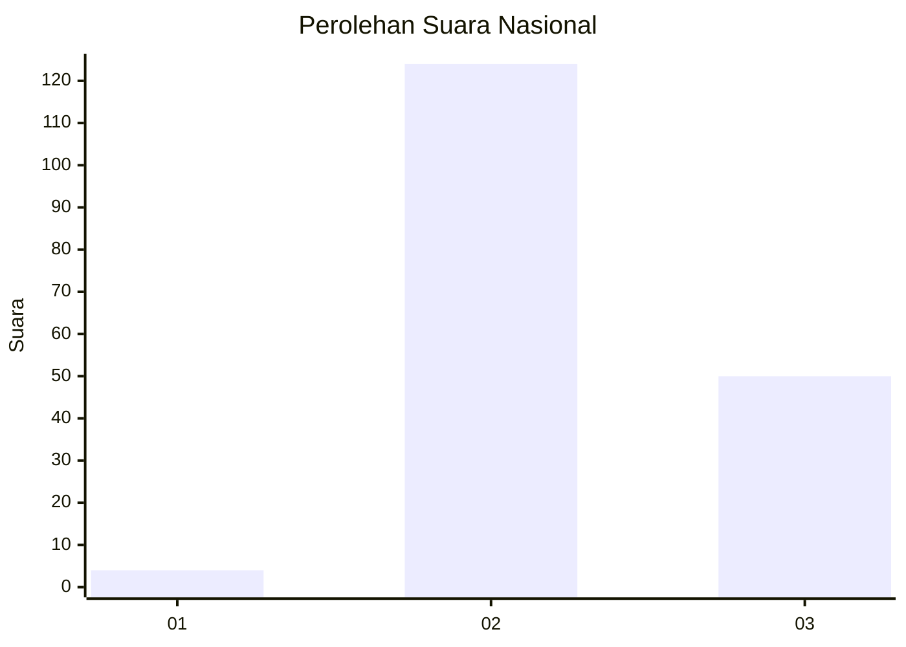
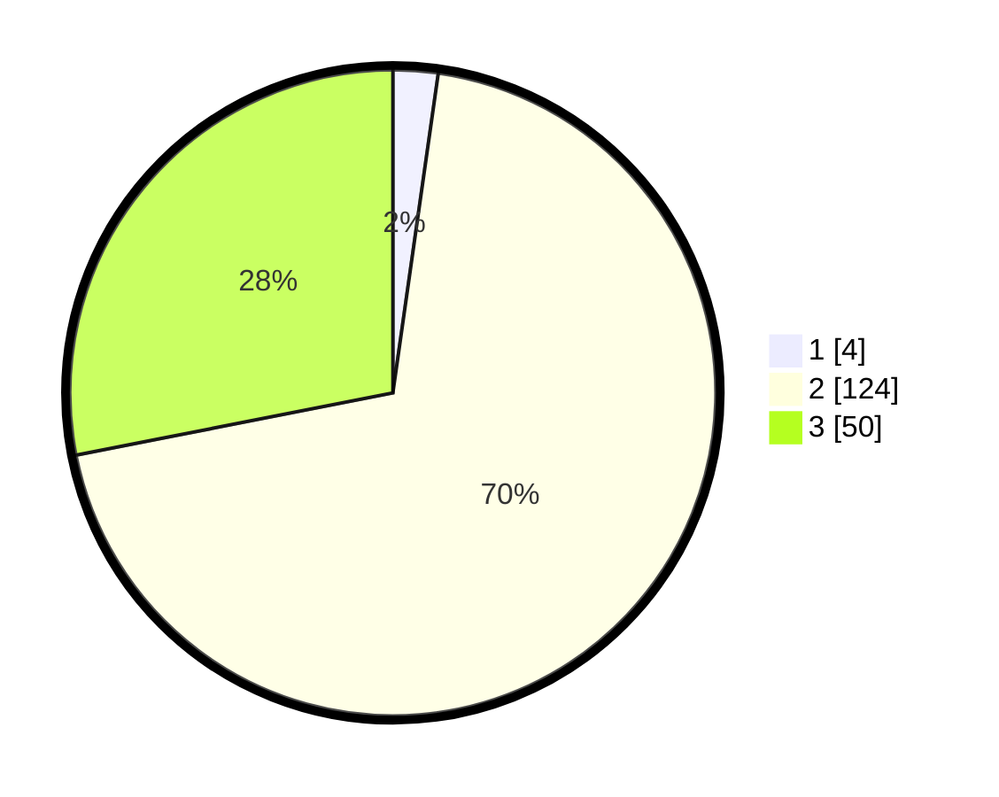

# Hasil

## Grafik

## Tabel

| No. | Nama Paslon    | Suara | Suara (raw) | Persentase |
|:--- |:-------------- | -----:| -----------:| ----------:|
| 1   | ANIES MUHAIMIN | 4     | [4][p-1]    | 2,25       |
| 2   | PRABOWO GIBRAN | 124   | [124][p-2]  | 69,66      |
| 3   | GANJAR MAHFUD  | 50    | [50][p-3]   | 28,09      |

[p-1]: https://github.com/gigit-pemilu/pemilu-2024/blob/main/pilpres/hitung-suara/sub/53-nusa-tenggara-timur/sub/19-manggarai-timur/sub/10-kota-komba-utara/sub/2001-golo-tolang/sub/001-tps/sub/paslon-1.txt
[p-2]: https://github.com/gigit-pemilu/pemilu-2024/blob/main/pilpres/hitung-suara/sub/53-nusa-tenggara-timur/sub/19-manggarai-timur/sub/10-kota-komba-utara/sub/2001-golo-tolang/sub/001-tps/sub/paslon-2.txt
[p-3]: https://github.com/gigit-pemilu/pemilu-2024/blob/main/pilpres/hitung-suara/sub/53-nusa-tenggara-timur/sub/19-manggarai-timur/sub/10-kota-komba-utara/sub/2001-golo-tolang/sub/001-tps/sub/paslon-3.txt

## Foto C Plano

https://sirekap-obj-formc.kpu.go.id/6f29/pemilu/ppwp/53/19/10/20/01/5319102001001-20240220-111600--74330b36-3b38-43c3-9fc0-fe290a86c426.jpg

https://sirekap-obj-formc.kpu.go.id/6f29/pemilu/ppwp/53/19/10/20/01/5319102001001-20240220-111708--37e0c1ad-4209-4fc5-84a8-9bf5d5328547.jpg

https://sirekap-obj-formc.kpu.go.id/6f29/pemilu/ppwp/53/19/10/20/01/5319102001001-20240220-111804--514d49b0-7957-470f-b4c9-f83b4018dd0a.jpg

## Metadata

| Key        | Value               |
| ---------- | ------------------- |
| Time Stamp | 2024-02-25 12:00:00 |

