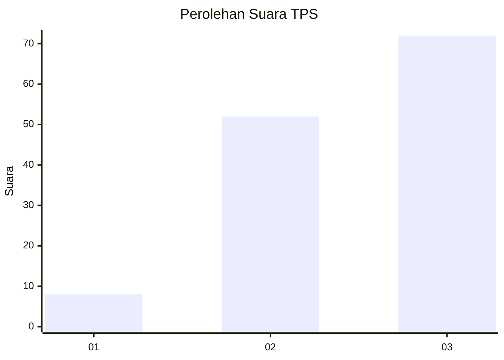
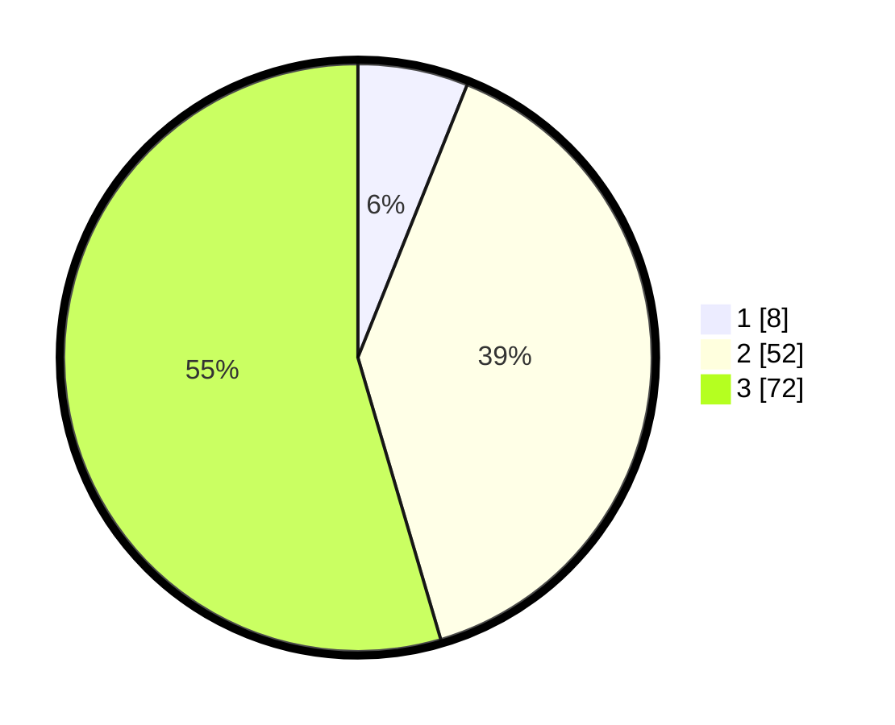

# Hasil

## Grafik

## Tabel

| No. | Nama Paslon    | Suara | Suara (raw) | Persentase |
|:--- |:-------------- | -----:| -----------:| ----------:|
| 1   | ANIES MUHAIMIN | 8     | [8][p-1]    | 6,06       |
| 2   | PRABOWO GIBRAN | 52    | [52][p-2]   | 39,39      |
| 3   | GANJAR MAHFUD  | 72    | [72][p-3]   | 54,55      |

[p-1]: https://github.com/gigit-pemilu/pemilu-2024-53-nusa-tenggara-timur/blob/main/pilpres/hitung-suara/sub/53-nusa-tenggara-timur/sub/19-manggarai-timur/sub/11-lamba-leda-utara/sub/2001-satar-padut/sub/004-tps/sub/paslon-1.txt
[p-2]: https://github.com/gigit-pemilu/pemilu-2024-53-nusa-tenggara-timur/blob/main/pilpres/hitung-suara/sub/53-nusa-tenggara-timur/sub/19-manggarai-timur/sub/11-lamba-leda-utara/sub/2001-satar-padut/sub/004-tps/sub/paslon-2.txt
[p-3]: https://github.com/gigit-pemilu/pemilu-2024-53-nusa-tenggara-timur/blob/main/pilpres/hitung-suara/sub/53-nusa-tenggara-timur/sub/19-manggarai-timur/sub/11-lamba-leda-utara/sub/2001-satar-padut/sub/004-tps/sub/paslon-3.txt

## Foto C Plano

https://sirekap-obj-formc.kpu.go.id/daba/pemilu/ppwp/53/19/11/20/01/5319112001004-20240215-131522--6d61879b-f06a-4533-9ed5-983e5f258b5f.jpg

https://sirekap-obj-formc.kpu.go.id/daba/pemilu/ppwp/53/19/11/20/01/5319112001004-20240215-131701--c5bd63c2-b380-43cd-9171-c245f96c74cb.jpg

https://sirekap-obj-formc.kpu.go.id/daba/pemilu/ppwp/53/19/11/20/01/5319112001004-20240215-131914--7cc8ddeb-227b-438b-b3bd-44d03a421380.jpg

## Metadata

| Key        | Value               |
| ---------- | ------------------- |
| Time Stamp | 2024-02-25 19:00:00 |

