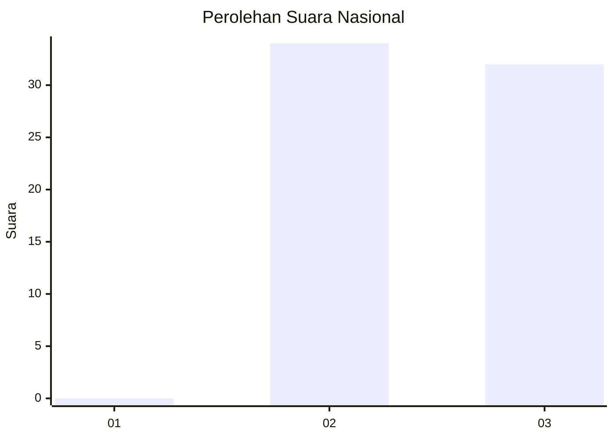
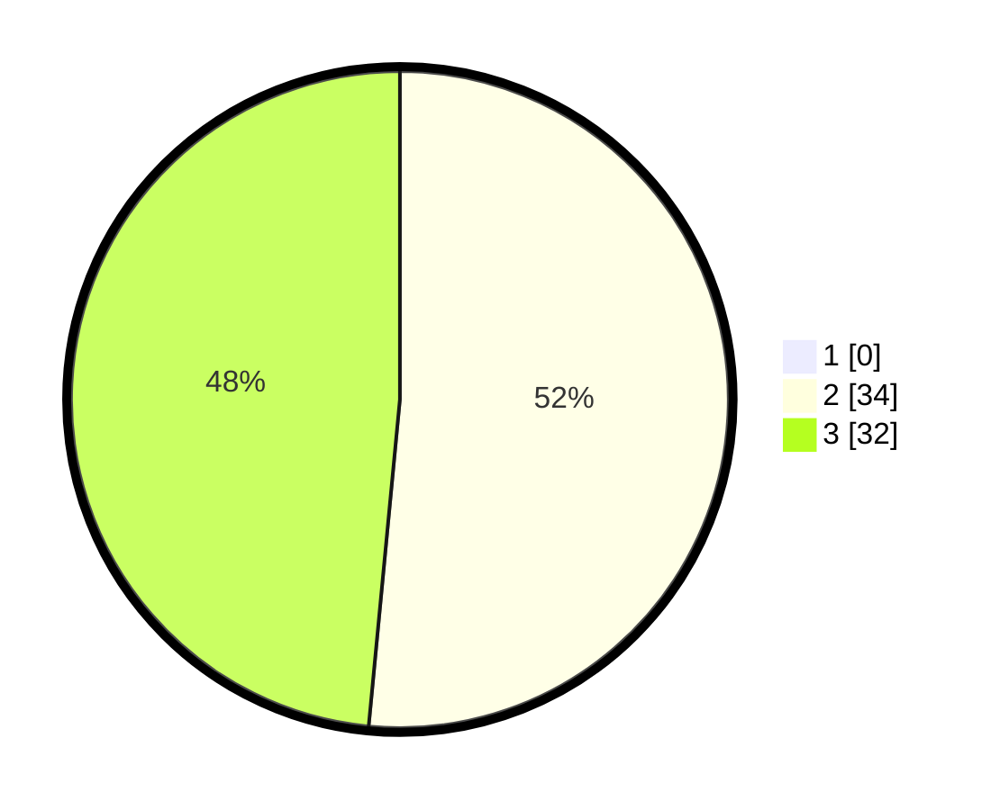

# Hasil

## Grafik

## Tabel

| No. | Nama Paslon    | Suara | Suara (raw) | Persentase |
|:--- |:-------------- | -----:| -----------:| ----------:|
| 1   | ANIES MUHAIMIN | 0     | [0][p-1]    | 0,00       |
| 2   | PRABOWO GIBRAN | 34    | [34][p-2]   | 51,52      |
| 3   | GANJAR MAHFUD  | 32    | [32][p-3]   | 48,48      |

[p-1]: https://github.com/gigit-pemilu/pemilu-2024/blob/main/pilpres/hitung-suara/sub/53-nusa-tenggara-timur/sub/19-manggarai-timur/sub/11-lamba-leda-utara/sub/2003-nampar-tabang/sub/005-tps/sub/paslon-1.txt
[p-2]: https://github.com/gigit-pemilu/pemilu-2024/blob/main/pilpres/hitung-suara/sub/53-nusa-tenggara-timur/sub/19-manggarai-timur/sub/11-lamba-leda-utara/sub/2003-nampar-tabang/sub/005-tps/sub/paslon-2.txt
[p-3]: https://github.com/gigit-pemilu/pemilu-2024/blob/main/pilpres/hitung-suara/sub/53-nusa-tenggara-timur/sub/19-manggarai-timur/sub/11-lamba-leda-utara/sub/2003-nampar-tabang/sub/005-tps/sub/paslon-3.txt

## Foto C Plano

https://sirekap-obj-formc.kpu.go.id/5192/pemilu/ppwp/53/19/11/20/03/5319112003005-20240215-071629--7d72b548-c63c-4f89-8951-f6ff273187d1.jpg

https://sirekap-obj-formc.kpu.go.id/5192/pemilu/ppwp/53/19/11/20/03/5319112003005-20240215-071512--ed3c02a5-145b-4639-a724-311fab47c97b.jpg

https://sirekap-obj-formc.kpu.go.id/5192/pemilu/ppwp/53/19/11/20/03/5319112003005-20240215-071900--e947e894-8cc7-4e73-923f-80627c1731cf.jpg

## Metadata

| Key        | Value               |
| ---------- | ------------------- |
| Time Stamp | 2024-02-16 16:25:10 |

