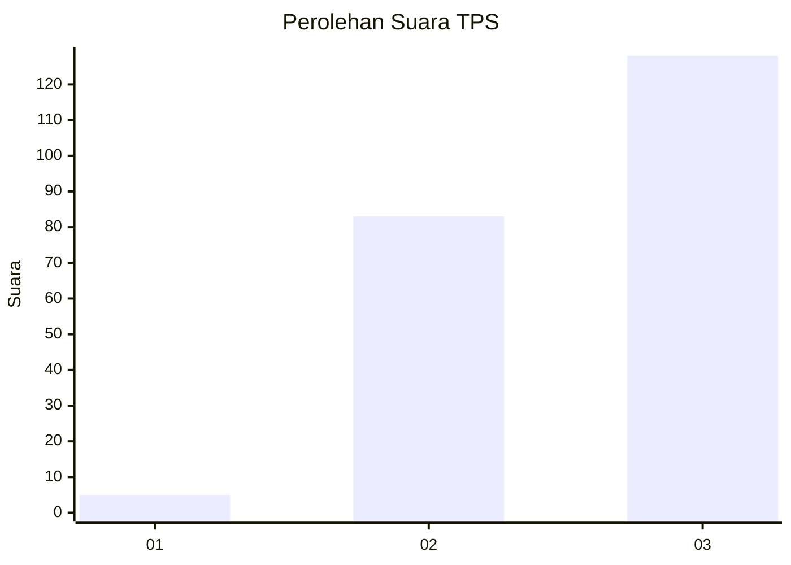
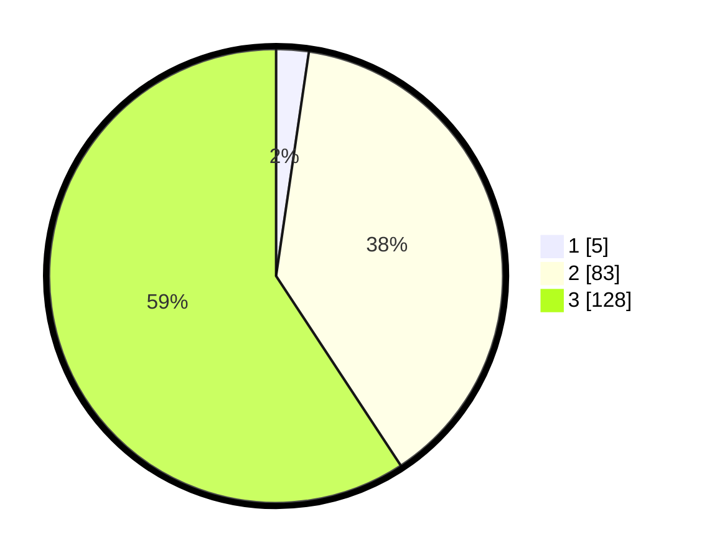

# Hasil

## Grafik

## Tabel

| No. | Nama Paslon    | Suara | Suara (raw) | Persentase |
|:--- |:-------------- | -----:| -----------:| ----------:|
| 1   | ANIES MUHAIMIN | 5     | [5][p-1]    | 2,31       |
| 2   | PRABOWO GIBRAN | 83    | [83][p-2]   | 38,43      |
| 3   | GANJAR MAHFUD  | 128   | [128][p-3]  | 59,26      |

[p-1]: https://github.com/gigit-pemilu/pemilu-2024-53-nusa-tenggara-timur/blob/main/pilpres/hitung-suara/sub/53-nusa-tenggara-timur/sub/19-manggarai-timur/sub/12-congkar/sub/1001-golo-wangkung/sub/003-tps/sub/paslon-1.txt
[p-2]: https://github.com/gigit-pemilu/pemilu-2024-53-nusa-tenggara-timur/blob/main/pilpres/hitung-suara/sub/53-nusa-tenggara-timur/sub/19-manggarai-timur/sub/12-congkar/sub/1001-golo-wangkung/sub/003-tps/sub/paslon-2.txt
[p-3]: https://github.com/gigit-pemilu/pemilu-2024-53-nusa-tenggara-timur/blob/main/pilpres/hitung-suara/sub/53-nusa-tenggara-timur/sub/19-manggarai-timur/sub/12-congkar/sub/1001-golo-wangkung/sub/003-tps/sub/paslon-3.txt

## Foto C Plano

https://sirekap-obj-formc.kpu.go.id/463e/pemilu/ppwp/53/19/12/10/01/5319121001003-20240221-110351--43a9dd53-d44a-4484-917d-ecb01394c108.jpg

https://sirekap-obj-formc.kpu.go.id/463e/pemilu/ppwp/53/19/12/10/01/5319121001003-20240221-110523--7332f528-93bb-4b57-821c-05784c51d0a8.jpg

https://sirekap-obj-formc.kpu.go.id/463e/pemilu/ppwp/53/19/12/10/01/5319121001003-20240221-110612--f3a61cf4-954c-4cda-b1ba-5065778f27e1.jpg

## Metadata

| Key        | Value               |
| ---------- | ------------------- |
| Time Stamp | 2024-02-24 22:31:28 |

