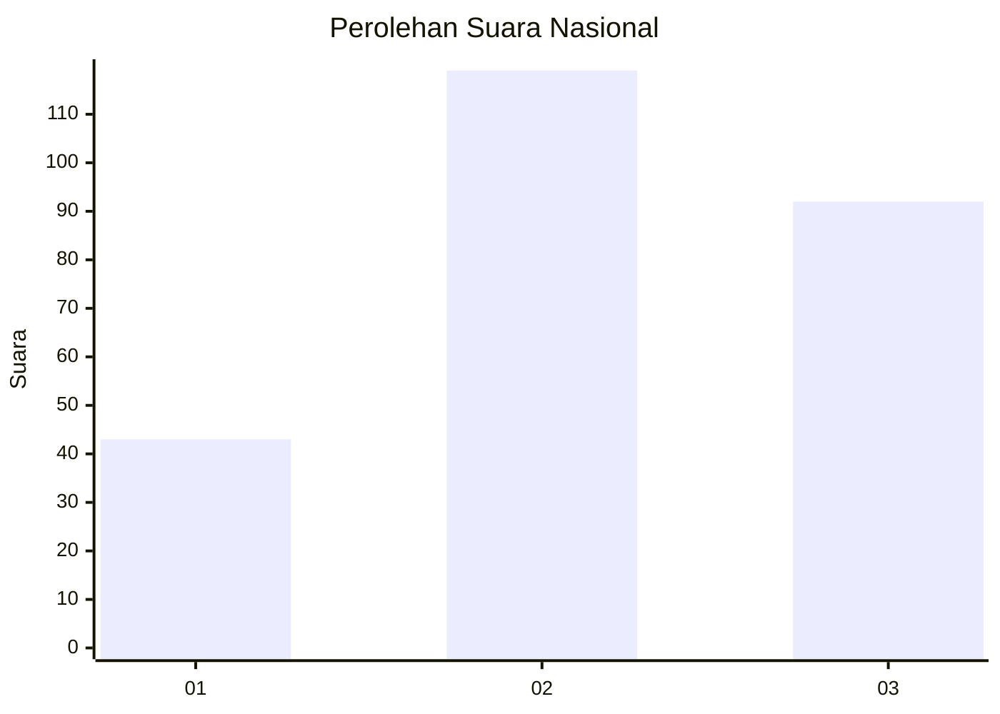
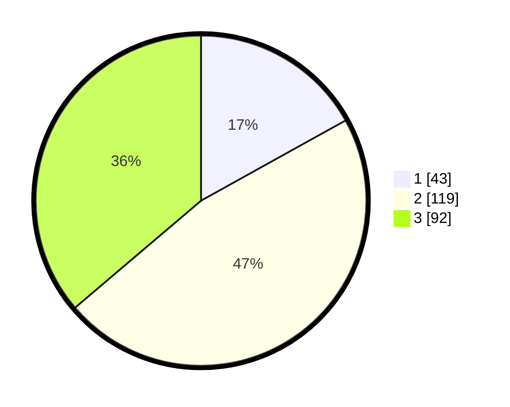

# Hasil

## Grafik

## Tabel

| No. | Nama Paslon    | Suara | Suara (raw) | Persentase |
|:--- |:-------------- | -----:| -----------:| ----------:|
| 1   | ANIES MUHAIMIN | 43    | [43][p-1]   | 16,93      |
| 2   | PRABOWO GIBRAN | 119   | [119][p-2]  | 46,85      |
| 3   | GANJAR MAHFUD  | 92    | [92][p-3]   | 36,22      |

[p-1]: https://github.com/gigit-pemilu/pemilu-2024/blob/main/pilpres/hitung-suara/sub/53-nusa-tenggara-timur/sub/19-manggarai-timur/sub/12-congkar/sub/1001-golo-wangkung/sub/004-tps/sub/paslon-1.txt
[p-2]: https://github.com/gigit-pemilu/pemilu-2024/blob/main/pilpres/hitung-suara/sub/53-nusa-tenggara-timur/sub/19-manggarai-timur/sub/12-congkar/sub/1001-golo-wangkung/sub/004-tps/sub/paslon-2.txt
[p-3]: https://github.com/gigit-pemilu/pemilu-2024/blob/main/pilpres/hitung-suara/sub/53-nusa-tenggara-timur/sub/19-manggarai-timur/sub/12-congkar/sub/1001-golo-wangkung/sub/004-tps/sub/paslon-3.txt

## Foto C Plano

https://sirekap-obj-formc.kpu.go.id/48be/pemilu/ppwp/53/19/12/10/01/5319121001004-20240215-083353--fb261353-6180-4a81-b15f-751897d10657.jpg

https://sirekap-obj-formc.kpu.go.id/48be/pemilu/ppwp/53/19/12/10/01/5319121001004-20240215-083939--877216df-93db-4536-9657-6aae4b353f50.jpg

https://sirekap-obj-formc.kpu.go.id/48be/pemilu/ppwp/53/19/12/10/01/5319121001004-20240215-084212--afcd1cfd-5e88-478e-8d89-49d5ba63b011.jpg

## Metadata

| Key        | Value               |
| ---------- | ------------------- |
| Time Stamp | 2024-02-15 16:00:26 |

