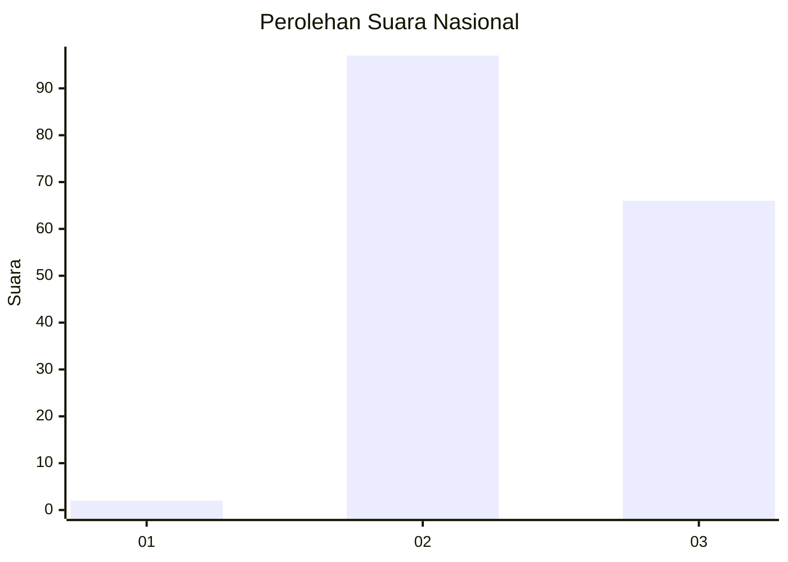
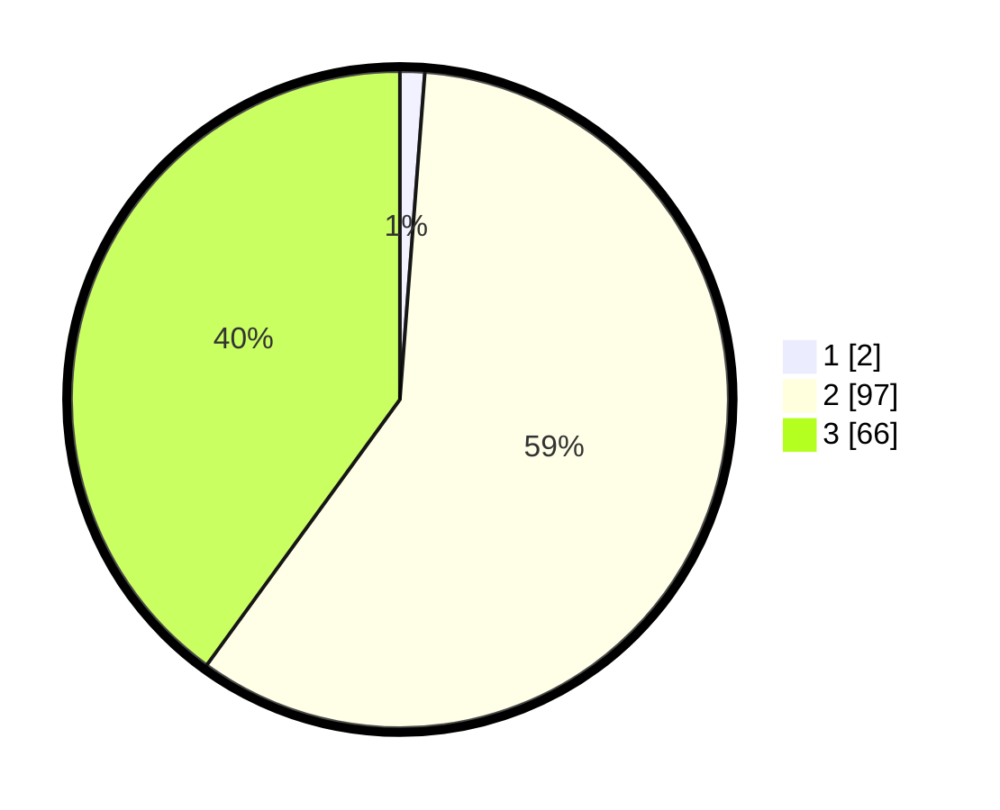

# Hasil

## Grafik

## Tabel

| No. | Nama Paslon    | Suara | Suara (raw) | Persentase |
|:--- |:-------------- | -----:| -----------:| ----------:|
| 1   | ANIES MUHAIMIN | 2     | [2][p-1]    | 1,21       |
| 2   | PRABOWO GIBRAN | 97    | [97][p-2]   | 58,79      |
| 3   | GANJAR MAHFUD  | 66    | [66][p-3]   | 40,00      |

[p-1]: https://github.com/gigit-pemilu/pemilu-2024/blob/main/pilpres/hitung-suara/sub/53-nusa-tenggara-timur/sub/19-manggarai-timur/sub/12-congkar/sub/1001-golo-wangkung/sub/005-tps/sub/paslon-1.txt
[p-2]: https://github.com/gigit-pemilu/pemilu-2024/blob/main/pilpres/hitung-suara/sub/53-nusa-tenggara-timur/sub/19-manggarai-timur/sub/12-congkar/sub/1001-golo-wangkung/sub/005-tps/sub/paslon-2.txt
[p-3]: https://github.com/gigit-pemilu/pemilu-2024/blob/main/pilpres/hitung-suara/sub/53-nusa-tenggara-timur/sub/19-manggarai-timur/sub/12-congkar/sub/1001-golo-wangkung/sub/005-tps/sub/paslon-3.txt

## Foto C Plano

https://sirekap-obj-formc.kpu.go.id/c32a/pemilu/ppwp/53/19/12/10/01/5319121001005-20240221-111314--81927fe2-032b-47df-9189-1989801a9810.jpg

https://sirekap-obj-formc.kpu.go.id/c32a/pemilu/ppwp/53/19/12/10/01/5319121001005-20240221-111408--abbc3039-3742-4047-94ca-54a99d1a6206.jpg

https://sirekap-obj-formc.kpu.go.id/c32a/pemilu/ppwp/53/19/12/10/01/5319121001005-20240221-111459--392d9e65-d02a-4785-9846-88a6496c766a.jpg

## Metadata

| Key        | Value               |
| ---------- | ------------------- |
| Time Stamp | 2024-02-24 22:31:28 |

