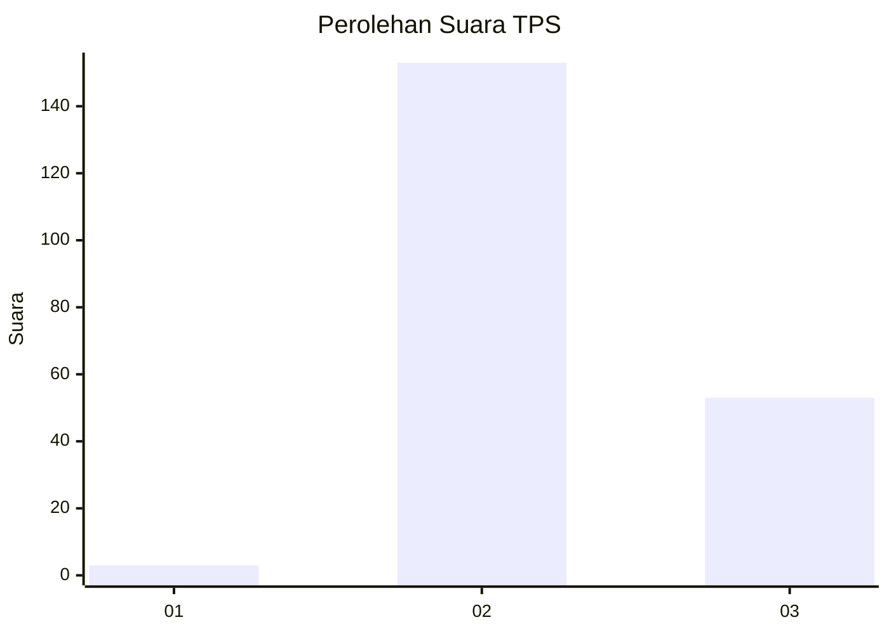
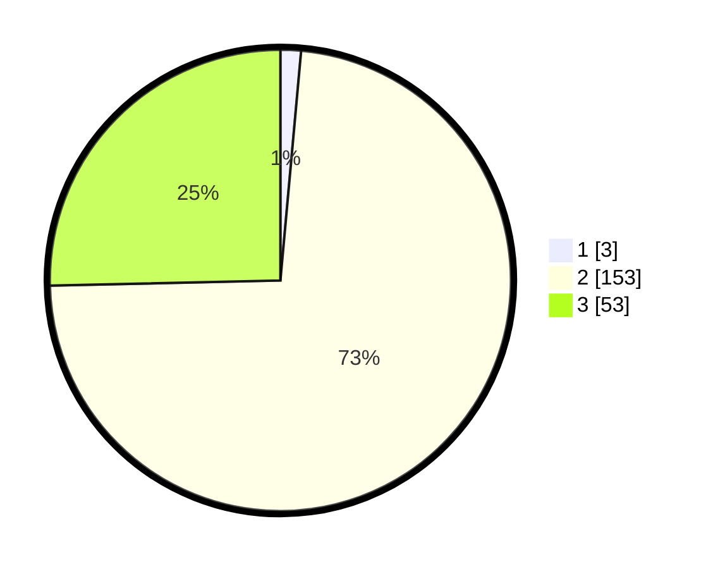

# Hasil

## Grafik

## Tabel

| No. | Nama Paslon    | Suara | Suara (raw) | Persentase |
|:--- |:-------------- | -----:| -----------:| ----------:|
| 1   | ANIES MUHAIMIN | 3     | [3][p-1]    | 1,44       |
| 2   | PRABOWO GIBRAN | 153   | [153][p-2]  | 73,21      |
| 3   | GANJAR MAHFUD  | 53    | [53][p-3]   | 25,36      |

[p-1]: https://github.com/gigit-pemilu/pemilu-2024-53-nusa-tenggara-timur/blob/main/pilpres/hitung-suara/sub/53-nusa-tenggara-timur/sub/20-sabu-raijua/sub/01-sabu-barat/sub/1001-mebba/sub/001-tps/sub/paslon-1.txt
[p-2]: https://github.com/gigit-pemilu/pemilu-2024-53-nusa-tenggara-timur/blob/main/pilpres/hitung-suara/sub/53-nusa-tenggara-timur/sub/20-sabu-raijua/sub/01-sabu-barat/sub/1001-mebba/sub/001-tps/sub/paslon-2.txt
[p-3]: https://github.com/gigit-pemilu/pemilu-2024-53-nusa-tenggara-timur/blob/main/pilpres/hitung-suara/sub/53-nusa-tenggara-timur/sub/20-sabu-raijua/sub/01-sabu-barat/sub/1001-mebba/sub/001-tps/sub/paslon-3.txt

## Foto C Plano

https://sirekap-obj-formc.kpu.go.id/1e00/pemilu/ppwp/53/20/01/10/01/5320011001001-20240215-071549--4a81f010-8915-40b2-8751-d6207612b3f2.jpg

https://sirekap-obj-formc.kpu.go.id/1e00/pemilu/ppwp/53/20/01/10/01/5320011001001-20240215-071834--6ce25031-93b6-44d5-b0f6-a3ec8823abb1.jpg

https://sirekap-obj-formc.kpu.go.id/1e00/pemilu/ppwp/53/20/01/10/01/5320011001001-20240215-072026--4272db30-97c1-4b30-9795-8620de0673c7.jpg

## Metadata

| Key        | Value               |
| ---------- | ------------------- |
| Time Stamp | 2024-02-24 23:00:00 |

