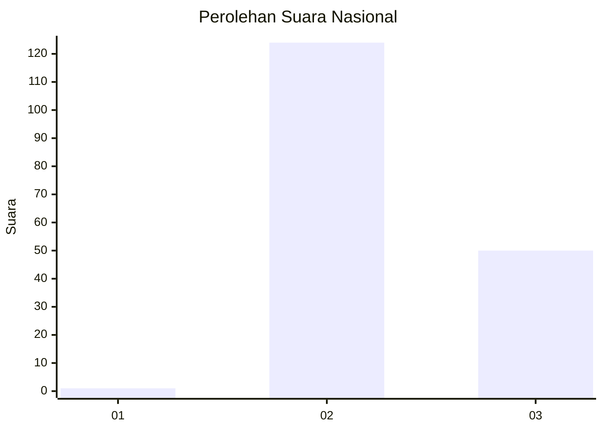
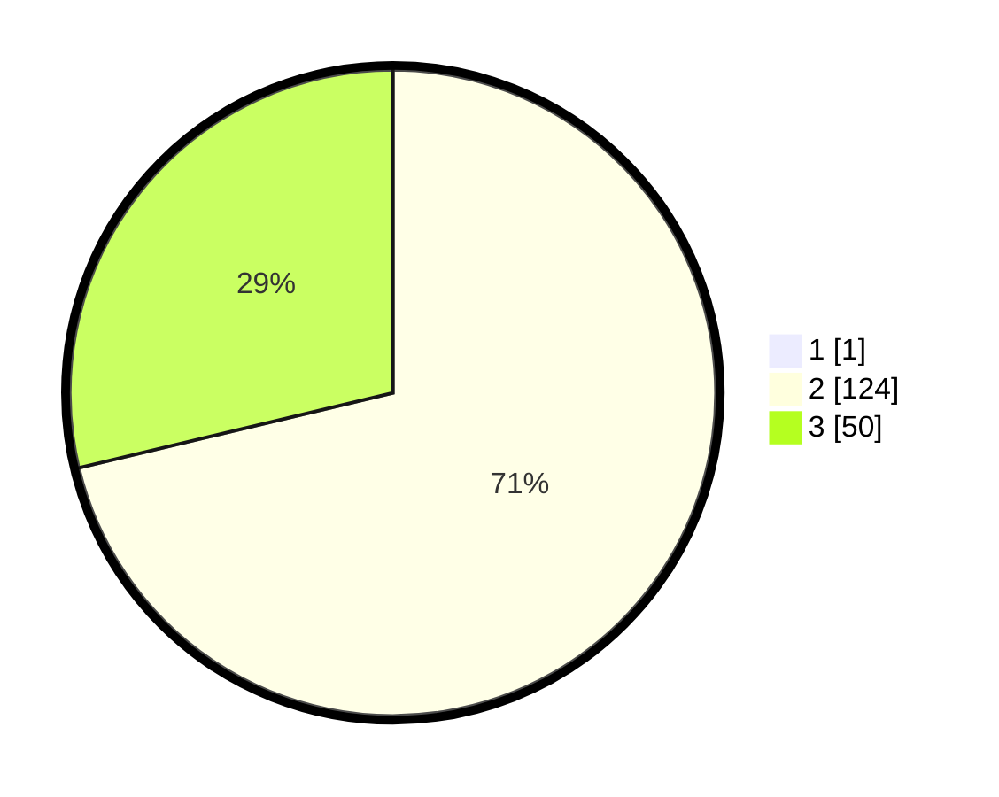

# Hasil

## Grafik

## Tabel

| No. | Nama Paslon    | Suara | Suara (raw) | Persentase |
|:--- |:-------------- | -----:| -----------:| ----------:|
| 1   | ANIES MUHAIMIN | 1     | [1][p-1]    | 0,57       |
| 2   | PRABOWO GIBRAN | 124   | [124][p-2]  | 70,86      |
| 3   | GANJAR MAHFUD  | 50    | [50][p-3]   | 28,57      |

[p-1]: https://github.com/gigit-pemilu/pemilu-2024/blob/main/pilpres/hitung-suara/sub/53-nusa-tenggara-timur/sub/20-sabu-raijua/sub/01-sabu-barat/sub/1001-mebba/sub/002-tps/sub/paslon-1.txt
[p-2]: https://github.com/gigit-pemilu/pemilu-2024/blob/main/pilpres/hitung-suara/sub/53-nusa-tenggara-timur/sub/20-sabu-raijua/sub/01-sabu-barat/sub/1001-mebba/sub/002-tps/sub/paslon-2.txt
[p-3]: https://github.com/gigit-pemilu/pemilu-2024/blob/main/pilpres/hitung-suara/sub/53-nusa-tenggara-timur/sub/20-sabu-raijua/sub/01-sabu-barat/sub/1001-mebba/sub/002-tps/sub/paslon-3.txt

## Foto C Plano

https://sirekap-obj-formc.kpu.go.id/6795/pemilu/ppwp/53/20/01/10/01/5320011001002-20240222-095917--7f507b62-68d9-4c4a-b2fc-9fd286075a37.jpg

https://sirekap-obj-formc.kpu.go.id/6795/pemilu/ppwp/53/20/01/10/01/5320011001002-20240222-100051--e696529f-9fb0-40f0-9bf1-f24377b13a9c.jpg

https://sirekap-obj-formc.kpu.go.id/6795/pemilu/ppwp/53/20/01/10/01/5320011001002-20240222-100157--75344c85-cf00-48d7-8469-aecffb8b2f8d.jpg

## Metadata

| Key        | Value               |
| ---------- | ------------------- |
| Time Stamp | 2024-02-22 11:00:00 |

## DATA PEMILIH TETAP

Jumlah pemilih dalam DPT: **221**.
 * L: **109**.
 * P: **112**.

## DATA PENGGUNA HAK PILIH

Jumlah pengguna hak pilih dalam DPT: **766**.
 * L: **84**.
 * P: **882**.

Jumlah pengguna hak pilih dalam DPTb: **4**.
 * L: **6**.
 * P: **83**.

Jumlah pengguna hak pilih dalam DPK: **3**.
 * L: **2**.
 * P: **81**.

Jumlah pengguna hak pilih: **178**.
 * L: **892**.
 * P: **86**.

## JUMLAH SUARA SAH DAN TIDAK SAH

JUMLAH SELURUH SUARA SAH: **175**.

JUMLAH SUARA TIDAK SAH: **3**.

JUMLAH SELURUH SUARA SAH DAN SUARA TIDAK SAH: **178**.

