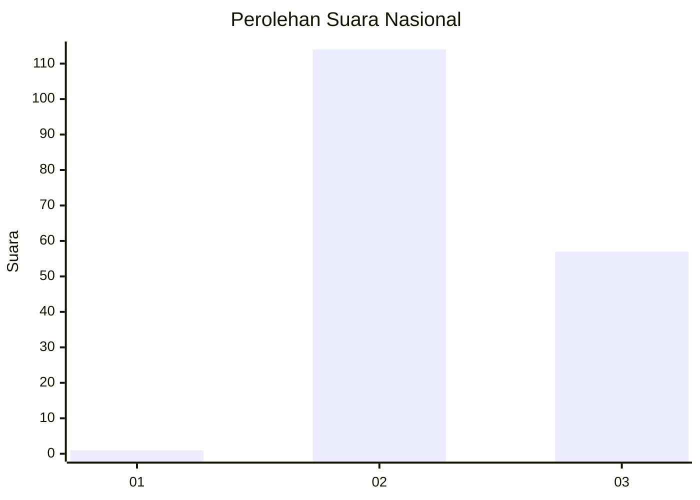
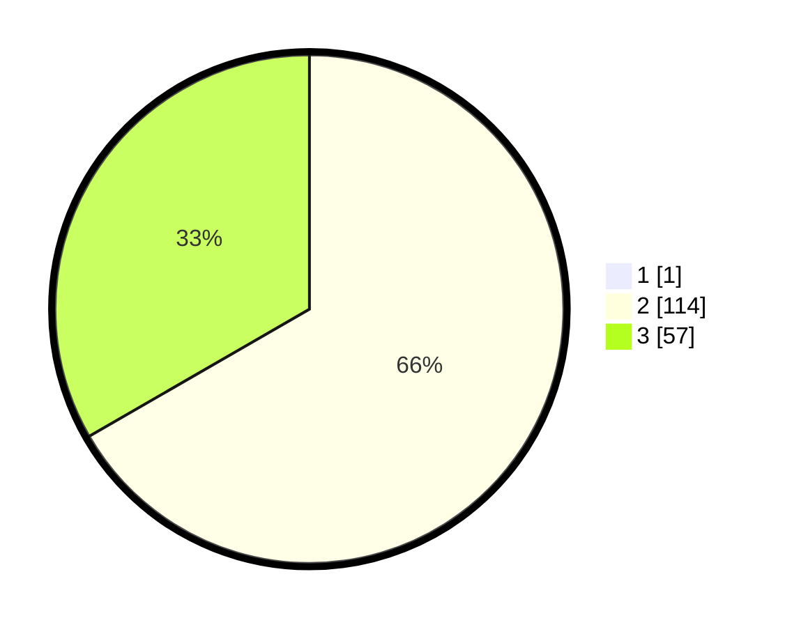

# Hasil

## Grafik

## Tabel

| No. | Nama Paslon    | Suara | Suara (raw) | Persentase |
|:--- |:-------------- | -----:| -----------:| ----------:|
| 1   | ANIES MUHAIMIN | 1     | [1][p-1]    | 0,58       |
| 2   | PRABOWO GIBRAN | 114   | [114][p-2]  | 66,28      |
| 3   | GANJAR MAHFUD  | 57    | [57][p-3]   | 33,14      |

[p-1]: https://github.com/gigit-pemilu/pemilu-2024/blob/main/pilpres/hitung-suara/sub/53-nusa-tenggara-timur/sub/20-sabu-raijua/sub/01-sabu-barat/sub/1001-mebba/sub/005-tps/sub/paslon-1.txt
[p-2]: https://github.com/gigit-pemilu/pemilu-2024/blob/main/pilpres/hitung-suara/sub/53-nusa-tenggara-timur/sub/20-sabu-raijua/sub/01-sabu-barat/sub/1001-mebba/sub/005-tps/sub/paslon-2.txt
[p-3]: https://github.com/gigit-pemilu/pemilu-2024/blob/main/pilpres/hitung-suara/sub/53-nusa-tenggara-timur/sub/20-sabu-raijua/sub/01-sabu-barat/sub/1001-mebba/sub/005-tps/sub/paslon-3.txt

## Foto C Plano

https://sirekap-obj-formc.kpu.go.id/ac60/pemilu/ppwp/53/20/01/10/01/5320011001005-20240215-090258--bc714271-0b5a-4f10-a9a1-7afb0e66b5a5.jpg

https://sirekap-obj-formc.kpu.go.id/ac60/pemilu/ppwp/53/20/01/10/01/5320011001005-20240215-090740--ab82cf29-5af5-4fcf-afe7-df3602e82cde.jpg

https://sirekap-obj-formc.kpu.go.id/ac60/pemilu/ppwp/53/20/01/10/01/5320011001005-20240215-090255--0f09f025-743e-45e0-82cf-aeb91d0e526d.jpg

## Metadata

| Key        | Value               |
| ---------- | ------------------- |
| Time Stamp | 2024-02-15 22:00:27 |

