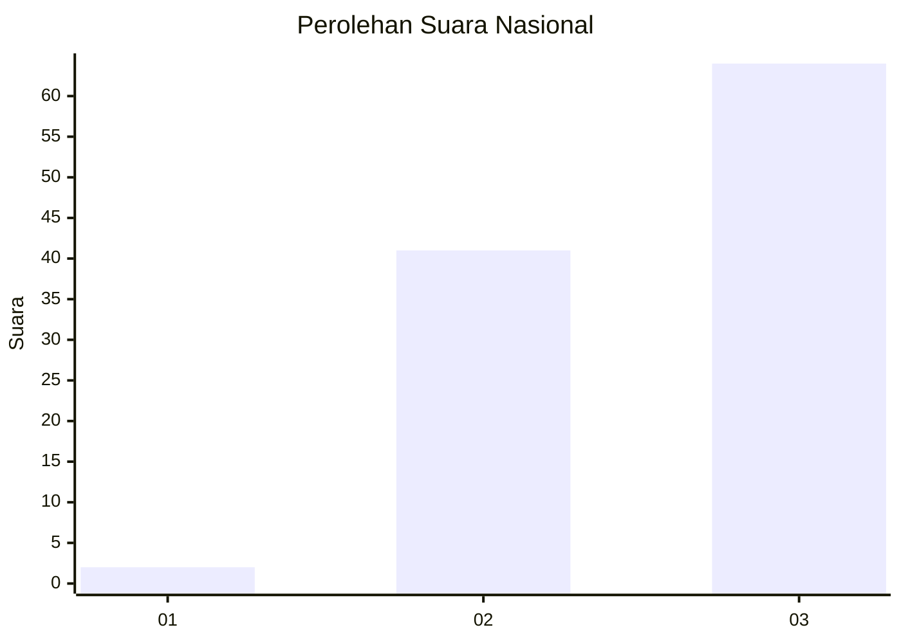
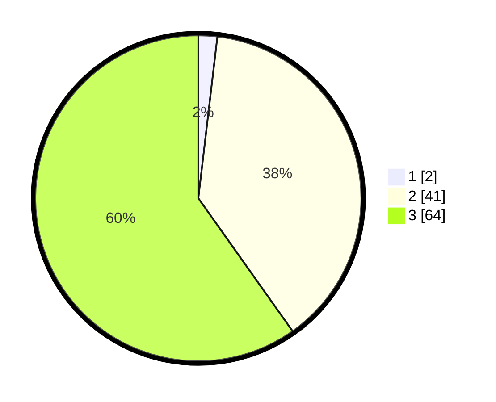

# Hasil

## Grafik

## Tabel

| No. | Nama Paslon    | Suara | Suara (raw) | Persentase |
|:--- |:-------------- | -----:| -----------:| ----------:|
| 1   | ANIES MUHAIMIN | 2     | [2][p-1]    | 1,87       |
| 2   | PRABOWO GIBRAN | 41    | [41][p-2]   | 38,32      |
| 3   | GANJAR MAHFUD  | 64    | [64][p-3]   | 59,81      |

[p-1]: https://github.com/gigit-pemilu/pemilu-2024/blob/main/pilpres/hitung-suara/sub/53-nusa-tenggara-timur/sub/20-sabu-raijua/sub/04-sabu-liae/sub/2003-waduwalla/sub/002-tps/sub/paslon-1.txt
[p-2]: https://github.com/gigit-pemilu/pemilu-2024/blob/main/pilpres/hitung-suara/sub/53-nusa-tenggara-timur/sub/20-sabu-raijua/sub/04-sabu-liae/sub/2003-waduwalla/sub/002-tps/sub/paslon-2.txt
[p-3]: https://github.com/gigit-pemilu/pemilu-2024/blob/main/pilpres/hitung-suara/sub/53-nusa-tenggara-timur/sub/20-sabu-raijua/sub/04-sabu-liae/sub/2003-waduwalla/sub/002-tps/sub/paslon-3.txt

## Foto C Plano

https://sirekap-obj-formc.kpu.go.id/6b22/pemilu/ppwp/53/20/04/20/03/5320042003002-20240215-073823--66d34ecd-ba59-419d-8bb0-f437c29f515b.jpg

https://sirekap-obj-formc.kpu.go.id/6b22/pemilu/ppwp/53/20/04/20/03/5320042003002-20240215-073954--79746c52-e0c8-4433-a10b-7b294592a1b9.jpg

https://sirekap-obj-formc.kpu.go.id/6b22/pemilu/ppwp/53/20/04/20/03/5320042003002-20240215-074114--be99ef2d-a181-48ae-878b-2dd06ead80b1.jpg

## Metadata

| Key        | Value               |
| ---------- | ------------------- |
| Time Stamp | 2024-02-25 18:00:00 |

