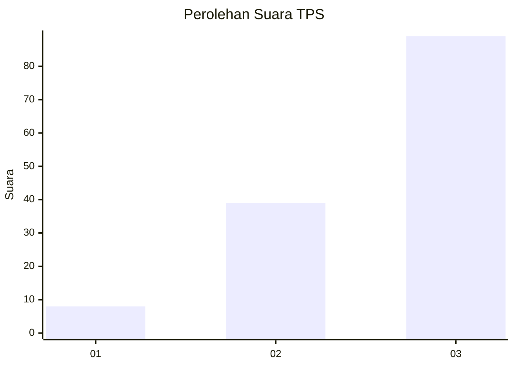
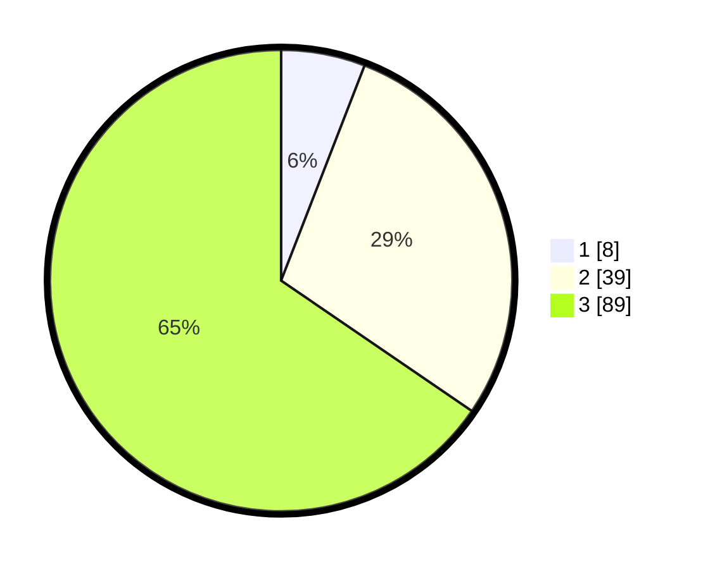

# Hasil

## Grafik

## Tabel

| No. | Nama Paslon    | Suara | Suara (raw) | Persentase |
|:--- |:-------------- | -----:| -----------:| ----------:|
| 1   | ANIES MUHAIMIN | 8     | [8][p-1]    | 5,88       |
| 2   | PRABOWO GIBRAN | 39    | [39][p-2]   | 28,68      |
| 3   | GANJAR MAHFUD  | 89    | [89][p-3]   | 65,44      |

[p-1]: https://github.com/gigit-pemilu/pemilu-2024-53-nusa-tenggara-timur/blob/main/pilpres/hitung-suara/sub/53-nusa-tenggara-timur/sub/20-sabu-raijua/sub/04-sabu-liae/sub/2005-eilogo/sub/004-tps/sub/paslon-1.txt
[p-2]: https://github.com/gigit-pemilu/pemilu-2024-53-nusa-tenggara-timur/blob/main/pilpres/hitung-suara/sub/53-nusa-tenggara-timur/sub/20-sabu-raijua/sub/04-sabu-liae/sub/2005-eilogo/sub/004-tps/sub/paslon-2.txt
[p-3]: https://github.com/gigit-pemilu/pemilu-2024-53-nusa-tenggara-timur/blob/main/pilpres/hitung-suara/sub/53-nusa-tenggara-timur/sub/20-sabu-raijua/sub/04-sabu-liae/sub/2005-eilogo/sub/004-tps/sub/paslon-3.txt

## Foto C Plano

https://sirekap-obj-formc.kpu.go.id/df80/pemilu/ppwp/53/20/04/20/05/5320042005004-20240214-194730--5c3e7e33-982b-4818-add0-20db5d070d00.jpg

https://sirekap-obj-formc.kpu.go.id/df80/pemilu/ppwp/53/20/04/20/05/5320042005004-20240214-194800--f8bd5029-2832-40e0-bff6-cfcecca7944a.jpg

https://sirekap-obj-formc.kpu.go.id/df80/pemilu/ppwp/53/20/04/20/05/5320042005004-20240214-194822--a84b3964-dbf0-46b1-bed2-9cb78a1ef155.jpg

## Metadata

| Key        | Value               |
| ---------- | ------------------- |
| Time Stamp | 2024-02-25 11:00:00 |

