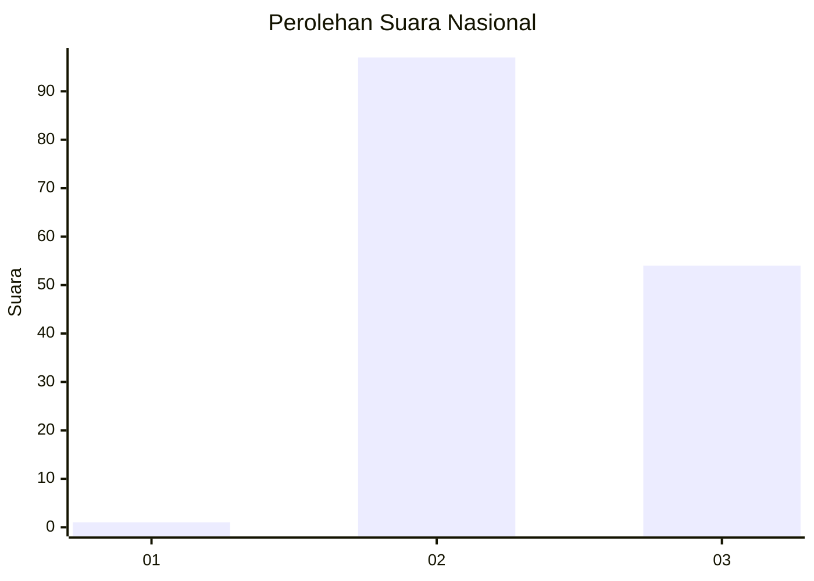
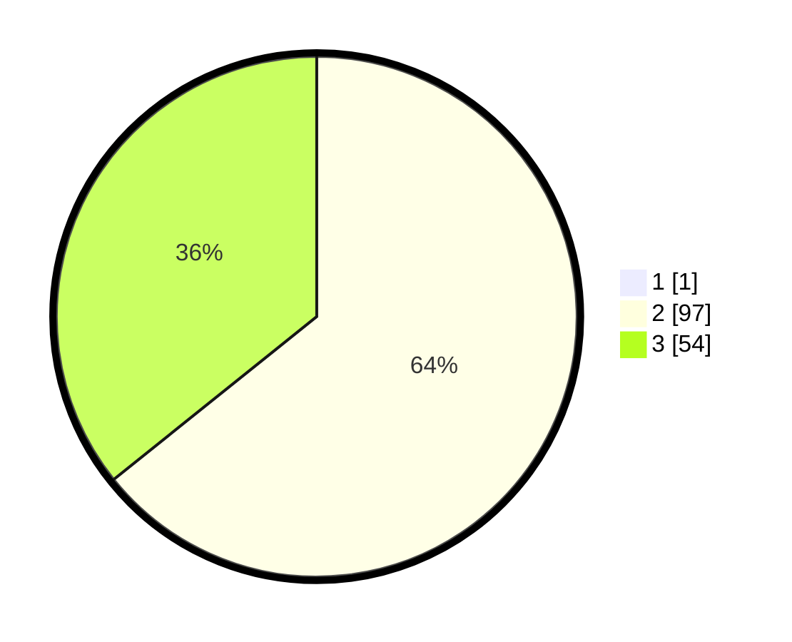

# Hasil

## Grafik

## Tabel

| No. | Nama Paslon    | Suara | Suara (raw) | Persentase |
|:--- |:-------------- | -----:| -----------:| ----------:|
| 1   | ANIES MUHAIMIN | 1     | [1][p-1]    | 0,66       |
| 2   | PRABOWO GIBRAN | 97    | [97][p-2]   | 63,82      |
| 3   | GANJAR MAHFUD  | 54    | [54][p-3]   | 35,53      |

[p-1]: https://github.com/gigit-pemilu/pemilu-2024/blob/main/pilpres/hitung-suara/sub/53-nusa-tenggara-timur/sub/20-sabu-raijua/sub/05-hawu-mehara/sub/2001-lobohede/sub/006-tps/sub/paslon-1.txt
[p-2]: https://github.com/gigit-pemilu/pemilu-2024/blob/main/pilpres/hitung-suara/sub/53-nusa-tenggara-timur/sub/20-sabu-raijua/sub/05-hawu-mehara/sub/2001-lobohede/sub/006-tps/sub/paslon-2.txt
[p-3]: https://github.com/gigit-pemilu/pemilu-2024/blob/main/pilpres/hitung-suara/sub/53-nusa-tenggara-timur/sub/20-sabu-raijua/sub/05-hawu-mehara/sub/2001-lobohede/sub/006-tps/sub/paslon-3.txt

## Foto C Plano

https://sirekap-obj-formc.kpu.go.id/2e1e/pemilu/ppwp/53/20/05/20/01/5320052001006-20240215-005542--f4f4ab28-89cc-4600-b41d-9d6febd243a5.jpg

https://sirekap-obj-formc.kpu.go.id/2e1e/pemilu/ppwp/53/20/05/20/01/5320052001006-20240215-010120--5da75d7e-71ff-48e5-b0ba-098bd7fac8dd.jpg

https://sirekap-obj-formc.kpu.go.id/2e1e/pemilu/ppwp/53/20/05/20/01/5320052001006-20240215-010851--f379b0b1-5974-412c-b848-f3762843d742.jpg

## Metadata

| Key        | Value               |
| ---------- | ------------------- |
| Time Stamp | 2024-02-25 00:00:00 |

