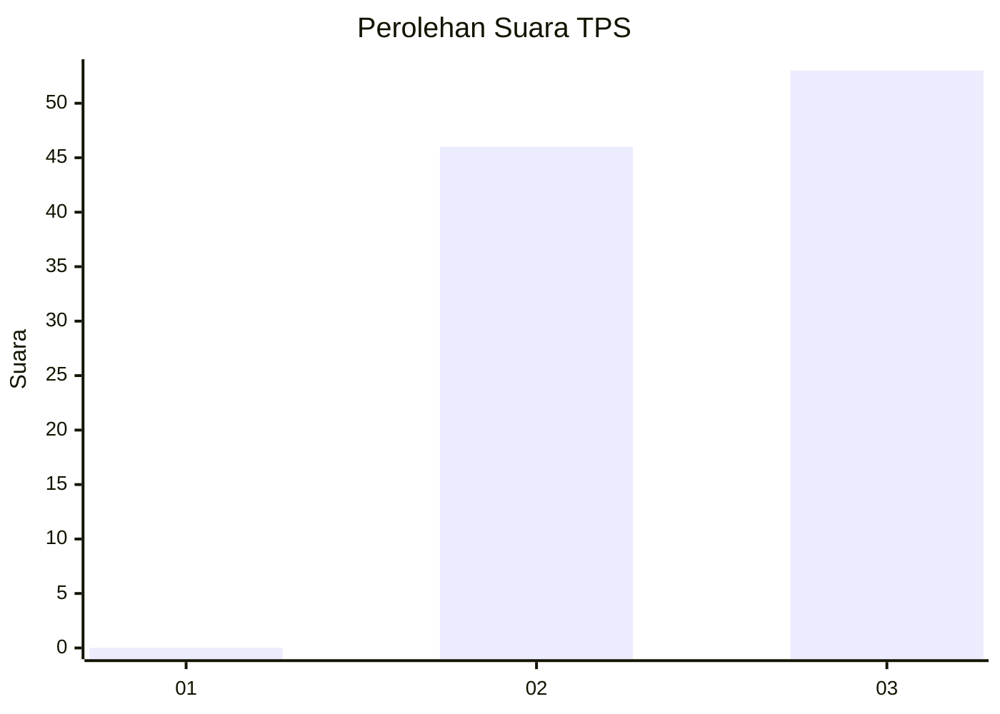
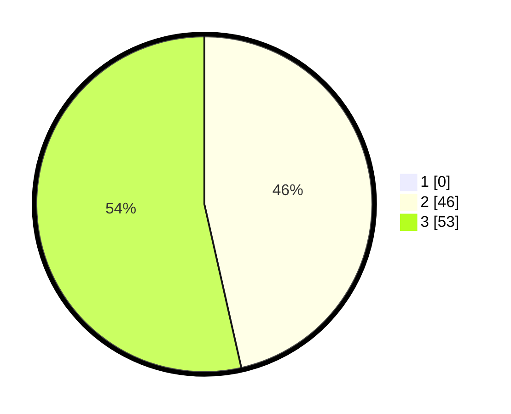

# Hasil

## Grafik

## Tabel

| No. | Nama Paslon    | Suara | Suara (raw) | Persentase |
|:--- |:-------------- | -----:| -----------:| ----------:|
| 1   | ANIES MUHAIMIN | 0     | [0][p-1]    | 0,00       |
| 2   | PRABOWO GIBRAN | 46    | [46][p-2]   | 46,46      |
| 3   | GANJAR MAHFUD  | 53    | [53][p-3]   | 53,54      |

[p-1]: https://github.com/gigit-pemilu/pemilu-2024-53-nusa-tenggara-timur/blob/main/pilpres/hitung-suara/sub/53-nusa-tenggara-timur/sub/20-sabu-raijua/sub/05-hawu-mehara/sub/2001-lobohede/sub/007-tps/sub/paslon-1.txt
[p-2]: https://github.com/gigit-pemilu/pemilu-2024-53-nusa-tenggara-timur/blob/main/pilpres/hitung-suara/sub/53-nusa-tenggara-timur/sub/20-sabu-raijua/sub/05-hawu-mehara/sub/2001-lobohede/sub/007-tps/sub/paslon-2.txt
[p-3]: https://github.com/gigit-pemilu/pemilu-2024-53-nusa-tenggara-timur/blob/main/pilpres/hitung-suara/sub/53-nusa-tenggara-timur/sub/20-sabu-raijua/sub/05-hawu-mehara/sub/2001-lobohede/sub/007-tps/sub/paslon-3.txt

## Foto C Plano

https://sirekap-obj-formc.kpu.go.id/238f/pemilu/ppwp/53/20/05/20/01/5320052001007-20240215-165408--7f33d8d1-2ed0-4cc2-8851-98084198d2e9.jpg

https://sirekap-obj-formc.kpu.go.id/238f/pemilu/ppwp/53/20/05/20/01/5320052001007-20240215-165317--97f0c2cb-02af-45b7-9d5c-d3b4a13555dc.jpg

https://sirekap-obj-formc.kpu.go.id/238f/pemilu/ppwp/53/20/05/20/01/5320052001007-20240215-114647--3e51db82-a852-4e71-8371-c8c1d22ae3ae.jpg

## Metadata

| Key        | Value               |
| ---------- | ------------------- |
| Time Stamp | 2024-02-16 21:01:00 |

