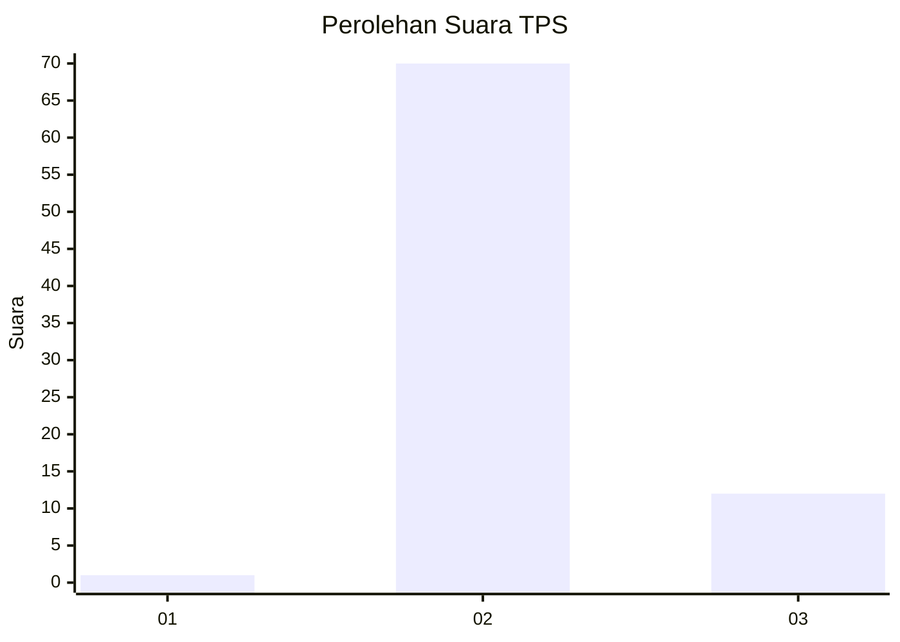
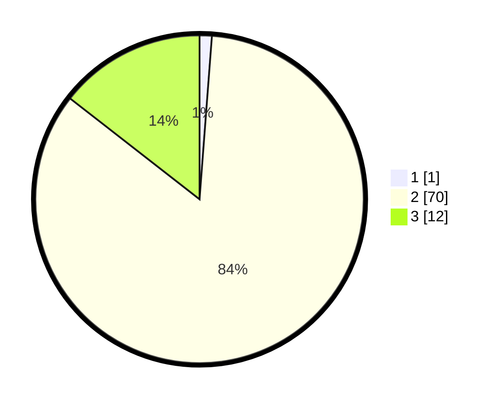

# Hasil

## Grafik

## Tabel

| No. | Nama Paslon    | Suara | Suara (raw) | Persentase |
|:--- |:-------------- | -----:| -----------:| ----------:|
| 1   | ANIES MUHAIMIN | 1     | [1][p-1]    | 1,20       |
| 2   | PRABOWO GIBRAN | 70    | [70][p-2]   | 84,34      |
| 3   | GANJAR MAHFUD  | 12    | [12][p-3]   | 14,46      |

[p-1]: https://github.com/gigit-pemilu/pemilu-2024-53-nusa-tenggara-timur/blob/main/pilpres/hitung-suara/sub/53-nusa-tenggara-timur/sub/21-malaka/sub/02-malaka-barat/sub/2005-umatoos/sub/008-tps/sub/paslon-1.txt
[p-2]: https://github.com/gigit-pemilu/pemilu-2024-53-nusa-tenggara-timur/blob/main/pilpres/hitung-suara/sub/53-nusa-tenggara-timur/sub/21-malaka/sub/02-malaka-barat/sub/2005-umatoos/sub/008-tps/sub/paslon-2.txt
[p-3]: https://github.com/gigit-pemilu/pemilu-2024-53-nusa-tenggara-timur/blob/main/pilpres/hitung-suara/sub/53-nusa-tenggara-timur/sub/21-malaka/sub/02-malaka-barat/sub/2005-umatoos/sub/008-tps/sub/paslon-3.txt

## Foto C Plano

https://sirekap-obj-formc.kpu.go.id/cde0/pemilu/ppwp/53/21/02/20/05/5321022005008-20240215-071927--e3e60981-5676-4709-933c-e599be2c1d83.jpg

https://sirekap-obj-formc.kpu.go.id/cde0/pemilu/ppwp/53/21/02/20/05/5321022005008-20240215-072102--0134b539-8525-42f1-99c5-0f7cc7ba2ee0.jpg

https://sirekap-obj-formc.kpu.go.id/cde0/pemilu/ppwp/53/21/02/20/05/5321022005008-20240215-072207--53da83f8-120b-444f-8f5f-72ae84825cd1.jpg

## Metadata

| Key        | Value               |
| ---------- | ------------------- |
| Time Stamp | 2024-02-15 21:01:18 |

