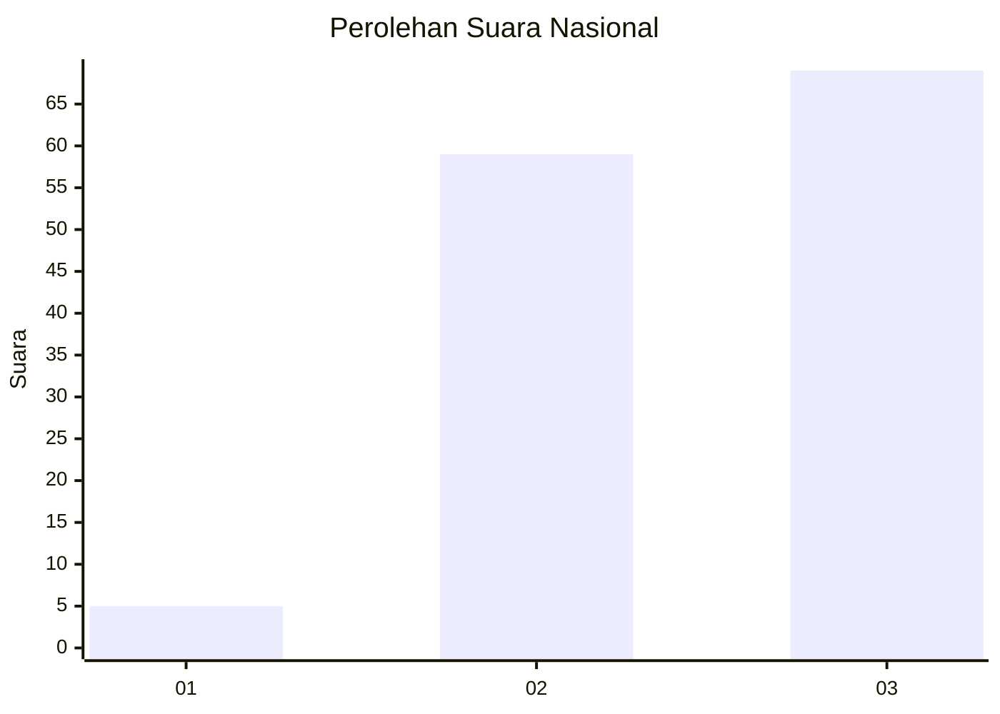
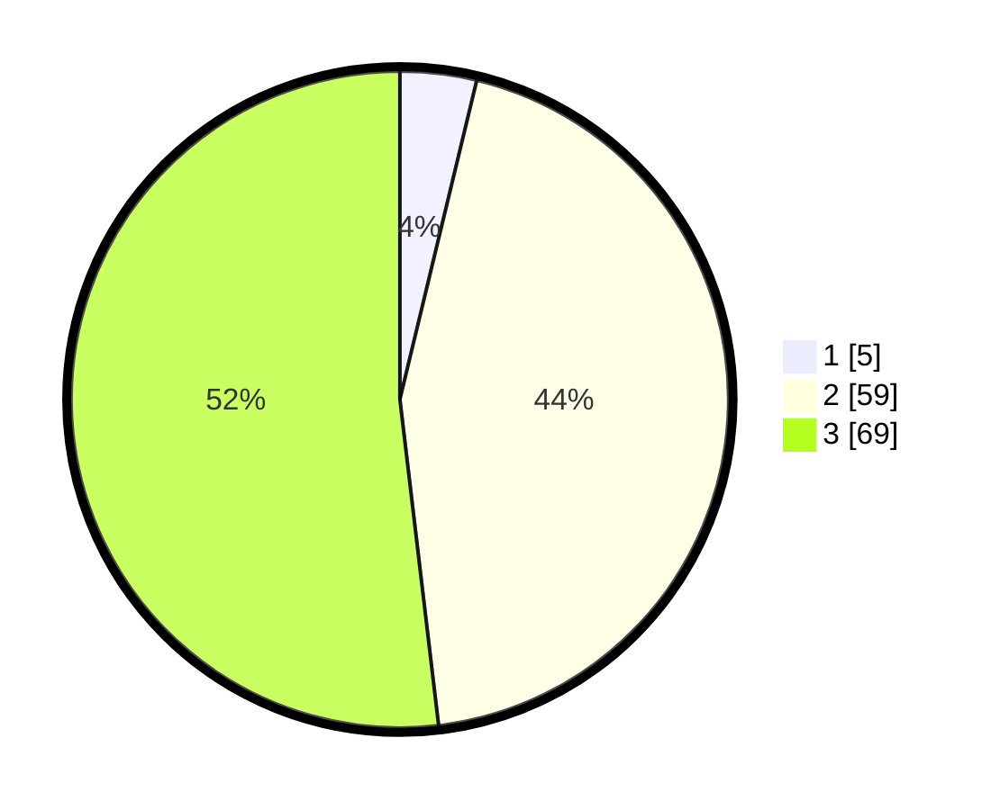

# Hasil

## Grafik

## Tabel

| No. | Nama Paslon    | Suara | Suara (raw) | Persentase |
|:--- |:-------------- | -----:| -----------:| ----------:|
| 1   | ANIES MUHAIMIN | 5     | [5][p-1]    | 3,76       |
| 2   | PRABOWO GIBRAN | 59    | [59][p-2]   | 44,36      |
| 3   | GANJAR MAHFUD  | 69    | [69][p-3]   | 51,88      |

[p-1]: https://github.com/gigit-pemilu/pemilu-2024/blob/main/pilpres/hitung-suara/sub/53-nusa-tenggara-timur/sub/21-malaka/sub/03-wewiku/sub/2001-halibasar/sub/001-tps/sub/paslon-1.txt
[p-2]: https://github.com/gigit-pemilu/pemilu-2024/blob/main/pilpres/hitung-suara/sub/53-nusa-tenggara-timur/sub/21-malaka/sub/03-wewiku/sub/2001-halibasar/sub/001-tps/sub/paslon-2.txt
[p-3]: https://github.com/gigit-pemilu/pemilu-2024/blob/main/pilpres/hitung-suara/sub/53-nusa-tenggara-timur/sub/21-malaka/sub/03-wewiku/sub/2001-halibasar/sub/001-tps/sub/paslon-3.txt

## Foto C Plano

https://sirekap-obj-formc.kpu.go.id/3fd6/pemilu/ppwp/53/21/03/20/01/5321032001001-20240215-113656--66b2d2a6-0885-4df7-bfd1-08d3f9c433b8.jpg

https://sirekap-obj-formc.kpu.go.id/3fd6/pemilu/ppwp/53/21/03/20/01/5321032001001-20240215-124248--14f765de-03f6-4450-aa44-a2aba1751597.jpg

https://sirekap-obj-formc.kpu.go.id/3fd6/pemilu/ppwp/53/21/03/20/01/5321032001001-20240215-134943--48c52b58-8ec0-4187-a56d-f8d5e98ba117.jpg

## Metadata

| Key        | Value               |
| ---------- | ------------------- |
| Time Stamp | 2024-02-15 22:00:27 |

