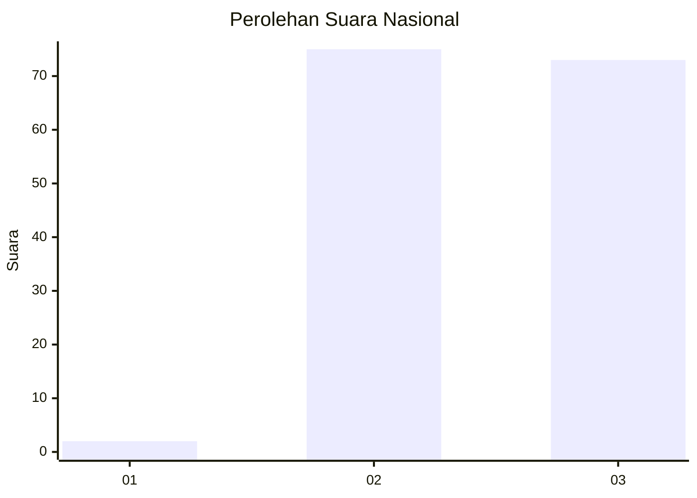
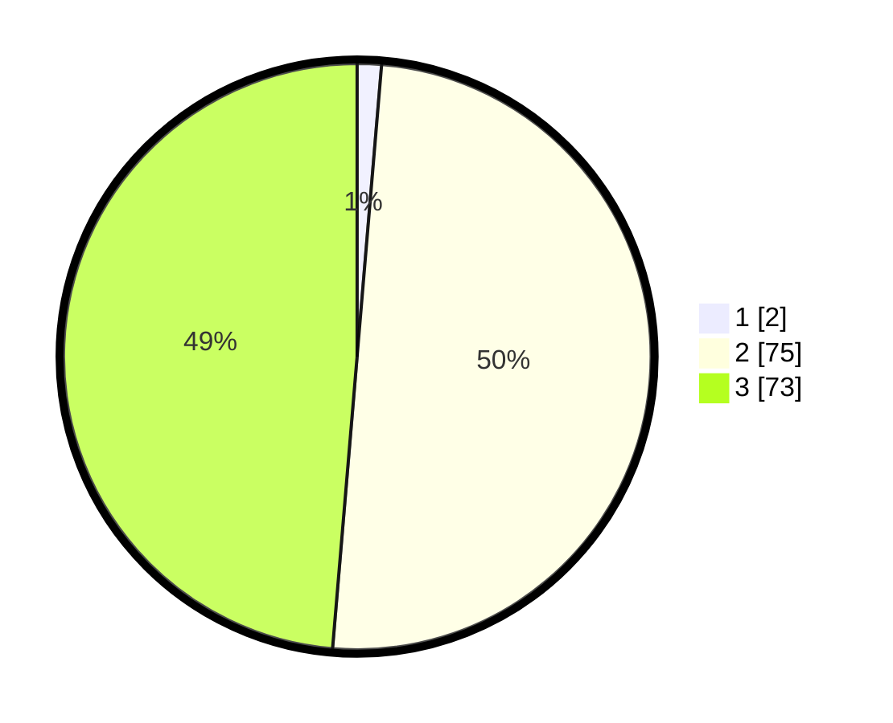

# Hasil

## Grafik

## Tabel

| No. | Nama Paslon    | Suara | Suara (raw) | Persentase |
|:--- |:-------------- | -----:| -----------:| ----------:|
| 1   | ANIES MUHAIMIN | 2     | [2][p-1]    | 1,33       |
| 2   | PRABOWO GIBRAN | 75    | [75][p-2]   | 50,00      |
| 3   | GANJAR MAHFUD  | 73    | [73][p-3]   | 48,67      |

[p-1]: https://github.com/gigit-pemilu/pemilu-2024/blob/main/pilpres/hitung-suara/sub/53-nusa-tenggara-timur/sub/21-malaka/sub/03-wewiku/sub/2002-weulun/sub/001-tps/sub/paslon-1.txt
[p-2]: https://github.com/gigit-pemilu/pemilu-2024/blob/main/pilpres/hitung-suara/sub/53-nusa-tenggara-timur/sub/21-malaka/sub/03-wewiku/sub/2002-weulun/sub/001-tps/sub/paslon-2.txt
[p-3]: https://github.com/gigit-pemilu/pemilu-2024/blob/main/pilpres/hitung-suara/sub/53-nusa-tenggara-timur/sub/21-malaka/sub/03-wewiku/sub/2002-weulun/sub/001-tps/sub/paslon-3.txt

## Foto C Plano

https://sirekap-obj-formc.kpu.go.id/a170/pemilu/ppwp/53/21/03/20/02/5321032002001-20240215-162631--064f4e82-c0c4-4325-838e-e7f63aa6e19f.jpg

https://sirekap-obj-formc.kpu.go.id/a170/pemilu/ppwp/53/21/03/20/02/5321032002001-20240215-073538--327f6e4d-991e-4a0a-9c29-bb1d43c42184.jpg

https://sirekap-obj-formc.kpu.go.id/a170/pemilu/ppwp/53/21/03/20/02/5321032002001-20240215-073641--6dd61db5-5ae3-4863-9628-fd1a7a66ad27.jpg

## Metadata

| Key        | Value               |
| ---------- | ------------------- |
| Time Stamp | 2024-02-15 16:30:25 |

