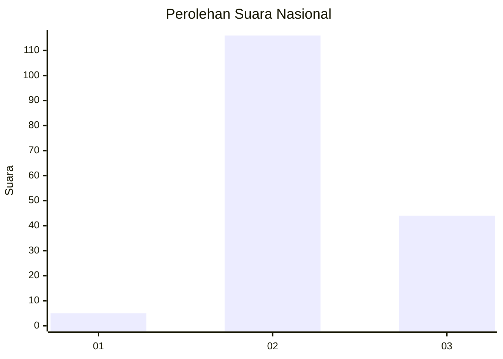
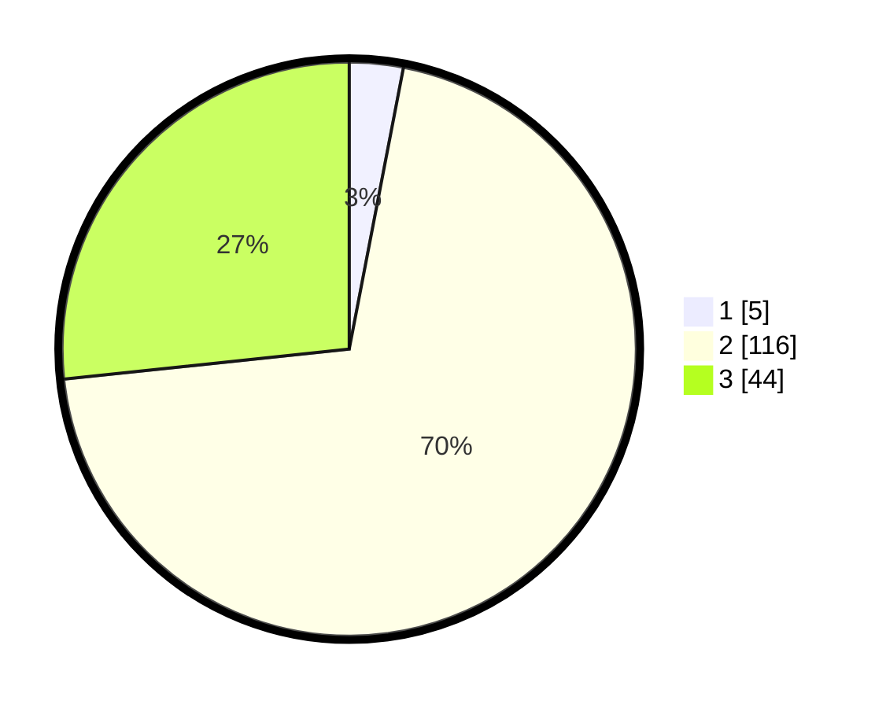

# Hasil

## Grafik

## Tabel

| No. | Nama Paslon    | Suara | Suara (raw) | Persentase |
|:--- |:-------------- | -----:| -----------:| ----------:|
| 1   | ANIES MUHAIMIN | 5     | [5][p-1]    | 3,03       |
| 2   | PRABOWO GIBRAN | 116   | [116][p-2]  | 70,30      |
| 3   | GANJAR MAHFUD  | 44    | [44][p-3]   | 26,67      |

[p-1]: https://github.com/gigit-pemilu/pemilu-2024/blob/main/pilpres/hitung-suara/sub/53-nusa-tenggara-timur/sub/21-malaka/sub/03-wewiku/sub/2004-badarai/sub/001-tps/sub/paslon-1.txt
[p-2]: https://github.com/gigit-pemilu/pemilu-2024/blob/main/pilpres/hitung-suara/sub/53-nusa-tenggara-timur/sub/21-malaka/sub/03-wewiku/sub/2004-badarai/sub/001-tps/sub/paslon-2.txt
[p-3]: https://github.com/gigit-pemilu/pemilu-2024/blob/main/pilpres/hitung-suara/sub/53-nusa-tenggara-timur/sub/21-malaka/sub/03-wewiku/sub/2004-badarai/sub/001-tps/sub/paslon-3.txt

## Foto C Plano

https://sirekap-obj-formc.kpu.go.id/0c81/pemilu/ppwp/53/21/03/20/04/5321032004001-20240215-153330--de2515e3-4c00-45fe-a1ff-5b8a7097a9d1.jpg

https://sirekap-obj-formc.kpu.go.id/0c81/pemilu/ppwp/53/21/03/20/04/5321032004001-20240215-161532--077d88b6-0fc9-4373-88c9-2407a82d4eda.jpg

https://sirekap-obj-formc.kpu.go.id/0c81/pemilu/ppwp/53/21/03/20/04/5321032004001-20240215-154347--e9f8ad29-017e-4750-a208-b727b7142044.jpg

## Metadata

| Key        | Value               |
| ---------- | ------------------- |
| Time Stamp | 2024-02-16 09:30:28 |

