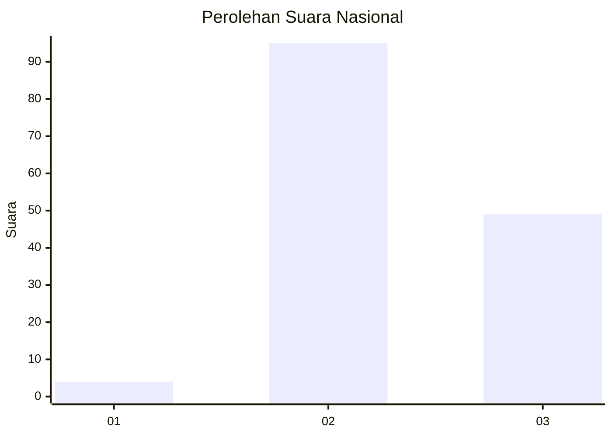
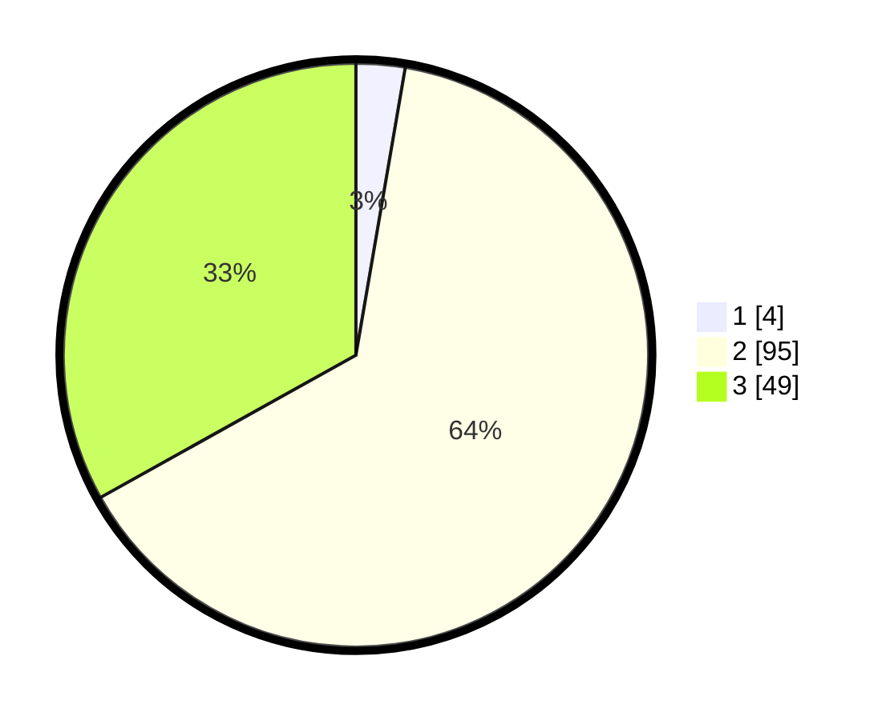

# Hasil

## Grafik

## Tabel

| No. | Nama Paslon    | Suara | Suara (raw) | Persentase |
|:--- |:-------------- | -----:| -----------:| ----------:|
| 1   | ANIES MUHAIMIN | 4     | [4][p-1]    | 2,70       |
| 2   | PRABOWO GIBRAN | 95    | [95][p-2]   | 64,19      |
| 3   | GANJAR MAHFUD  | 49    | [49][p-3]   | 33,11      |

[p-1]: https://github.com/gigit-pemilu/pemilu-2024/blob/main/pilpres/hitung-suara/sub/53-nusa-tenggara-timur/sub/21-malaka/sub/03-wewiku/sub/2004-badarai/sub/002-tps/sub/paslon-1.txt
[p-2]: https://github.com/gigit-pemilu/pemilu-2024/blob/main/pilpres/hitung-suara/sub/53-nusa-tenggara-timur/sub/21-malaka/sub/03-wewiku/sub/2004-badarai/sub/002-tps/sub/paslon-2.txt
[p-3]: https://github.com/gigit-pemilu/pemilu-2024/blob/main/pilpres/hitung-suara/sub/53-nusa-tenggara-timur/sub/21-malaka/sub/03-wewiku/sub/2004-badarai/sub/002-tps/sub/paslon-3.txt

## Foto C Plano

https://sirekap-obj-formc.kpu.go.id/e74c/pemilu/ppwp/53/21/03/20/04/5321032004002-20240215-132117--ab695af9-f307-4359-94b1-c4b35ea59100.jpg

https://sirekap-obj-formc.kpu.go.id/e74c/pemilu/ppwp/53/21/03/20/04/5321032004002-20240215-143132--0a85142f-1057-4b14-aeb6-a97c5f26473b.jpg

https://sirekap-obj-formc.kpu.go.id/e74c/pemilu/ppwp/53/21/03/20/04/5321032004002-20240215-132250--a53f5684-ddbe-4bbb-b831-808b7def1ef2.jpg

## Metadata

| Key        | Value               |
| ---------- | ------------------- |
| Time Stamp | 2024-02-16 09:30:28 |

