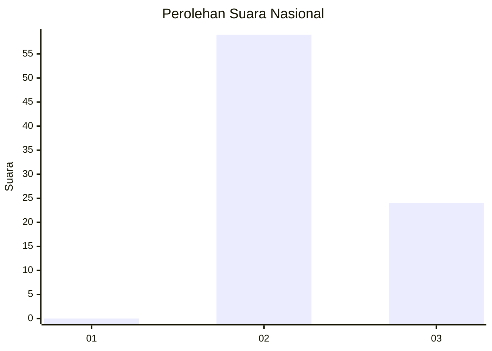
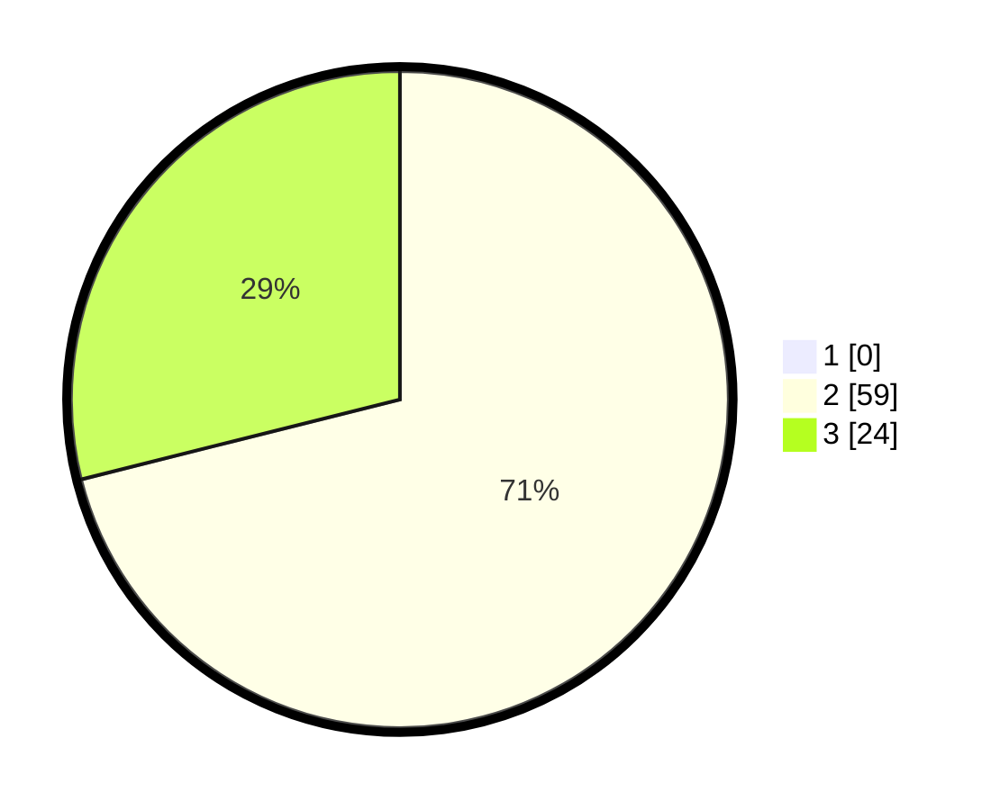

# Hasil

## Grafik

## Tabel

| No. | Nama Paslon    | Suara | Suara (raw) | Persentase |
|:--- |:-------------- | -----:| -----------:| ----------:|
| 1   | ANIES MUHAIMIN | 0     | [0][p-1]    | 0,00       |
| 2   | PRABOWO GIBRAN | 59    | [59][p-2]   | 71,08      |
| 3   | GANJAR MAHFUD  | 24    | [24][p-3]   | 28,92      |

[p-1]: https://github.com/gigit-pemilu/pemilu-2024/blob/main/pilpres/hitung-suara/sub/53-nusa-tenggara-timur/sub/21-malaka/sub/03-wewiku/sub/2005-weoe/sub/016-tps/sub/paslon-1.txt
[p-2]: https://github.com/gigit-pemilu/pemilu-2024/blob/main/pilpres/hitung-suara/sub/53-nusa-tenggara-timur/sub/21-malaka/sub/03-wewiku/sub/2005-weoe/sub/016-tps/sub/paslon-2.txt
[p-3]: https://github.com/gigit-pemilu/pemilu-2024/blob/main/pilpres/hitung-suara/sub/53-nusa-tenggara-timur/sub/21-malaka/sub/03-wewiku/sub/2005-weoe/sub/016-tps/sub/paslon-3.txt

## Foto C Plano

https://sirekap-obj-formc.kpu.go.id/7b9c/pemilu/ppwp/53/21/03/20/05/5321032005016-20240215-191659--c864e324-cb3d-4f16-82e0-effed1cd33ac.jpg

https://sirekap-obj-formc.kpu.go.id/7b9c/pemilu/ppwp/53/21/03/20/05/5321032005016-20240215-191907--f7c84fdb-54a4-40ee-a7a7-e85a1b59d9f1.jpg

https://sirekap-obj-formc.kpu.go.id/7b9c/pemilu/ppwp/53/21/03/20/05/5321032005016-20240215-192113--41671fbc-6bc4-4d9f-9cd0-e144ce5e5458.jpg

## Metadata

| Key        | Value               |
| ---------- | ------------------- |
| Time Stamp | 2024-02-15 22:00:27 |

