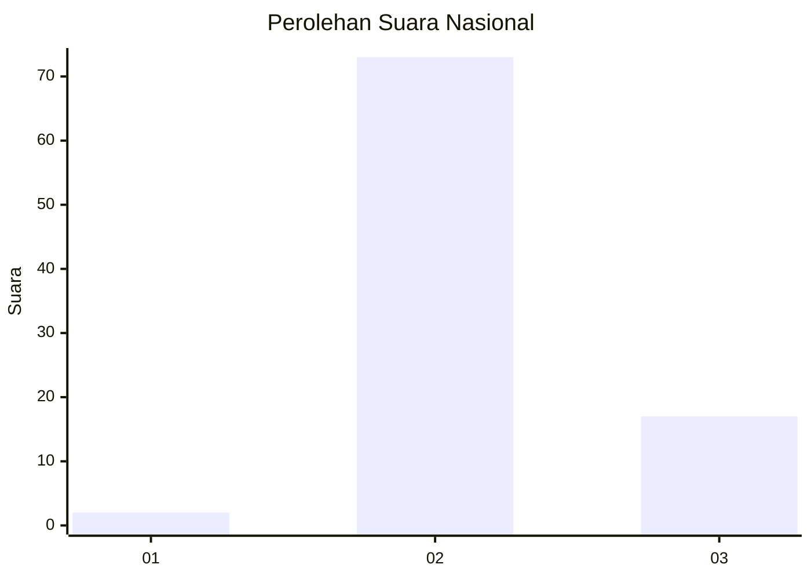
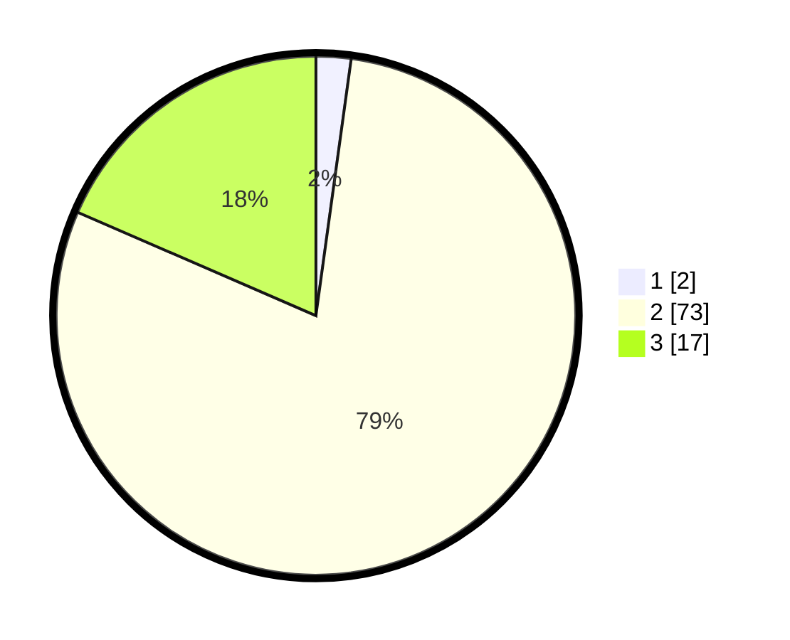

# Hasil

## Grafik

## Tabel

| No. | Nama Paslon    | Suara | Suara (raw) | Persentase |
|:--- |:-------------- | -----:| -----------:| ----------:|
| 1   | ANIES MUHAIMIN | 2     | [2][p-1]    | 2,17       |
| 2   | PRABOWO GIBRAN | 73    | [73][p-2]   | 79,35      |
| 3   | GANJAR MAHFUD  | 17    | [17][p-3]   | 18,48      |

[p-1]: https://github.com/gigit-pemilu/pemilu-2024/blob/main/pilpres/hitung-suara/sub/53-nusa-tenggara-timur/sub/21-malaka/sub/03-wewiku/sub/2008-alkani/sub/007-tps/sub/paslon-1.txt
[p-2]: https://github.com/gigit-pemilu/pemilu-2024/blob/main/pilpres/hitung-suara/sub/53-nusa-tenggara-timur/sub/21-malaka/sub/03-wewiku/sub/2008-alkani/sub/007-tps/sub/paslon-2.txt
[p-3]: https://github.com/gigit-pemilu/pemilu-2024/blob/main/pilpres/hitung-suara/sub/53-nusa-tenggara-timur/sub/21-malaka/sub/03-wewiku/sub/2008-alkani/sub/007-tps/sub/paslon-3.txt

## Foto C Plano

https://sirekap-obj-formc.kpu.go.id/1998/pemilu/ppwp/53/21/03/20/08/5321032008007-20240215-081751--ea01c2fc-cf84-4292-80af-50c6aee4f3ce.jpg

https://sirekap-obj-formc.kpu.go.id/1998/pemilu/ppwp/53/21/03/20/08/5321032008007-20240215-081902--cc30927d-0c65-4a04-8226-9d7c4be1d981.jpg

https://sirekap-obj-formc.kpu.go.id/1998/pemilu/ppwp/53/21/03/20/08/5321032008007-20240215-082016--8ffc2e6e-1440-41a7-84a7-01b0cee96134.jpg

## Metadata

| Key        | Value               |
| ---------- | ------------------- |
| Time Stamp | 2024-02-16 10:00:28 |

