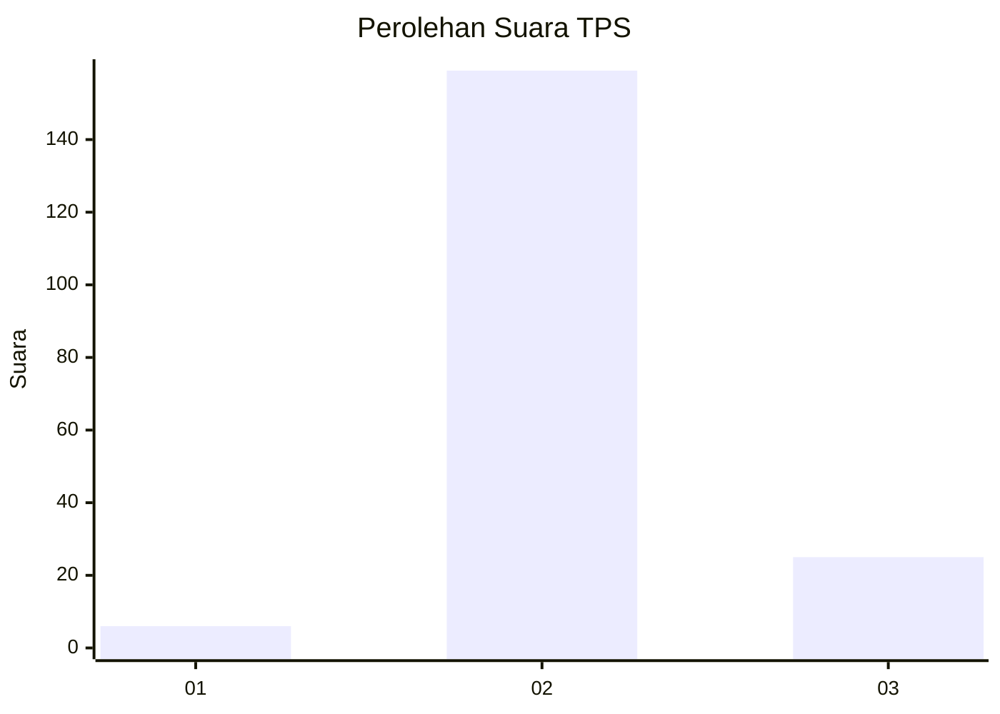
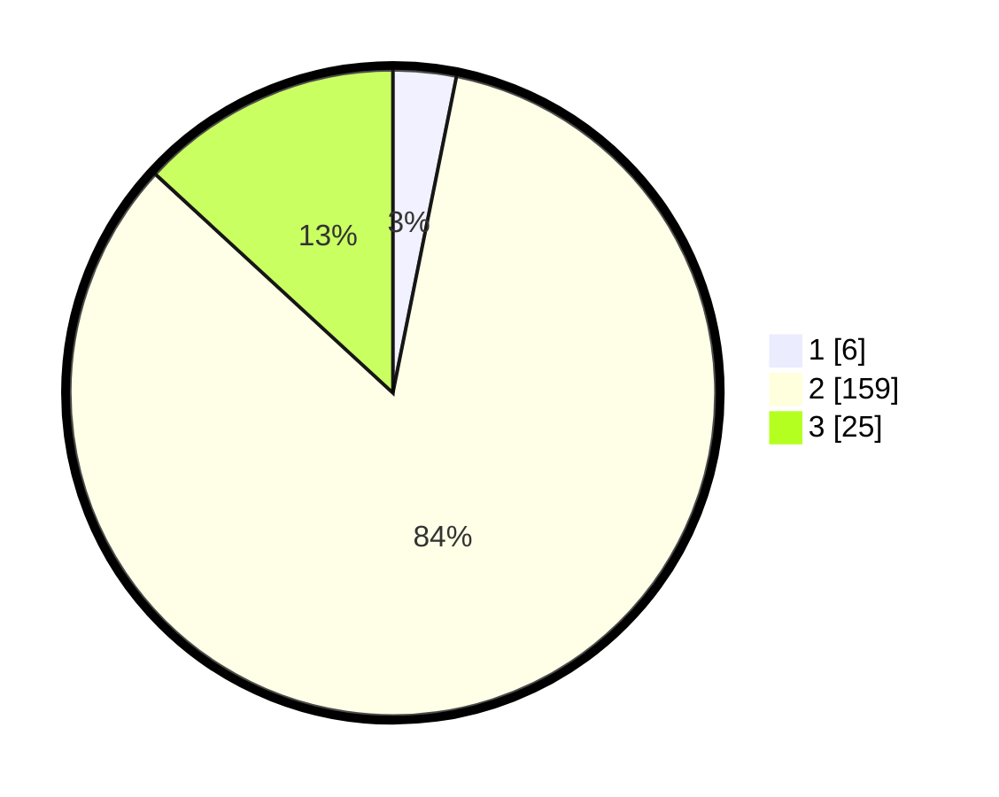

# Hasil

## Grafik

## Tabel

| No. | Nama Paslon    | Suara | Suara (raw) | Persentase |
|:--- |:-------------- | -----:| -----------:| ----------:|
| 1   | ANIES MUHAIMIN | 6     | [6][p-1]    | 3,16       |
| 2   | PRABOWO GIBRAN | 159   | [159][p-2]  | 83,68      |
| 3   | GANJAR MAHFUD  | 25    | [25][p-3]   | 13,16      |

[p-1]: https://github.com/gigit-pemilu/pemilu-2024-53-nusa-tenggara-timur/blob/main/pilpres/hitung-suara/sub/53-nusa-tenggara-timur/sub/21-malaka/sub/04-weliman/sub/2002-haitimuk/sub/001-tps/sub/paslon-1.txt
[p-2]: https://github.com/gigit-pemilu/pemilu-2024-53-nusa-tenggara-timur/blob/main/pilpres/hitung-suara/sub/53-nusa-tenggara-timur/sub/21-malaka/sub/04-weliman/sub/2002-haitimuk/sub/001-tps/sub/paslon-2.txt
[p-3]: https://github.com/gigit-pemilu/pemilu-2024-53-nusa-tenggara-timur/blob/main/pilpres/hitung-suara/sub/53-nusa-tenggara-timur/sub/21-malaka/sub/04-weliman/sub/2002-haitimuk/sub/001-tps/sub/paslon-3.txt

## Foto C Plano

https://sirekap-obj-formc.kpu.go.id/3ffc/pemilu/ppwp/53/21/04/20/02/5321042002001-20240214-221230--4fa48b47-66a5-4dca-bc4f-88cd3c95c94a.jpg

https://sirekap-obj-formc.kpu.go.id/3ffc/pemilu/ppwp/53/21/04/20/02/5321042002001-20240214-222344--1005f6f9-c227-40f3-ac11-7f23db06b385.jpg

https://sirekap-obj-formc.kpu.go.id/3ffc/pemilu/ppwp/53/21/04/20/02/5321042002001-20240214-221641--e288d437-a95f-4ccc-8d7c-243100cfae5b.jpg

## Metadata

| Key        | Value               |
| ---------- | ------------------- |
| Time Stamp | 2024-02-15 15:00:29 |

