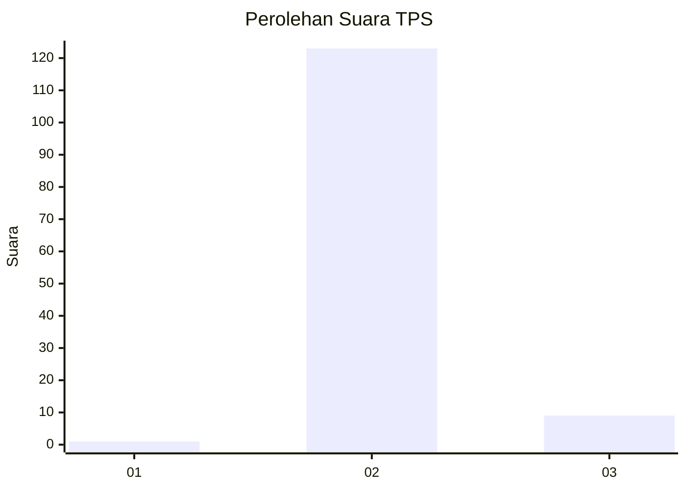
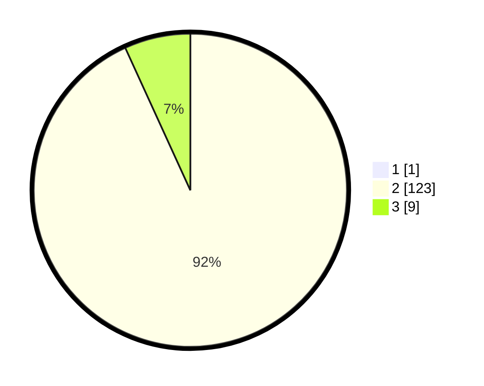

# Hasil

## Grafik

## Tabel

| No. | Nama Paslon    | Suara | Suara (raw) | Persentase |
|:--- |:-------------- | -----:| -----------:| ----------:|
| 1   | ANIES MUHAIMIN | 1     | [1][p-1]    | 0,75       |
| 2   | PRABOWO GIBRAN | 123   | [123][p-2]  | 92,48      |
| 3   | GANJAR MAHFUD  | 9     | [9][p-3]    | 6,77       |

[p-1]: https://github.com/gigit-pemilu/pemilu-2024-53-nusa-tenggara-timur/blob/main/pilpres/hitung-suara/sub/53-nusa-tenggara-timur/sub/21-malaka/sub/04-weliman/sub/2002-haitimuk/sub/005-tps/sub/paslon-1.txt
[p-2]: https://github.com/gigit-pemilu/pemilu-2024-53-nusa-tenggara-timur/blob/main/pilpres/hitung-suara/sub/53-nusa-tenggara-timur/sub/21-malaka/sub/04-weliman/sub/2002-haitimuk/sub/005-tps/sub/paslon-2.txt
[p-3]: https://github.com/gigit-pemilu/pemilu-2024-53-nusa-tenggara-timur/blob/main/pilpres/hitung-suara/sub/53-nusa-tenggara-timur/sub/21-malaka/sub/04-weliman/sub/2002-haitimuk/sub/005-tps/sub/paslon-3.txt

## Foto C Plano

https://sirekap-obj-formc.kpu.go.id/1886/pemilu/ppwp/53/21/04/20/02/5321042002005-20240215-024129--11553fb6-abf5-4904-bc92-f44e27bd50b5.jpg

https://sirekap-obj-formc.kpu.go.id/1886/pemilu/ppwp/53/21/04/20/02/5321042002005-20240215-031047--d5157320-1557-40b3-bf30-286708b9601b.jpg

https://sirekap-obj-formc.kpu.go.id/1886/pemilu/ppwp/53/21/04/20/02/5321042002005-20240215-031514--8876d665-cd85-4f25-b613-cad87194ed10.jpg

## Metadata

| Key        | Value               |
| ---------- | ------------------- |
| Time Stamp | 2024-02-16 10:30:29 |

