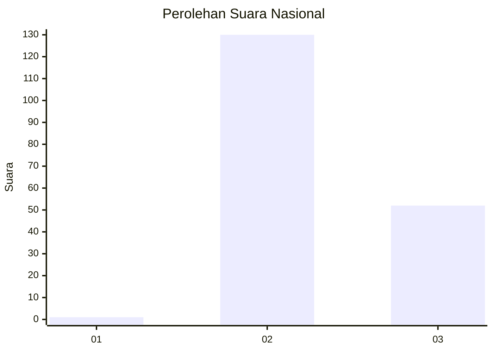
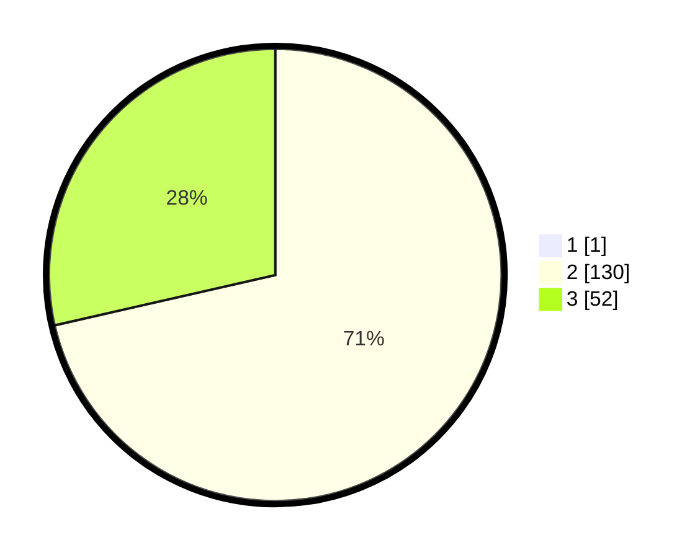

# Hasil

## Grafik

## Tabel

| No. | Nama Paslon    | Suara | Suara (raw) | Persentase |
|:--- |:-------------- | -----:| -----------:| ----------:|
| 1   | ANIES MUHAIMIN | 1     | [1][p-1]    | 0,55       |
| 2   | PRABOWO GIBRAN | 130   | [130][p-2]  | 71,04      |
| 3   | GANJAR MAHFUD  | 52    | [52][p-3]   | 28,42      |

[p-1]: https://github.com/gigit-pemilu/pemilu-2024/blob/main/pilpres/hitung-suara/sub/53-nusa-tenggara-timur/sub/21-malaka/sub/04-weliman/sub/2003-laleten/sub/002-tps/sub/paslon-1.txt
[p-2]: https://github.com/gigit-pemilu/pemilu-2024/blob/main/pilpres/hitung-suara/sub/53-nusa-tenggara-timur/sub/21-malaka/sub/04-weliman/sub/2003-laleten/sub/002-tps/sub/paslon-2.txt
[p-3]: https://github.com/gigit-pemilu/pemilu-2024/blob/main/pilpres/hitung-suara/sub/53-nusa-tenggara-timur/sub/21-malaka/sub/04-weliman/sub/2003-laleten/sub/002-tps/sub/paslon-3.txt

## Foto C Plano

https://sirekap-obj-formc.kpu.go.id/aa98/pemilu/ppwp/53/21/04/20/03/5321042003002-20240215-095656--f09f15db-f1fd-4d73-bfc8-bf1320132d68.jpg

https://sirekap-obj-formc.kpu.go.id/aa98/pemilu/ppwp/53/21/04/20/03/5321042003002-20240215-100028--68b47921-4a51-4134-90e9-599110929558.jpg

https://sirekap-obj-formc.kpu.go.id/aa98/pemilu/ppwp/53/21/04/20/03/5321042003002-20240215-100304--0357efb7-4bd8-4725-a8f9-2f9812f75172.jpg

## Metadata

| Key        | Value               |
| ---------- | ------------------- |
| Time Stamp | 2024-02-16 10:30:29 |

