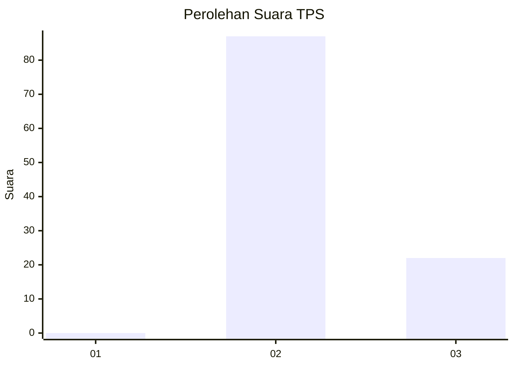
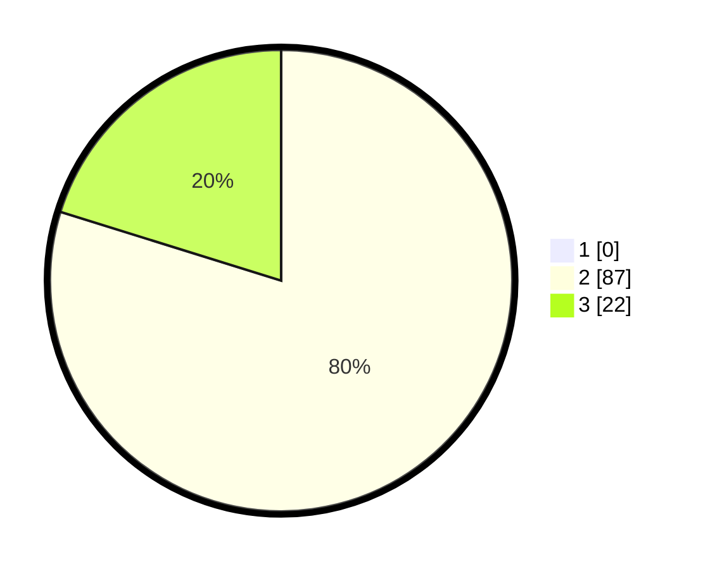

# Hasil

## Grafik

## Tabel

| No. | Nama Paslon    | Suara | Suara (raw) | Persentase |
|:--- |:-------------- | -----:| -----------:| ----------:|
| 1   | ANIES MUHAIMIN | 0     | [0][p-1]    | 0,00       |
| 2   | PRABOWO GIBRAN | 87    | [87][p-2]   | 79,82      |
| 3   | GANJAR MAHFUD  | 22    | [22][p-3]   | 20,18      |

[p-1]: https://github.com/gigit-pemilu/pemilu-2024-53-nusa-tenggara-timur/blob/main/pilpres/hitung-suara/sub/53-nusa-tenggara-timur/sub/21-malaka/sub/05-rinhat/sub/2001-saenama/sub/001-tps/sub/paslon-1.txt
[p-2]: https://github.com/gigit-pemilu/pemilu-2024-53-nusa-tenggara-timur/blob/main/pilpres/hitung-suara/sub/53-nusa-tenggara-timur/sub/21-malaka/sub/05-rinhat/sub/2001-saenama/sub/001-tps/sub/paslon-2.txt
[p-3]: https://github.com/gigit-pemilu/pemilu-2024-53-nusa-tenggara-timur/blob/main/pilpres/hitung-suara/sub/53-nusa-tenggara-timur/sub/21-malaka/sub/05-rinhat/sub/2001-saenama/sub/001-tps/sub/paslon-3.txt

## Foto C Plano

https://sirekap-obj-formc.kpu.go.id/349d/pemilu/ppwp/53/21/05/20/01/5321052001001-20240215-002247--33703875-45cd-4422-9d13-41f817a8bbae.jpg

https://sirekap-obj-formc.kpu.go.id/349d/pemilu/ppwp/53/21/05/20/01/5321052001001-20240215-002936--e1e95b9e-659a-4dfa-b6dc-e87f8d36c876.jpg

https://sirekap-obj-formc.kpu.go.id/349d/pemilu/ppwp/53/21/05/20/01/5321052001001-20240215-061556--4fe31fbd-a9d1-4f04-b676-3b6f92031309.jpg

## Metadata

| Key        | Value               |
| ---------- | ------------------- |
| Time Stamp | 2024-02-15 19:30:26 |

