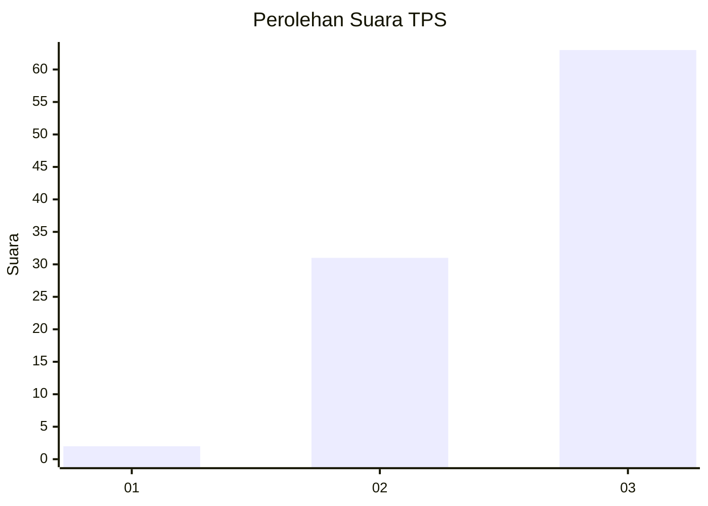
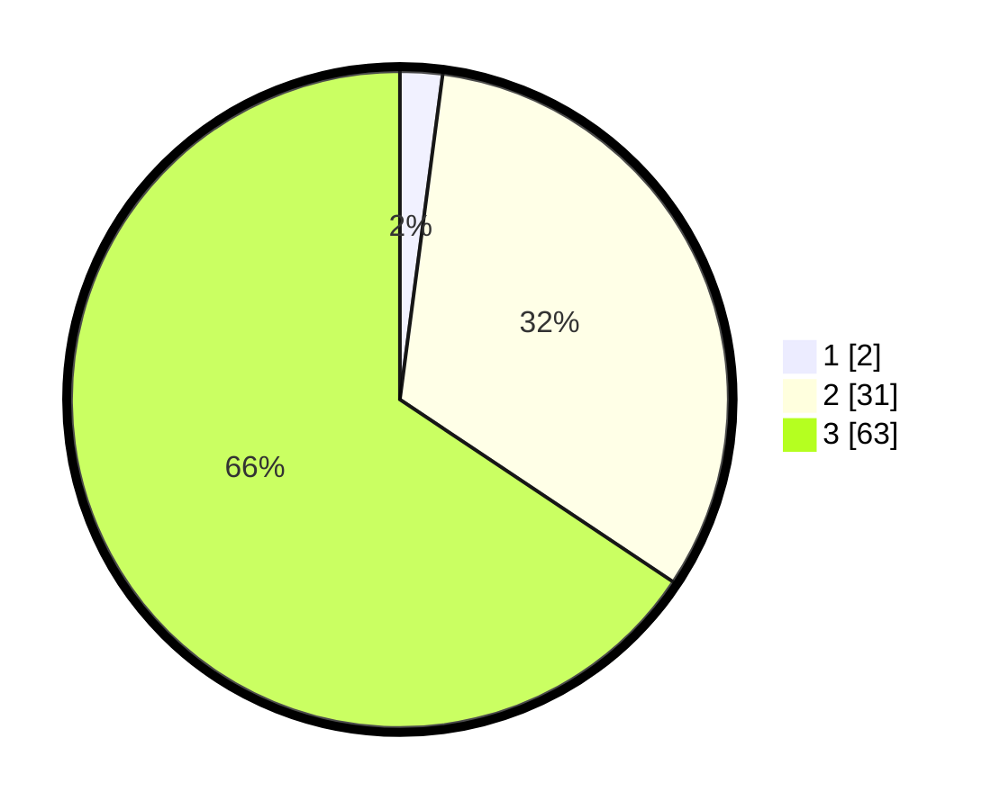

# Hasil

## Grafik

## Tabel

| No. | Nama Paslon    | Suara | Suara (raw) | Persentase |
|:--- |:-------------- | -----:| -----------:| ----------:|
| 1   | ANIES MUHAIMIN | 2     | [2][p-1]    | 2,08       |
| 2   | PRABOWO GIBRAN | 31    | [31][p-2]   | 32,29      |
| 3   | GANJAR MAHFUD  | 63    | [63][p-3]   | 65,63      |

[p-1]: https://github.com/gigit-pemilu/pemilu-2024-53-nusa-tenggara-timur/blob/main/pilpres/hitung-suara/sub/53-nusa-tenggara-timur/sub/21-malaka/sub/05-rinhat/sub/2019-muke/sub/002-tps/sub/paslon-1.txt
[p-2]: https://github.com/gigit-pemilu/pemilu-2024-53-nusa-tenggara-timur/blob/main/pilpres/hitung-suara/sub/53-nusa-tenggara-timur/sub/21-malaka/sub/05-rinhat/sub/2019-muke/sub/002-tps/sub/paslon-2.txt
[p-3]: https://github.com/gigit-pemilu/pemilu-2024-53-nusa-tenggara-timur/blob/main/pilpres/hitung-suara/sub/53-nusa-tenggara-timur/sub/21-malaka/sub/05-rinhat/sub/2019-muke/sub/002-tps/sub/paslon-3.txt

## Foto C Plano

https://sirekap-obj-formc.kpu.go.id/959b/pemilu/ppwp/53/21/05/20/19/5321052019002-20240215-153247--886ecefc-be1e-47f5-8f78-0ff99919dc3b.jpg

https://sirekap-obj-formc.kpu.go.id/959b/pemilu/ppwp/53/21/05/20/19/5321052019002-20240215-153726--a49b00f5-87ba-4610-be59-d4dd06cf7734.jpg

https://sirekap-obj-formc.kpu.go.id/959b/pemilu/ppwp/53/21/05/20/19/5321052019002-20240215-154048--41d77d62-17f9-4835-badf-316d34e0e5e6.jpg

## Metadata

| Key        | Value               |
| ---------- | ------------------- |
| Time Stamp | 2024-02-15 23:29:50 |

