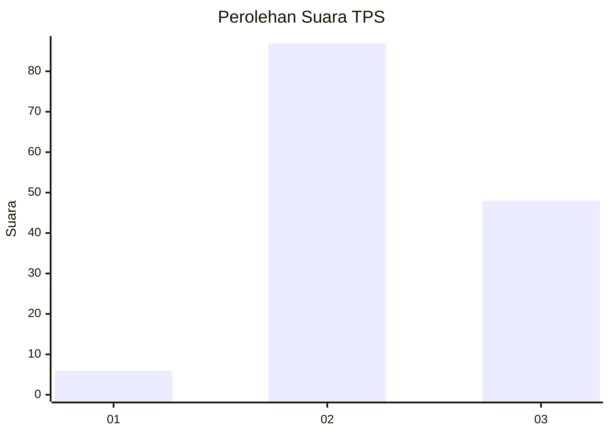
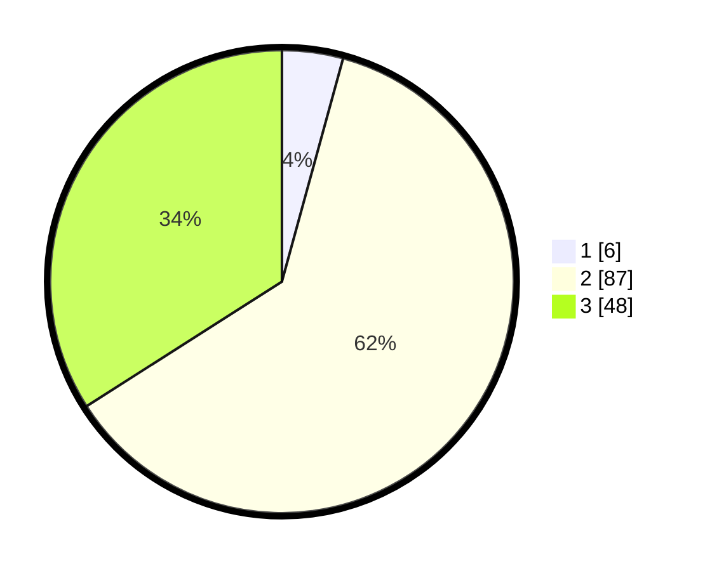

# Hasil

## Grafik

## Tabel

| No. | Nama Paslon    | Suara | Suara (raw) | Persentase |
|:--- |:-------------- | -----:| -----------:| ----------:|
| 1   | ANIES MUHAIMIN | 6     | [6][p-1]    | 4,26       |
| 2   | PRABOWO GIBRAN | 87    | [87][p-2]   | 61,70      |
| 3   | GANJAR MAHFUD  | 48    | [48][p-3]   | 34,04      |

[p-1]: https://github.com/gigit-pemilu/pemilu-2024-53-nusa-tenggara-timur/blob/main/pilpres/hitung-suara/sub/53-nusa-tenggara-timur/sub/21-malaka/sub/06-io-kufeu/sub/2002-kufeu/sub/001-tps/sub/paslon-1.txt
[p-2]: https://github.com/gigit-pemilu/pemilu-2024-53-nusa-tenggara-timur/blob/main/pilpres/hitung-suara/sub/53-nusa-tenggara-timur/sub/21-malaka/sub/06-io-kufeu/sub/2002-kufeu/sub/001-tps/sub/paslon-2.txt
[p-3]: https://github.com/gigit-pemilu/pemilu-2024-53-nusa-tenggara-timur/blob/main/pilpres/hitung-suara/sub/53-nusa-tenggara-timur/sub/21-malaka/sub/06-io-kufeu/sub/2002-kufeu/sub/001-tps/sub/paslon-3.txt

## Foto C Plano

https://sirekap-obj-formc.kpu.go.id/6f6e/pemilu/ppwp/53/21/06/20/02/5321062002001-20240214-214055--3ebcb116-7238-40ed-8e57-cc8e9faef009.jpg

https://sirekap-obj-formc.kpu.go.id/6f6e/pemilu/ppwp/53/21/06/20/02/5321062002001-20240214-214303--be3a4b80-11f8-4ddc-9196-b2f35189225d.jpg

https://sirekap-obj-formc.kpu.go.id/6f6e/pemilu/ppwp/53/21/06/20/02/5321062002001-20240214-214720--686dfdba-6786-4224-bcac-bffb3fd2a160.jpg

## Metadata

| Key        | Value               |
| ---------- | ------------------- |
| Time Stamp | 2024-02-15 18:30:25 |

