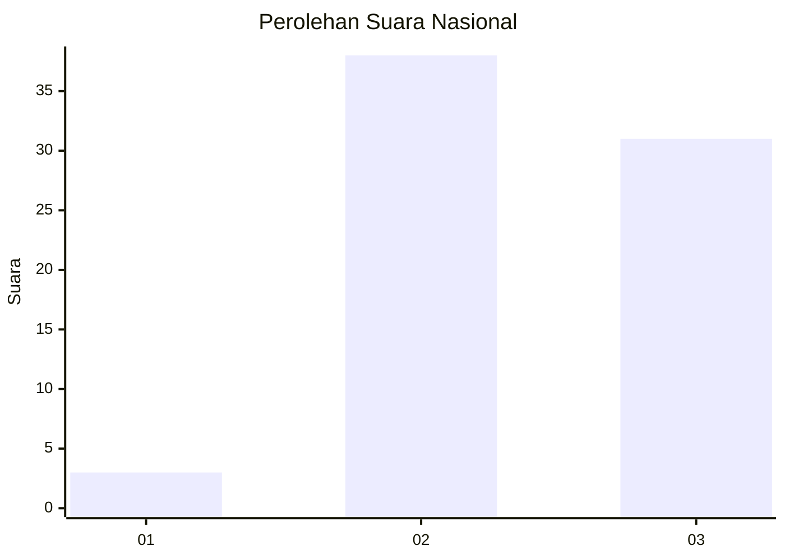
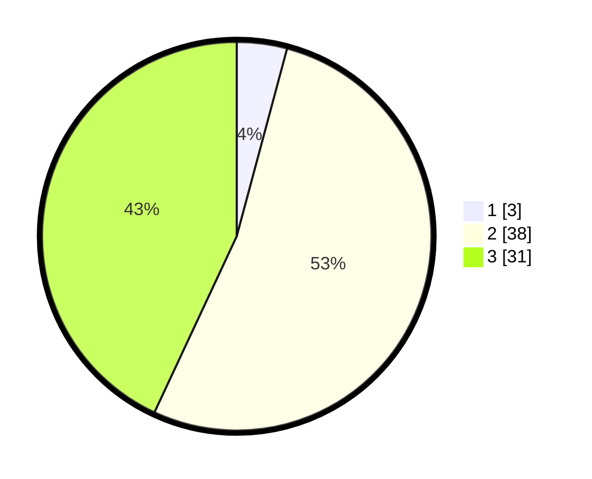

# Hasil

## Grafik

## Tabel

| No. | Nama Paslon    | Suara | Suara (raw) | Persentase |
|:--- |:-------------- | -----:| -----------:| ----------:|
| 1   | ANIES MUHAIMIN | 3     | [3][p-1]    | 4,17       |
| 2   | PRABOWO GIBRAN | 38    | [38][p-2]   | 52,78      |
| 3   | GANJAR MAHFUD  | 31    | [31][p-3]   | 43,06      |

[p-1]: https://github.com/gigit-pemilu/pemilu-2024/blob/main/pilpres/hitung-suara/sub/53-nusa-tenggara-timur/sub/21-malaka/sub/08-laenmanen/sub/2002-tesa/sub/007-tps/sub/paslon-1.txt
[p-2]: https://github.com/gigit-pemilu/pemilu-2024/blob/main/pilpres/hitung-suara/sub/53-nusa-tenggara-timur/sub/21-malaka/sub/08-laenmanen/sub/2002-tesa/sub/007-tps/sub/paslon-2.txt
[p-3]: https://github.com/gigit-pemilu/pemilu-2024/blob/main/pilpres/hitung-suara/sub/53-nusa-tenggara-timur/sub/21-malaka/sub/08-laenmanen/sub/2002-tesa/sub/007-tps/sub/paslon-3.txt

## Foto C Plano

https://sirekap-obj-formc.kpu.go.id/eb73/pemilu/ppwp/53/21/08/20/02/5321082002007-20240215-072700--f054633f-27cd-4e27-9bfd-58b1eea497ac.jpg

https://sirekap-obj-formc.kpu.go.id/eb73/pemilu/ppwp/53/21/08/20/02/5321082002007-20240215-072845--524cf845-985a-4236-99e6-8fb709de69b3.jpg

https://sirekap-obj-formc.kpu.go.id/eb73/pemilu/ppwp/53/21/08/20/02/5321082002007-20240215-073037--84491864-fb35-413e-89b9-619ffcf0c813.jpg

## Metadata

| Key        | Value               |
| ---------- | ------------------- |
| Time Stamp | 2024-02-15 16:00:26 |

