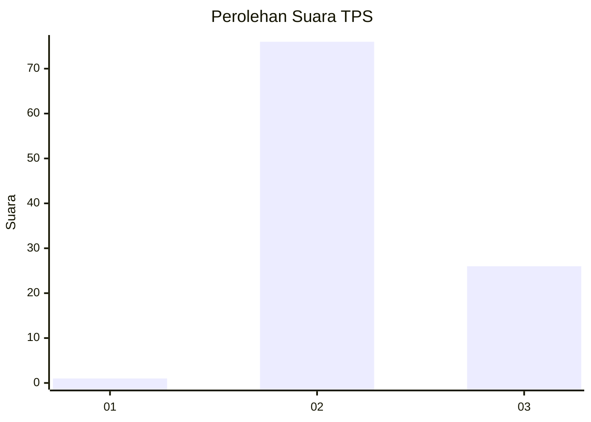
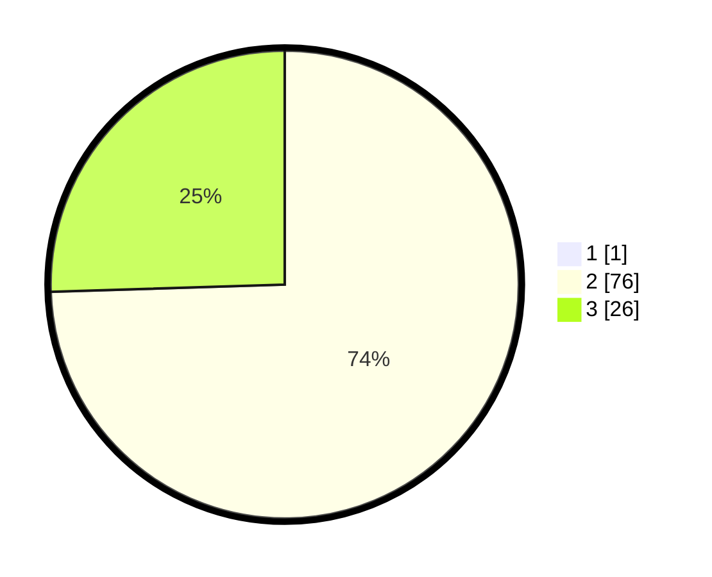

# Hasil

## Grafik

## Tabel

| No. | Nama Paslon    | Suara | Suara (raw) | Persentase |
|:--- |:-------------- | -----:| -----------:| ----------:|
| 1   | ANIES MUHAIMIN | 1     | [1][p-1]    | 0,97       |
| 2   | PRABOWO GIBRAN | 76    | [76][p-2]   | 73,79      |
| 3   | GANJAR MAHFUD  | 26    | [26][p-3]   | 25,24      |

[p-1]: https://github.com/gigit-pemilu/pemilu-2024-53-nusa-tenggara-timur/blob/main/pilpres/hitung-suara/sub/53-nusa-tenggara-timur/sub/21-malaka/sub/09-malaka-timur/sub/2002-wemeda/sub/007-tps/sub/paslon-1.txt
[p-2]: https://github.com/gigit-pemilu/pemilu-2024-53-nusa-tenggara-timur/blob/main/pilpres/hitung-suara/sub/53-nusa-tenggara-timur/sub/21-malaka/sub/09-malaka-timur/sub/2002-wemeda/sub/007-tps/sub/paslon-2.txt
[p-3]: https://github.com/gigit-pemilu/pemilu-2024-53-nusa-tenggara-timur/blob/main/pilpres/hitung-suara/sub/53-nusa-tenggara-timur/sub/21-malaka/sub/09-malaka-timur/sub/2002-wemeda/sub/007-tps/sub/paslon-3.txt

## Foto C Plano

https://sirekap-obj-formc.kpu.go.id/ee71/pemilu/ppwp/53/21/09/20/02/5321092002007-20240215-165107--a5b1c535-70d3-47af-ad8b-8d66385b0e7f.jpg

https://sirekap-obj-formc.kpu.go.id/ee71/pemilu/ppwp/53/21/09/20/02/5321092002007-20240215-165635--50da511d-6dac-465f-b593-9a411feb2d65.jpg

https://sirekap-obj-formc.kpu.go.id/ee71/pemilu/ppwp/53/21/09/20/02/5321092002007-20240215-165811--6ab24432-ab75-4065-a45a-fdc63c000b90.jpg

## Metadata

| Key        | Value               |
| ---------- | ------------------- |
| Time Stamp | 2024-02-15 22:30:27 |

