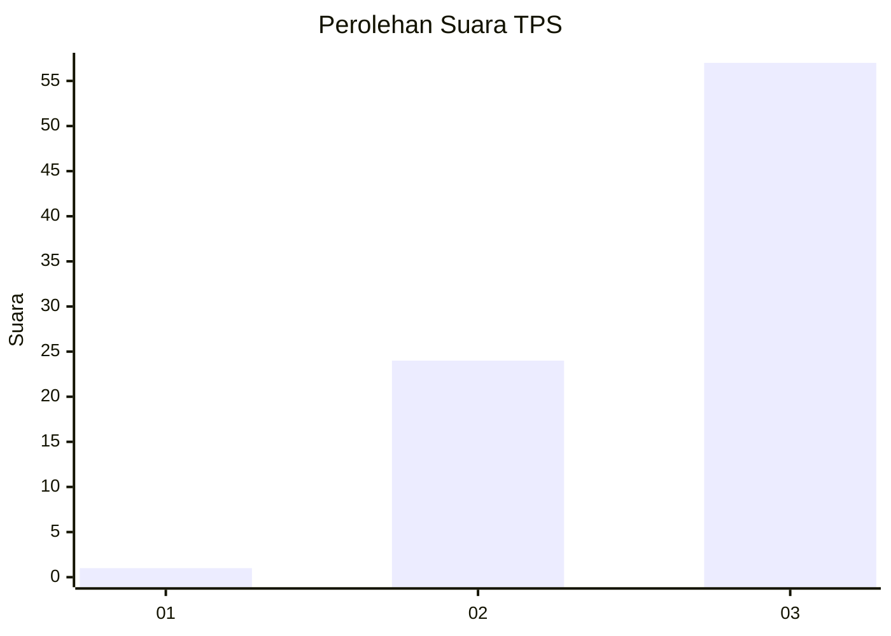
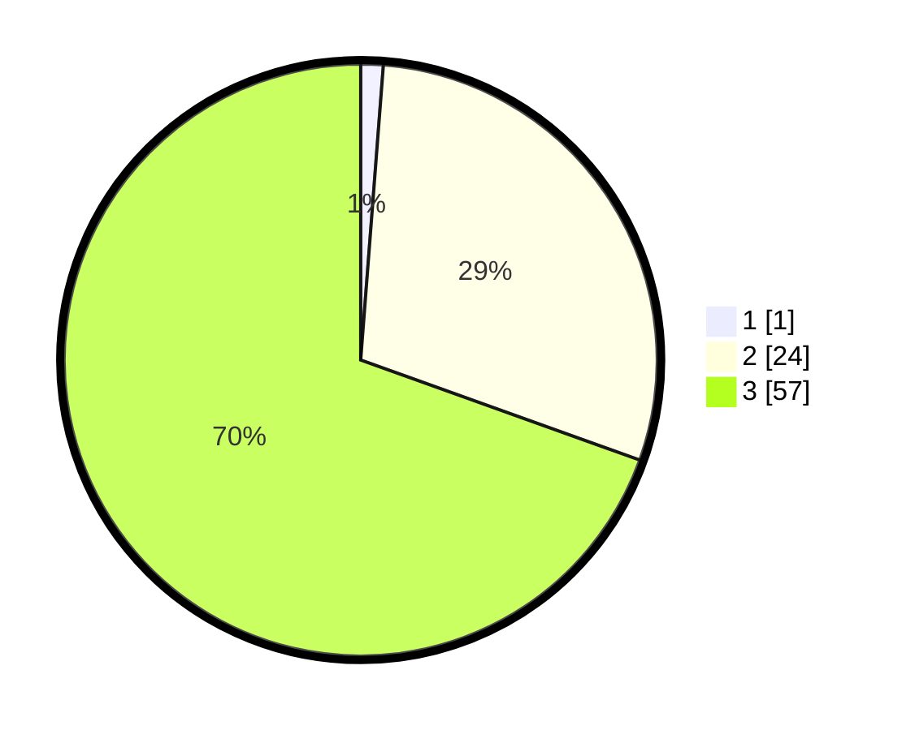

# Hasil

## Grafik

## Tabel

| No. | Nama Paslon    | Suara | Suara (raw) | Persentase |
|:--- |:-------------- | -----:| -----------:| ----------:|
| 1   | ANIES MUHAIMIN | 1     | [1][p-1]    | 1,22       |
| 2   | PRABOWO GIBRAN | 24    | [24][p-2]   | 29,27      |
| 3   | GANJAR MAHFUD  | 57    | [57][p-3]   | 69,51      |

[p-1]: https://github.com/gigit-pemilu/pemilu-2024-53-nusa-tenggara-timur/blob/main/pilpres/hitung-suara/sub/53-nusa-tenggara-timur/sub/21-malaka/sub/09-malaka-timur/sub/2006-sanleo/sub/006-tps/sub/paslon-1.txt
[p-2]: https://github.com/gigit-pemilu/pemilu-2024-53-nusa-tenggara-timur/blob/main/pilpres/hitung-suara/sub/53-nusa-tenggara-timur/sub/21-malaka/sub/09-malaka-timur/sub/2006-sanleo/sub/006-tps/sub/paslon-2.txt
[p-3]: https://github.com/gigit-pemilu/pemilu-2024-53-nusa-tenggara-timur/blob/main/pilpres/hitung-suara/sub/53-nusa-tenggara-timur/sub/21-malaka/sub/09-malaka-timur/sub/2006-sanleo/sub/006-tps/sub/paslon-3.txt

## Foto C Plano

https://sirekap-obj-formc.kpu.go.id/8cfe/pemilu/ppwp/53/21/09/20/06/5321092006006-20240215-114302--50a603d8-ae11-4c71-9c64-1ef47c5498b2.jpg

https://sirekap-obj-formc.kpu.go.id/8cfe/pemilu/ppwp/53/21/09/20/06/5321092006006-20240215-114401--b209ad31-c335-405d-96ff-6025f70985fd.jpg

https://sirekap-obj-formc.kpu.go.id/8cfe/pemilu/ppwp/53/21/09/20/06/5321092006006-20240215-114815--2fdc2857-9b64-483b-80ec-ef3666d55cfe.jpg

## Metadata

| Key        | Value               |
| ---------- | ------------------- |
| Time Stamp | 2024-02-16 14:30:33 |

