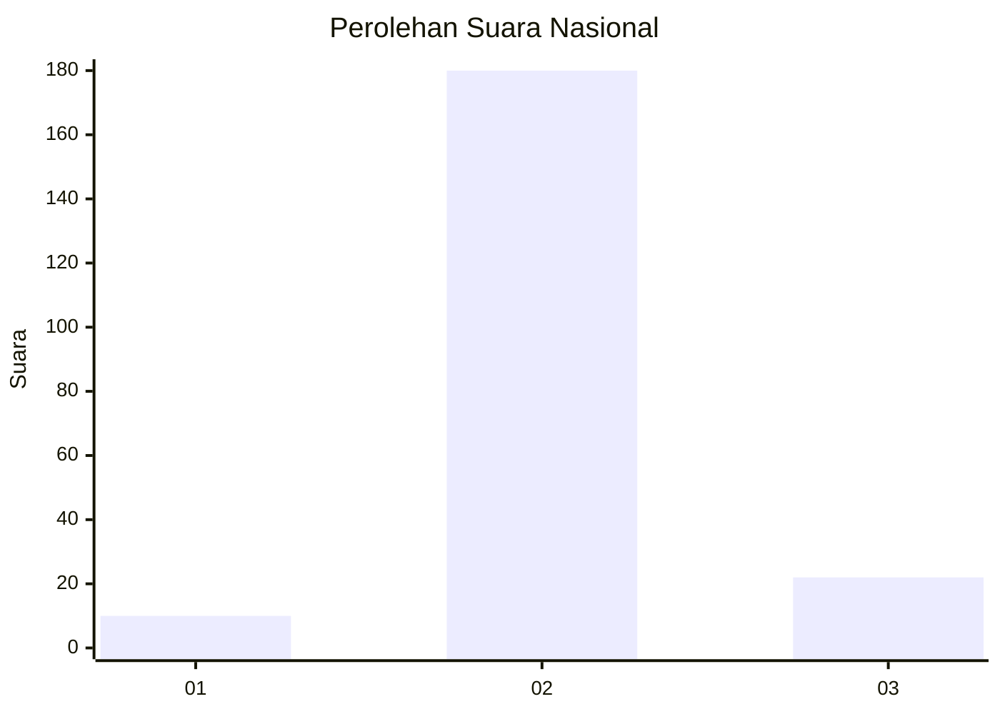
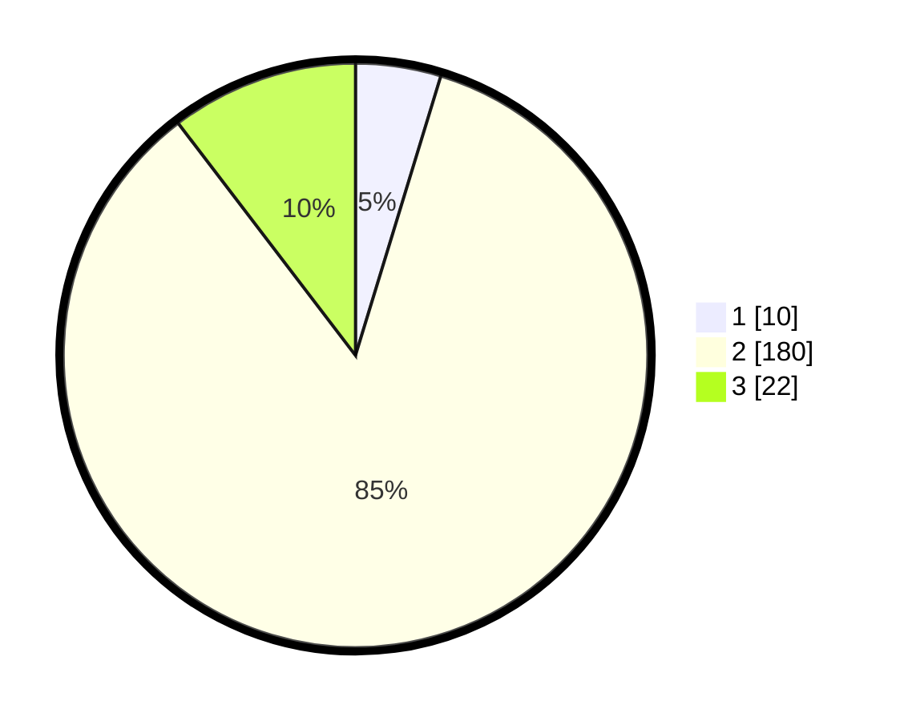

# Hasil

## Grafik

## Tabel

| No. | Nama Paslon    | Suara | Suara (raw) | Persentase |
|:--- |:-------------- | -----:| -----------:| ----------:|
| 1   | ANIES MUHAIMIN | 10    | [10][p-1]   | 4,72       |
| 2   | PRABOWO GIBRAN | 180   | [180][p-2]  | 84,91      |
| 3   | GANJAR MAHFUD  | 22    | [22][p-3]   | 10,38      |

[p-1]: https://github.com/gigit-pemilu/pemilu-2024/blob/main/pilpres/hitung-suara/sub/53-nusa-tenggara-timur/sub/21-malaka/sub/10-kobalima-timur/sub/2003-alas/sub/002-tps/sub/paslon-1.txt
[p-2]: https://github.com/gigit-pemilu/pemilu-2024/blob/main/pilpres/hitung-suara/sub/53-nusa-tenggara-timur/sub/21-malaka/sub/10-kobalima-timur/sub/2003-alas/sub/002-tps/sub/paslon-2.txt
[p-3]: https://github.com/gigit-pemilu/pemilu-2024/blob/main/pilpres/hitung-suara/sub/53-nusa-tenggara-timur/sub/21-malaka/sub/10-kobalima-timur/sub/2003-alas/sub/002-tps/sub/paslon-3.txt

## Foto C Plano

https://sirekap-obj-formc.kpu.go.id/0a79/pemilu/ppwp/53/21/10/20/03/5321102003002-20240215-123324--f8787f7a-4e17-490c-a79b-f804425d3146.jpg

https://sirekap-obj-formc.kpu.go.id/0a79/pemilu/ppwp/53/21/10/20/03/5321102003002-20240215-123805--10c1fea5-1638-41a3-aa3b-6fe370157b1c.jpg

https://sirekap-obj-formc.kpu.go.id/0a79/pemilu/ppwp/53/21/10/20/03/5321102003002-20240215-124011--36490932-1aad-4eee-a8a7-5c655178e149.jpg

## Metadata

| Key        | Value               |
| ---------- | ------------------- |
| Time Stamp | 2024-02-15 16:00:26 |

