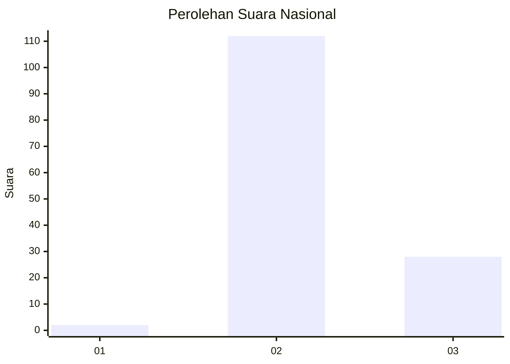

# Hasil

## Grafik

## Tabel

| No. | Nama Paslon    | Suara | Suara (raw) | Persentase |
|:--- |:-------------- | -----:| -----------:| ----------:|
| 1   | ANIES MUHAIMIN | 2     | [2][p-1]    | 1,41       |
| 2   | PRABOWO GIBRAN | 112   | [112][p-2]  | 78,87      |
| 3   | GANJAR MAHFUD  | 28    | [28][p-3]   | 19,72      |

[p-1]: https://github.com/gigit-pemilu/pemilu-2024/blob/main/pilpres/hitung-suara/sub/53-nusa-tenggara-timur/sub/21-malaka/sub/10-kobalima-timur/sub/2003-alas/sub/004-tps/sub/paslon-1.txt
[p-2]: https://github.com/gigit-pemilu/pemilu-2024/blob/main/pilpres/hitung-suara/sub/53-nusa-tenggara-timur/sub/21-malaka/sub/10-kobalima-timur/sub/2003-alas/sub/004-tps/sub/paslon-2.txt
[p-3]: https://github.com/gigit-pemilu/pemilu-2024/blob/main/pilpres/hitung-suara/sub/53-nusa-tenggara-timur/sub/21-malaka/sub/10-kobalima-timur/sub/2003-alas/sub/004-tps/sub/paslon-3.txt

## Foto C Plano

https://sirekap-obj-formc.kpu.go.id/cfd3/pemilu/ppwp/53/21/10/20/03/5321102003004-20240215-142019--01a474a3-b102-4a13-b1d5-ecbb9faa9c92.jpg

https://sirekap-obj-formc.kpu.go.id/cfd3/pemilu/ppwp/53/21/10/20/03/5321102003004-20240215-142203--a1dc728c-6506-492c-9780-72ed9e8c9f50.jpg

https://sirekap-obj-formc.kpu.go.id/cfd3/pemilu/ppwp/53/21/10/20/03/5321102003004-20240215-142524--8a3d2c72-c700-4167-aa8e-911438673045.jpg

## Metadata

| Key        | Value               |
| ---------- | ------------------- |
| Time Stamp | 2024-02-15 22:30:27 |

