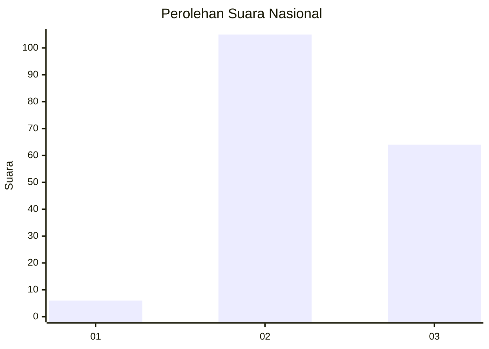
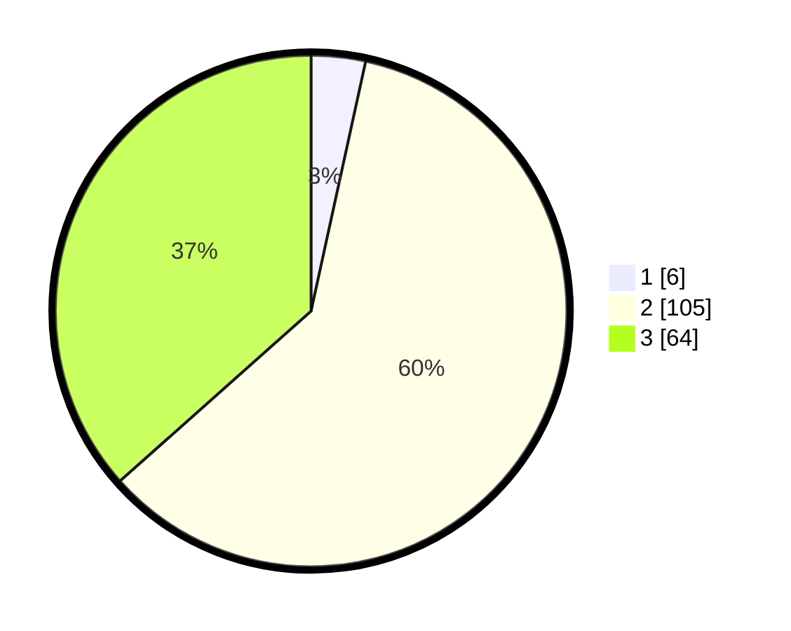

# Hasil

## Grafik

## Tabel

| No. | Nama Paslon    | Suara | Suara (raw) | Persentase |
|:--- |:-------------- | -----:| -----------:| ----------:|
| 1   | ANIES MUHAIMIN | 6     | [6][p-1]    | 3,43       |
| 2   | PRABOWO GIBRAN | 105   | [105][p-2]  | 60,00      |
| 3   | GANJAR MAHFUD  | 64    | [64][p-3]   | 36,57      |

[p-1]: https://github.com/gigit-pemilu/pemilu-2024/blob/main/pilpres/hitung-suara/sub/53-nusa-tenggara-timur/sub/21-malaka/sub/12-botin-leobele/sub/2001-babotin/sub/001-tps/sub/paslon-1.txt
[p-2]: https://github.com/gigit-pemilu/pemilu-2024/blob/main/pilpres/hitung-suara/sub/53-nusa-tenggara-timur/sub/21-malaka/sub/12-botin-leobele/sub/2001-babotin/sub/001-tps/sub/paslon-2.txt
[p-3]: https://github.com/gigit-pemilu/pemilu-2024/blob/main/pilpres/hitung-suara/sub/53-nusa-tenggara-timur/sub/21-malaka/sub/12-botin-leobele/sub/2001-babotin/sub/001-tps/sub/paslon-3.txt

## Foto C Plano

https://sirekap-obj-formc.kpu.go.id/0e83/pemilu/ppwp/53/21/12/20/01/5321122001001-20240215-130004--18c59151-268c-469a-9fb3-80e270094d25.jpg

https://sirekap-obj-formc.kpu.go.id/0e83/pemilu/ppwp/53/21/12/20/01/5321122001001-20240215-075339--0b2ef1b8-1525-4826-b0bc-da67564e33f9.jpg

https://sirekap-obj-formc.kpu.go.id/0e83/pemilu/ppwp/53/21/12/20/01/5321122001001-20240215-062252--fe00ad8d-aa72-4362-bd9d-92c52b649032.jpg

## Metadata

| Key        | Value               |
| ---------- | ------------------- |
| Time Stamp | 2024-02-16 09:00:28 |

