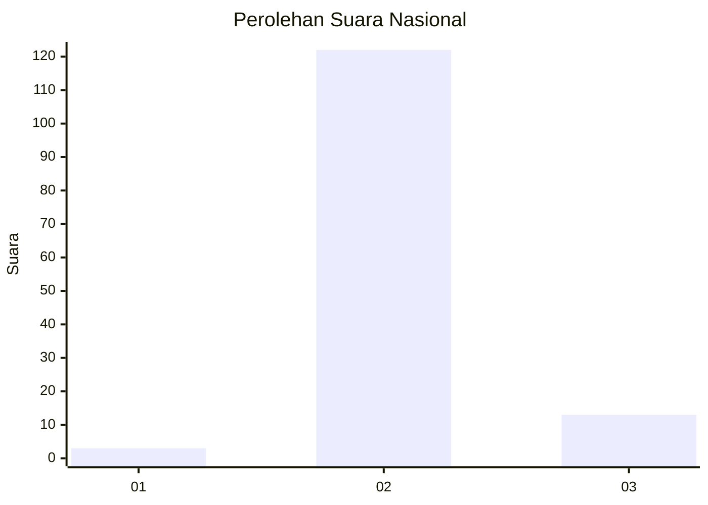
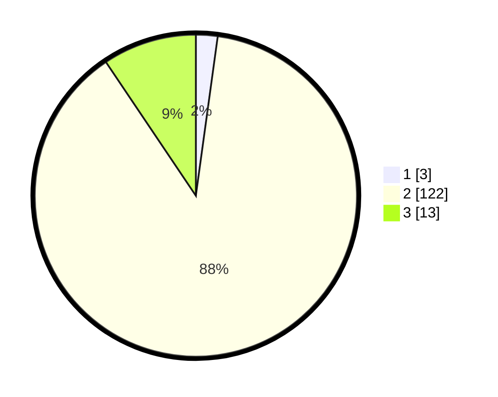

# Hasil

## Grafik

## Tabel

| No. | Nama Paslon    | Suara | Suara (raw) | Persentase |
|:--- |:-------------- | -----:| -----------:| ----------:|
| 1   | ANIES MUHAIMIN | 3     | [3][p-1]    | 2,17       |
| 2   | PRABOWO GIBRAN | 122   | [122][p-2]  | 88,41      |
| 3   | GANJAR MAHFUD  | 13    | [13][p-3]   | 9,42       |

[p-1]: https://github.com/gigit-pemilu/pemilu-2024/blob/main/pilpres/hitung-suara/sub/53-nusa-tenggara-timur/sub/21-malaka/sub/12-botin-leobele/sub/2002-kereana/sub/002-tps/sub/paslon-1.txt
[p-2]: https://github.com/gigit-pemilu/pemilu-2024/blob/main/pilpres/hitung-suara/sub/53-nusa-tenggara-timur/sub/21-malaka/sub/12-botin-leobele/sub/2002-kereana/sub/002-tps/sub/paslon-2.txt
[p-3]: https://github.com/gigit-pemilu/pemilu-2024/blob/main/pilpres/hitung-suara/sub/53-nusa-tenggara-timur/sub/21-malaka/sub/12-botin-leobele/sub/2002-kereana/sub/002-tps/sub/paslon-3.txt

## Foto C Plano

https://sirekap-obj-formc.kpu.go.id/07a0/pemilu/ppwp/53/21/12/20/02/5321122002002-20240215-072657--8b174c9c-16d4-4256-b86c-533e095f11a6.jpg

https://sirekap-obj-formc.kpu.go.id/07a0/pemilu/ppwp/53/21/12/20/02/5321122002002-20240214-160121--fd80f7b8-d6c6-4621-b74f-b6c53824db6f.jpg

https://sirekap-obj-formc.kpu.go.id/07a0/pemilu/ppwp/53/21/12/20/02/5321122002002-20240214-202624--5f5939eb-383b-4aa3-98a2-a44e5c7a2166.jpg

## Metadata

| Key        | Value               |
| ---------- | ------------------- |
| Time Stamp | 2024-02-15 09:00:24 |

